# 1. 项目概述

## 项目背景与定位

ut-bench 是校企联合项目「多模型单测自动生成横向评测平台」的核心代码仓库，面向 AI 辅助单元测试生成能力的横向评测平台。项目针对不同大语言模型（L L M）生成单测质量差异难以量化、缺乏统一评测标准和基准数据集的痛点，系统性地评估和对比 GPT-4o、Claude 3.5 Sonnet、DeepSeek-V3、混元等模型在自动生成单元测试方面的效果，为 CSIG 单测质量防护体系的模型选型和能力优化提供数据支撑。

> Sources: [README.md](https://git.tencent.com/ut/ut-bench/blob/a11a49cb0e4bd26fc939914e1547ced334b40812/README.md#L9-L19)

## 项目目标

项目通过以下三大核心目标构建标准化评测体系：

- 建立标准化 Benchmark 数据集：覆盖 Java、Python、Go 多语言，涵盖不同代码复杂度的样本
- 定义统一评测指标体系：从正确性、覆盖率、有效性、效率、工程质量五大维度量化评估
- 构建自动化流水线：端到端自动完成生成 → 编译 → 执行 → 覆盖率 → 变异测试全链路评测

目标设计详见《1.1 项目目标与价值》。

> Sources: [README.md](https://git.tencent.com/ut/ut-bench/blob/a11a49cb0e4bd26fc939914e1547ced334b40812/README.md#L20-L26)

## 主要功能特性

项目具备以下核心功能特性：

**多语言与多模型支持**

- 编程语言覆盖：Java、Python、 Go
- 模型支持：GPT-4o、Claude 3.5 Sonnet、DeepSeek-V3、混元

**统一评测指标体系**

- 正确性：编译通过率、测试执行通过率
- 覆盖率：行覆盖率、分支覆盖率、函数覆盖率
- 有效性：变异测试得分（目标 ≥ 85%）
- 效率：生成耗时、Token 消耗
- 工程质量：Mock 准确率、断言充分性

**自动化与可视化**

- 端到端评测流水线
- 多模型横向对比报告
- 多维度分析（语言、复杂度、场景）

> Sources: [README.md](https://git.tencent.com/ut/ut-bench/blob/a11a49cb0e4bd26fc939914e1547ced334b40812/README.md#L11-L78)

## 技术架构概览

项目采用流水线式评测技术架构，以 Shell 脚本为核心编排层，通过模块化组件实现评测流程端到端自动化。核心模块包括：

- **Runner（评测执行器）**：调用模型 API 生成测试代码
- **Evaluator（评测指标计算）**：执行编译验证、测试执行、覆盖率分析、变异测试
- **Reporter（评测报告生成）**：生成可视化分析报告
- **Config（评测配置）**：通过 models.yaml 统一管理模型配置

评测流水线包含五个关键阶段：调用模型 API 生成测试代码、编译验证、执行测试、覆盖率分析、变异测试。详细架构设计见《2. 评测体系设计》。


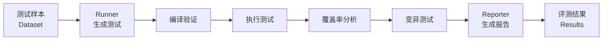

> Sources: [README.md](https://git.tencent.com/ut/ut-bench/blob/a11a49cb0e4bd26fc939914e1547ced334b40812/README.md#L32-L60)

## 核心价值与应用场景

**核心价值**

- 提供公平量化的多模型横向对比基准
- 支持按语言、复杂度、场景等多维度深入分析
- 为工程实践提供数据驱动的模型选型决策依据

**应用场景**

- 模型能力评估：系统性评估不同 LLM 在单测生成领域的表现
- 模型选型决策：基于评测数据选择最适合工程场景的模型
- 质量防护体系优化：为 CSIG 单测质量防护提供模型能力优化方向
- 模型能力提升迭代：通过评测结果反馈指导模型能力迭代

> Sources: [README.md](https://git.tencent.com/ut/ut-bench/blob/a11a49cb0e4bd26fc939914e1547ced334b40812/README.md#L150-L154)

# 1.1. 项目目标与价值

## 项目核心目标

ut-bench 项目致力于构建系统化的 AI 单测生成能力评测体系，通过三重核心目标协同支撑完整的评测能力：

1. **建立标准化 Benchmark 数据集**：覆盖 Java、Python、Go 多语言，涵盖不同复杂度和业务场景的代码样本，为横向评测提供统一基准
2. **定义统一评测指标体系**：包括正确性、覆盖率、有效性、效率、工程质量五大维度，量化模型生成质量
3. **自动化评测流水线**：端到端完成生成 → 编译 → 执行 → 覆盖率 → 变异测试全链路
4. **可视化评测报告**：支持多模型横向对比，可按语言、复杂度、场景多维度分析

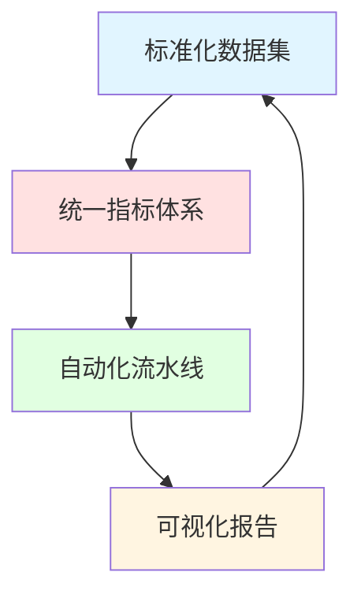


> Sources:
> [README.md](https://git.tencent.com/ut/ut-bench/blob/a11a49cb0e4bd26fc939914e1547ced334b40812/README.md#L20)

## 解决的痛点问题

当前 AI 单测生成领域面临以下核心痛点：

- **质量差异难以量化**：不同模型（GPT-4o、Claude、DeepSeek、混元等）生成单测的质量差异缺乏量化标准
- **缺失评测基准**：缺乏统一的评测标准和基准数据集，导致评测结果不可复现、不可对比
- **缺乏横向对比**：生成的测试用例在编译通过率、执行通过率、覆盖率等维度缺乏横向对比数据
- **选型决策困难**：难以指导工程实践中的模型选型决策和技术应用推广

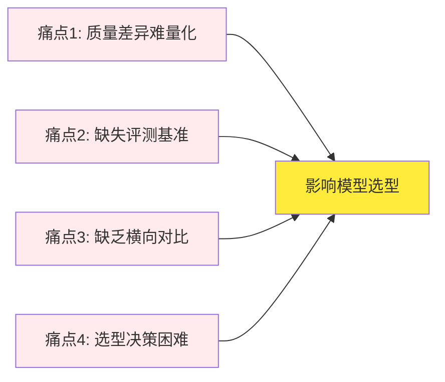

> Sources:
> [README.md](https://git.tencent.com/ut/ut-bench/blob/a11a49cb0e4bd26fc939914e1547ced334b40812/README.md#L13)

## 项目定位与特色

ut-bench 作为校企联合项目「多模型单测自动生成横向评测平台」的核心代码仓库，具有以下特色：

- **多语言覆盖**：支持 Java、Python、Go 三种主流编程语言
- **多模型对比**：支持 GPT-4o、Claude 3.5 Sonnet、DeepSeek-V3、混元等主流模型的横向评测
- **标准化评测理念**：通过统一的数据集和指标体系，确保评测结果的可比性和可复现性
- **横向评测特性**：侧重于多模型之间的效果对比，而非单模型性能评估

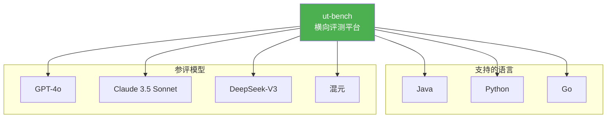

> Sources:
> [README.md](https://git.tencent.com/ut/ut-bench/blob/a11a49cb0e4bd26fc939914e1547ced334b40812/README.md#L11)

## 工程实践价值

项目为 CSIG 单测质量防护体系提供核心价值支撑：

- **模型选型数据支撑**：通过标准化评测为模型选型提供客观数据依据，降低选型决策成本
- **模型能力特长揭示**：通过多维指标（正确性、覆盖率、有效性等）分析，揭示不同模型在不同场景下的能力特长
- **技术优化推动**：通过积累评测数据，推动模型能力的持续优化和技术方案的迭代改进
- **工程决策指导**：评测结果可直接指导工程实践中的模型应用策略，如针对不同语言场景选择最优模型

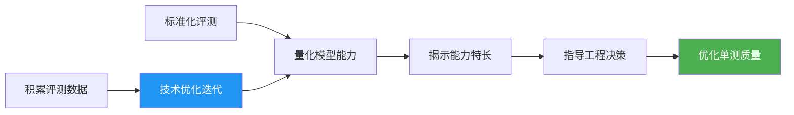

> Sources:
> [README.md](https://git.tencent.com/ut/ut-bench/blob/a11a49cb0e4bd26fc939914e1547ced334b40812/README.md#L151)

## 相关文档指引

深入了解项目实现细节和设计方案，可参考以下关联文档：

| 文档名称         | 路径                              | 说明                             |
| :--------------- | :-------------------------------- | :------------------------------- |
| 评测方案总体设计 | docs/design/benchmark-design.md   | 评测体系的整体架构设计           |
| 评测指标定义     | docs/design/metrics-definition.md | 五大维度指标的详细定义           |
| 数据集设计       | docs/design/dataset-design.md     | Benchmark 数据集的设计原则和结构 |
| 模型能力调研     | docs/research/model-survey.md     | 参评模型的能力分析报告           |

> Sources:
> [README.md](https://git.tencent.com/ut/ut-bench/blob/a11a49cb0e4bd26fc939914e1547ced334b40812/README.md#L133)

# 1.2. 工程结构说明

## 整体目录结构

ut-bench项目采用功能模块化的目录组织方式，将不同功能和职责分离到独立的目录中。根目录包含两大核心文件和七大功能模块，各模块职责清晰，便于协作开发和维护。

> Sources: [README.md](https://git.tencent.com/ut/ut-bench/blob/a11a49cb0e4bd26fc939914e1547ced334b40812/README.md#L31)

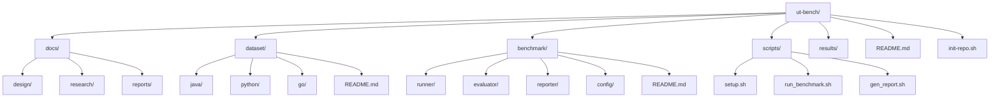

## docs目录说明

docs目录作为技术文档的集中管理区，采用分层文档管理体系，将不同类型的文档进行分类存储。该目录包含三个子目录：

- design/：方案设计文档，包含评测方案总体设计、评测指标定义和数据集设计
- research/：调研报告，涵盖模型能力调研和相关工具调研
- reports/：评测报告，存储历次评测结果的可视化对比报告

这种分层管理确保了技术方案的清晰性和可追溯性，便于开发人员快速定位所需文档。

> Sources: [README.md](https://git.tencent.com/ut/ut-bench/blob/a11a49cb0e4bd26fc939914e1547ced334b40812/README.md#L34)

## dataset目录说明

dataset目录存储评测基准数据集，采用按编程语言分类的组织方式。目录包含：

- java/：Java语言测试样本
- python/：Python语言测试样本
- go/：Go语言测试样本
- README.md：数据集说明文档

数据集覆盖不同复杂度（简单、中等、复杂）和不同业务场景（工具类、服务类、数据处理类），为评测提供标准化、可对比的测试样本集。详细的数据集设计和样本结构参见第4章评测基准数据集。

> Sources: [README.md](https://git.tencent.com/ut/ut-bench/blob/a11a49cb0e4bd26fc939914e1547ced334b40812/README.md#L43)

## benchmark目录说明

benchmark目录是评测核心代码区，包含完成评测流程所需的关键模块：

- runner/：评测执行器，负责调用配置的模型API生成单元测试代码
- evaluator/：评测指标计算，执行编译验证、覆盖率分析、变异测试等任务
- reporter/：评测报告生成，将评测数据转换为可视化报告
- config/：评测配置，统一管理参评模型的API配置
- README.md：评测模块说明文档

各模块功能解耦，职责单一，便于独立维护和扩展。详细功能与接口参见第5章评测执行引擎。

> Sources: [README.md](https://git.tencent.com/ut/ut-bench/blob/a11a49cb0e4bd26fc939914e1547ced334b40812/README.md#L48)

## scripts目录说明

scripts目录提供环境初始化、评测执行和报告生成三个核心Shell脚本：

- setup.sh：环境初始化脚本，完成运行环境的依赖安装和配置加载
- run_benchmark.sh：运行完整评测脚本（runner → evaluator → reporter），支持通过参数进行单模型或单语言定向评测
- gen_report.sh：生成评测报告脚本，将评测数据可视化输出

核心业务流程的详细说明参见第7章核心业务流程。

> Sources: [README.md](https://git.tencent.com/ut/ut-bench/blob/a11a49cb0e4bd26fc939914e1547ced334b40812/README.md#L55)

## results目录说明

results目录用于评测结果的存档，包括历次评测的原始数据和生成的可视化分析报告。该目录按评测时间或版本进行组织，便于历史回溯和趋势分析。

> Sources: [README.md](https://git.tencent.com/ut/ut-bench/blob/a11a49cb0e4bd26fc939914e1547ced334b40812/README.md#L59)

## 项目文件说明

项目根目录包含两个核心文件：

- README.md：项目说明文档，包含项目简介、目录结构、评测指标、快速开始和使用说明等完整信息
- init-repo.sh：仓库初始化脚本，用于首次初始化git仓库、添加远程origin、创建分支并进行初始提交

> Sources: [README.md](https://git.tencent.com/ut/ut-bench/blob/a11a49cb0e4bd26fc939914e1547ced334b40812/README.md#L1) | [init-repo.sh](https://git.tencent.com/ut/ut-bench/blob/a11a49cb0e4bd26fc939914e1547ced334b40812/init-repo.sh#L1)

# 1.3. 技术架构概览

## 架构设计理念

ut-bench 项目采用流水线式评测架构，核心设计理念包括端到端自动化、模块化组件设计和关注点分离原则。评测流程采用标准化流水线模式，每个阶段有明确的输入输出和质量标准，确保评测过程的一致性和可重复性。系统通过配置驱动的模型管理机制，新增评测模型仅需修改配置文件，无需改动核心代码，降低扩展成本。

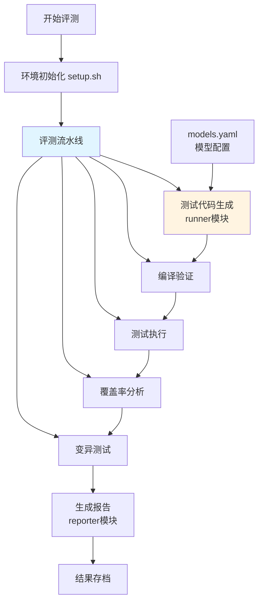

## 技术栈选型

系统以 Shell 脚本作为核心编排层，选型基于跨语言兼容、易于调试和适合自动化流程的考量。模块化组件采用 Python 实现，包括 runner、evaluator、reporter 三大模块，确保业务逻辑的灵活性和可维护性。配置管理通过 models.yaml 实现，支持统一管理参评模型的 API 配置、参数设置和访问密钥。

## 流水线架构总览

评测流水线包含五个关键阶段，形成从测试生成到质量评估的完整闭环。数据流从测试样本输入，依次经过测试代码生成、编译验证、测试执行、覆盖率分析和变异测试，最终汇聚为评测结果。

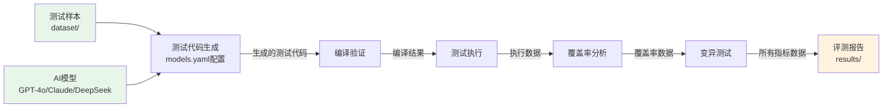

各阶段输入输出规范：

- 测试生成阶段：输入测试样本 + 模型配置，输出生成的测试代码
- 编译验证阶段：输入测试代码，输出编译结果和编译通过率
- 测试执行阶段：输入编译通过的代码，输出测试执行通过率
- 覆盖率分析阶段：输入测试执行数据，输出行/分支/函数覆盖率
- 变异测试阶段：输入测试代码，输出变异测试得分

## 测试代码生成阶段

评测流水线第一阶段由 runner 模块负责调用配置的 AI 模型 API 生成测试代码。系统支持 GPT-4o、Claude 3.5 Sonnet、DeepSeek-V3、混元等主流模型，覆盖 Java、Python、Go 多种编程语言。runner 模块通过模型客户端封装 API 调用逻辑，处理多语言测试生成的差异化要求，具备错误处理和重试机制，确保生成过程的稳定性。

> Sources:
> [benchmark/runner/](https://git.tencent.com/ut/ut-bench/blob/a11a49cb0e4bd26fc939914e1547ced334b40812/benchmark/runner/)

## 编译验证阶段

编译验证阶段旨在验证生成的测试代码能否成功编译，确保代码的语法正确性和依赖完整性。系统针对不同编程语言采用对应的编译验证方式：Java 使用 javac 编译，Python 进行语法检查，Go 使用 go build 编译。该阶段统计编译通过率，作为测试代码质量的第一道防线。

## 测试执行阶段

测试执行阶段负责执行编译通过的测试用例，统计测试执行通过率。系统通过断言验证机制检测测试用例的正确性，记录测试执行过程中的异常和错误信息。只有通过此阶段的测试代码才能进入后续的覆盖率和变异测试分析。

## 覆盖率分析阶段

覆盖率分析阶段计算行覆盖率、分支覆盖率、函数覆盖率三类指标，量化测试代码对被测代码的覆盖程度。系统集成主流覆盖率分析工具：JaCoCo 用于 Java 项目，coverage 用于 Python 项目，go tool cover 用于 Go 项目，通过自动化脚本采集覆盖率数据并生成详细报告。

## 变异测试阶段

变异测试阶段通过注入代码缺陷评估测试用例的缺陷检测能力，计算变异测试得分。系统以 Mutation Score ≥ 85% 为目标阈值，只有达到或超过此阈值的测试用例被认为具备有效的缺陷检测能力。变异测试是评估测试质量的重要指标，直接反映测试用例发现潜在缺陷的能力。

## 编排层设计

当前编排层通过 `setup.sh`、`run_benchmark.sh` 与 `gen_report.sh` 实现端到端自动化：setup.sh 负责环境初始化，安装所需依赖并加载配置；run_benchmark.sh 串联 runner、evaluator、reporter 的主流程；gen_report.sh 负责单独生成评测报告。编排层协调 runner、evaluator、reporter 模块的协作关系，确保评测流程的顺畅执行。

> Sources:
> [scripts/](https://git.tencent.com/ut/ut-bench/blob/a11a49cb0e4bd26fc939914e1547ced334b40812/scripts/)

## 模块化组件关系

runner、evaluator、reporter 三个核心模块职责清晰、边界明确。 runner 负责测试生成，调用模型 API 生成测试代码；evaluator 负责质量评估，执行编译、测试、覆盖率分析、变异测试并计算指标；reporter 负责结果展示，生成可视化评测报告。模块间通过标准接口进行数据交互，形成松耦合、高内聚的组件架构。

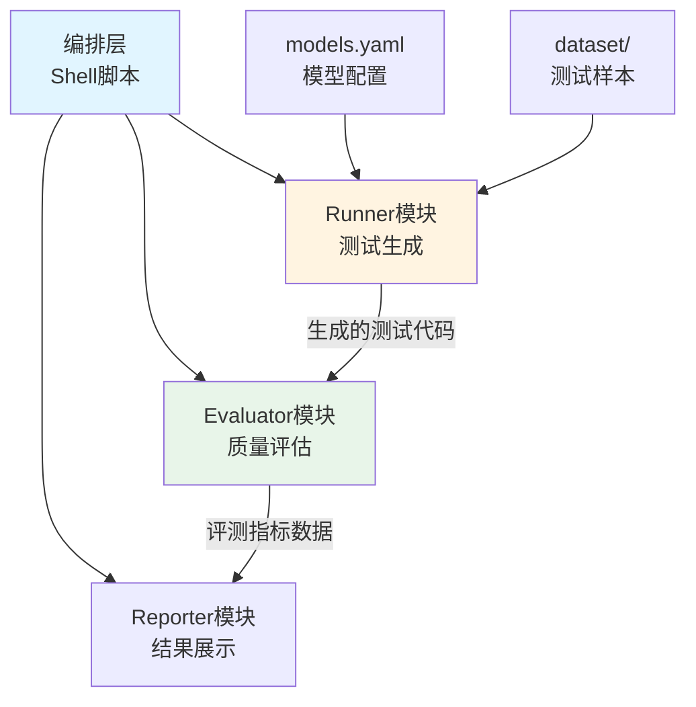

# 2. 评测体系设计

## 评测方案总体设计

ut-bench评测方案采用横向对比基准测试(Benchmark)方法论,通过建立标准化评测体系,系统性地评估和对比不同大语言模型在自动生成单元测试方面的能力差异。评测体系覆盖Java、Python、Go三种编程语言,建立统一的多维度评测指标体系,解决不同模型生成单测质量差异难以量化、缺乏统一评测标准和基准数据集的问题。

评测体系的设计原则包括:标准化(统一的评测流程和数据集)、可重复性(相同的输入产生一致的输出)、可扩展性(支持新增模型和语言)和多维度评估(从正确性、覆盖率、有效性、效率、工程质量五个维度综合评价)。

> Sources:
> [README.md](https://git.tencent.com/ut/ut-bench/blob/a11a49cb0e4bd26fc939914e1547ced334b40812/README.md#L1)

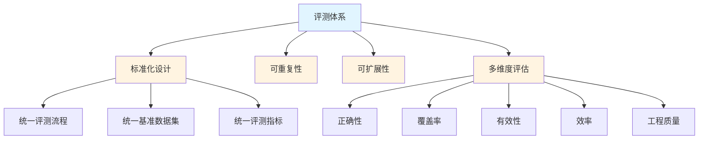

## 评测流水线架构设计

评测流水线采用五阶段设计模式,构建从测试代码生成到质量评估的完整闭环。各阶段按顺序执行,前一阶段的输出作为下一阶段的输入,确保评测过程的一致性和可重复性。流水线设计支持模块化扩展,各阶段可以独立优化和替换。

流水线六个核心阶段包括:测试代码生成、编译验证、测试执行、覆盖率分析、变异测试、评测报告生成。每个阶段都有明确的输入输出和质量标准,通过标准化的接口定义实现模块间的松耦合。

> Sources:
> [README.md](https://git.tencent.com/ut/ut-bench/blob/a11a49cb0e4bd26fc939914e1547ced334b40812/README.md#L24)

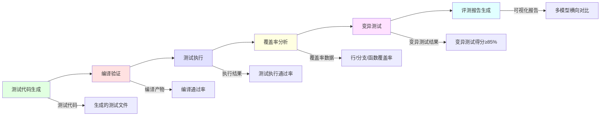

## 测试代码生成阶段

测试代码生成阶段是评测流水线的第一个阶段,由Runner模块负责调用配置的AI模型API,根据数据集中的代码样本自动生成单元测试代码。该阶段的输入包括测试样本文件和模型配置(models.yaml),输出为生成的测试代码文件。

该阶段的质量标准包括:生成的测试代码语法正确、适配对应语言的测试框架(JUnit/pytest/testing)、包含必要的依赖Mock和断言。API调用机制支持错误处理和重试策略,确保网络异常或API限流时有相应的容错机制。

> Sources:
> [README.md](https://git.tencent.com/ut/ut-bench/blob/a11a49cb0e4bd26fc939914e1547ced334b40812/README.md#L50)

## 编译验证阶段

编译验证阶段对生成的测试代码进行编译检查,是评测流水线的第二个阶段,也是测试执行的前置条件。该阶段的输入为生成的测试代码文件,输出包括编译结果文件和编译状态(通过/失败)。

不同编程语言对应不同的编译工具链:Java使用javac编译器,Python是解释型语言使用语法检查,Go使用go build工具。该阶段的质量标准是编译通过率,即成功编译的测试代码数量占总生成数量的比例,反映模型生成语法的正确性。

> Sources:
> [README.md](https://git.tencent.com/ut/ut-bench/blob/a11a49cb0e4bd26fc939914e1547ced334b40812/README.md#L68)

## 测试执行阶段

测试执行阶段负责运行编译通过的测试用例,是评测流水线的第三个阶段。该阶段的输入为编译产物(编译通过的测试代码),输出为测试执行结果和测试报告。

该阶段记录每个测试用例的执行状态(通过/失败/错误),捕获异常信息和堆栈跟踪,支持不同测试框架的配置(JUnit、pytest、Go testing)。质量标准是测试执行通过率,即所有测试用例都通过的样本数量占编译通过数量的比例,反映生成测试用例的功能正确性。

> Sources:
> [README.md](https://git.tencent.com/ut/ut-bench/blob/a11a49cb0e4bd26fc939914e1547ced334b40812/README.md#L69)

## 覆盖率分析阶段

覆盖率分析阶段对执行通过的测试进行覆盖率统计,是评测流水线的第四个阶段。该阶段的输入为测试执行结果,输出为覆盖率数据文件。

该阶段计算三类覆盖率指标:行覆盖率(Line Coverage)测试覆盖的代码行比例、分支覆盖率(Branch Coverage)测试覆盖的分支比例、函数覆盖率(Function Coverage)测试覆盖的函数比例。不同语言使用不同的覆盖率分析工具:Java使用JaCoCo、Python使用coverage、Go使用go tool cover。

> Sources:
> [README.md](https://git.tencent.com/ut/ut-bench/blob/a11a49cb0e4bd26fc939914e1547ced334b40812/README.md#L70)

## 变异测试阶段

变异测试阶段通过注入代码缺陷评估测试用例的有效性,是评测流水线的第五个阶段。该阶段的输入为源代码和测试用例,输出为变异测试报告和变异得分。

变异测试原理是对源代码应用一系列变异操作符(如修改运算符、删除语句等)生成变异体,然后用测试用例执行变异体,统计被测试用例发现的变异体数量占比。质量标准是变异测试得分(Mutation Score)≥85%,这是衡量缺陷检测能力的核心指标。

> Sources:
> [README.md](https://git.tencent.com/ut/ut-bench/blob/a11a49cb0e4bd26fc939914e1547ced334b40812/README.md#L73)

## 评测报告生成阶段

评测报告生成阶段由Reporter模块负责将评测数据转换为可视化报告,是评测流水线的最后阶段。该阶段的输入包括所有阶段的评测数据和指标,输出为可视化评测报告。

报告支持多种格式(JSON、CSV、HTML),包含多模型横向对比数据和多维度分析展示,支持按语言、复杂度、业务场景等维度进行数据聚合。质量标准包括报告的完整性(包含所有评测指标)、清晰度(可视化图表展示)和分析性(支持深入分析)。

> Sources:
> [README.md](https://git.tencent.com/ut/ut-bench/blob/a11a49cb0e4bd26fc939914e1547ced334b40812/README.md#L52)

## 模块协作机制

Runner、Evaluator、Reporter三个核心模块通过明确的接口定义进行协作,实现职责分离和松耦合设计。Runner专注于测试生成,调用AI模型API生成测试代码;Evaluator专注于质量评估,执行编译、测试、覆盖率、变异测试;Reporter专注于结果可视化,生成评测报告。

模块协作机制基于数据驱动原则,各模块通过标准化的数据格式进行交互,Runner生成测试代码文件,Evaluator读取并生成评测数据,Reporter汇总所有数据生成最终报告。这种设计确保系统的可维护性和可扩展性。

> Sources:
> [README.md](https://git.tencent.com/ut/ut-bench/blob/a11a49cb0e4bd26fc939914e1547ced334b40812/README.md#L48)

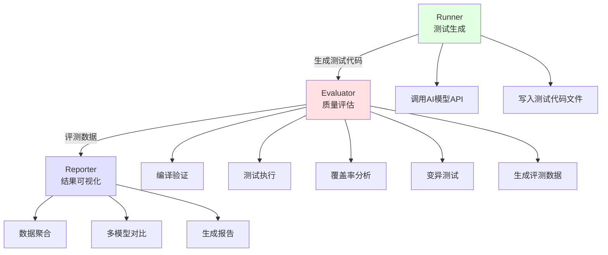

## 数据流转机制

评测流程中的数据流转从测试样本开始,经过多个阶段的转换和处理,最终汇聚为可视化评测报告。数据流转路径包括:测试样本→模型API调用→测试代码生成→编译产物管理→测试执行记录→覆盖率数据收集→变异测试结果汇总→报告数据聚合。

每个阶段都有明确的输入输出格式,通过文件系统作为数据中转介质。中间产物按临时目录组织,确保数据可追溯性,支持问题排查和结果复现。最终汇聚的数据包含编译通过率、测试执行通过率、覆盖率指标、变异测试得分等五大维度的评测结果。

> Sources:
> [README.md](https://git.tencent.com/ut/ut-bench/blob/a11a49cb0e4bd26fc939914e1547ced334b40812/README.md#L56)

## 中间产物管理

评测过程中的中间产物包括暂存的测试代码文件、编译产物、覆盖率数据文件、变异测试报告等,通过临时目录进行管理。中间产物按评测任务ID组织,每个任务有独立的临时目录结构。

中间产物的生命周期包括:创建(阶段开始时生成临时文件)、保留(用于问题排查和结果复现)、清理(评测完成后可选清理)。管理策略确保评测过程的可追溯性,同时控制磁盘空间使用,避免大量历史中间产物占用存储资源。

> Sources:
> [README.md](https://git.tencent.com/ut/ut-bench/blob/a11a49cb0e4bd26fc939914e1547ced334b40812/README.md#L59)

## 流水线质量保障机制

评测流水线的质量保障机制包括各阶段的失败处理策略、错误重试机制、异常捕获和日志记录。单个样本的失败不影响整体评测流程,系统记录失败原因并继续处理下一个样本。

错误重试机制针对可恢复错误(如网络超时、API限流)设置重试次数和退避策略。异常捕获覆盖所有阶段,确保异常不会导致流水线中断。详细的日志记录包括每个阶段的输入输出、执行状态、错误信息,支持问题排查和结果复现。

> Sources:
> [README.md](https://git.tencent.com/ut/ut-bench/blob/a11a49cb0e4bd26fc939914e1547ced334b40812/README.md#L31)

## 评测体系扩展性设计

评测体系的扩展性设计通过配置驱动实现,降低扩展成本。新增模型只需修改models.yaml配置文件,添加模型名称、API密钥、参数设置即可,无需改动核心代码。

新增语言需要扩展语言工具链配置,包括编译器、测试框架、覆盖率分析工具的配置。新增评测指标需要扩展evaluator模块,添加新的指标计算逻辑。新增数据集需要扩展dataset目录,放置对应语言的测试样本。模块化设计确保各扩展点相互独立,互不影响。

> Sources:
> [README.md](https://git.tencent.com/ut/ut-bench/blob/a11a49cb0e4bd26fc939914e1547ced334b40812/README.md#L54)

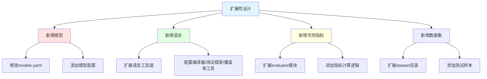

# 2.1. 评测方案总体设计

## 设计目标与价值定位

评测方案的核心设计目标是建立可量化的模型对比体系，解决不同模型生成单测质量差异难以量化的问题。通过建立标准化的评测体系和自动化流水线，为 CSIG 单测质量防护体系的模型选型和能力优化提供关键数据支撑。

评测方案需实现三大关键能力：标准化评测、自动化执行、多维度分析。标准化评测确保评测过程的一致性和可复现性；自动化执行实现从测试代码生成到质量评估的端到端自动化；多维度分析支持按语言、复杂度、场景等多维度的深入分析。

评测方案与工程实践的价值关联体现在为模型能力优化提供数据反馈，通过持续积累评测结果数据，形成模型能力评估的基准线，推动模型在单元测试生成领域的持续改进。

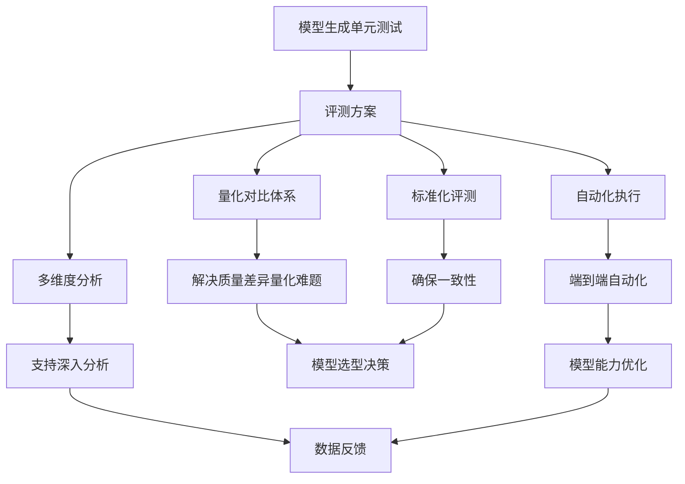

## 评测覆盖范围界定

**编程语言覆盖范围**：评测方案覆盖 Java、Python、Go 三种主流编程语言。选择依据是这三种语言在企业级应用开发中的广泛使用，代表不同的编程范式和类型系统特性，能够全面评估模型在不同语言环境下的测试生成能力。

**代码复杂度维度**：采用分级策略，从简单纯函数到复杂业务场景进行分层覆盖。简单级涵盖基础函数和工具类，中级包含类实例方法和对象交互，高级涉及复杂业务逻辑、异步处理和多重条件分支。

**业务场景类型**：覆盖工具类、服务类、数据处理类、网络IO、文件IO等典型场景。工具类场景侧重无状态方法的测试；服务类场景关注对象状态和行为；数据处理类场景重点测试算法逻辑；网络IO和文件IO场景模拟外部依赖的处理策略。

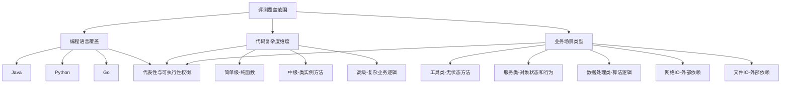

> Sources:
> [dataset/](https://git.tencent.com/ut/ut-bench/blob/a11a49cb0e4bd26fc939914e1547ced334b40812/dataset/)

## 横向对比基准测试方法论

横向对比基准测试方法的核心思想是**在同一数据集和评测条件下，对比不同模型的表现**。该方法摒弃单一模型的局限性，通过横向对比揭示不同模型的真实性能差异，为模型选型提供客观依据。

基准测试的关键特征是**控制变量法设计**，确保评测的公平性和一致性。所有参评模型使用相同的测试样本数据集、相同的评测指标定义和相同的执行环境配置，唯一变量是模型本身。这种设计消除了外部干扰因素，使评测结果真正反映模型能力的差异。

标准化流程包含三个统一：统一的测试样本确保测试挑战的对等性、统一的评测指标确保评估标准的相同性、统一的执行环境确保计算资源的一致性。通过这三重统一，保证评测结果的可复现性和可对比性，不同时间、不同环境的评测结果具备可比性。

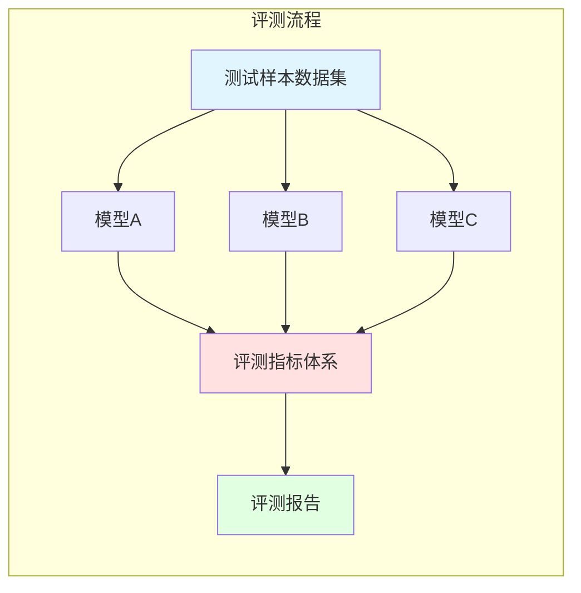

> Sources:
> [scripts/run_benchmark.sh](https://git.tencent.com/ut/ut-bench/blob/a11a49cb0e4bd26fc939914e1547ced334b40812/scripts/run_benchmark.sh)

## 评测体系标准化设计原则

**指标体系的科学性**：评测体系从五个维度建立量化指标，确保评估的全面性和客观性。正确性维度通过编译通过率、测试执行通过率验证生成代码的有效性；覆盖率维度通过行覆盖率、分支覆盖率、函数覆盖率衡量测试的完整性；有效性维度通过变异测试得分（Mutation Score）评估测试用例的缺陷检测能力；效率维度关注测试代码生成和执行的资源消耗；工程质量维度评估代码的可维护性和规范符合度。

**评测流程的自动化**：从生成到质量评估实现全链路自动化，包括：调用模型 API 生成测试代码、编译验证、执行测试、覆盖率分析、变异测试五个阶段。自动化消除人工操作的误差，提升评测效率，支持大规模模型的持续评测。

**结果展示的可视化**：支持多模型横向对比和多维度分析的可视化展示，通过图表直观呈现不同模型在各指标上的表现差异，帮助快速识别模型的强项和弱项，为决策提供直观依据。

**配置管理的灵活性**：通过配置驱动的模型管理机制，新增评测模型仅需修改配置文件，无需改动核心代码。配置文件统一管理 API 配置、参数设置和访问密钥，支持灵活的模型扩展和参数调整。

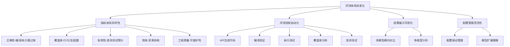

> Sources:
> [benchmark/config/models.yaml](https://git.tencent.com/ut/ut-bench/blob/a11a49cb0e4bd26fc939914e1547ced334b40812/benchmark/config/models.yaml)

## 评测方案整体框架

评测方案构建了三大核心组成部分的协同架构：评测基准数据集、评测执行引擎、评测指标体系。整体架构采用端到端的流水线设计，实现从数据输入到评测输出的完整闭环。

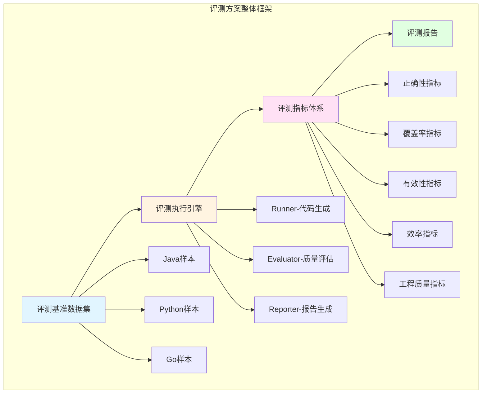

**评测基准数据集**：提供标准化的测试样本，按照编程语言、复杂度、场景类型进行分层组织，数据集为其他组件提供统一的输入基准。

**评测执行引擎**：包含 runner、evaluator、reporter 三个核心模块。runner 负责调用模型 API 生成测试代码；evaluator 执行编译验证、测试执行、覆盖率分析、变异测试，计算各项指标；reporter 将原始数据和指标结果转换为可视化报告。三个模块流水线式协作，数据从 runner 流向 evaluator，最终汇聚于 reporter。

**评测指标体系**：定义了五大维度的量化评估标准，为 evaluator 的计算逻辑提供规范依据，确保评测结果的科学性和一致性。

**可扩展性设计**：框架支持三个层面的扩展：新增语言通过扩展 dataset 中的样本目录实现；新增模型通过配置文件添加 API 配置实现；新增指标通过扩充 evaluator 的计算逻辑和 reporter 的展示逻辑实现。

## 设计与实施约束

**技术选型约束**：评测方案基于 Shell 脚本为核心的编排层，采用模块化组件的实现方式。runner、evaluator、reporter 组件职责清晰，通过标准化的接口实现数据流转，降低组件间的耦合度，提升系统的可维护性。

**性能约束**：评测时间和资源消耗要求可控。通过并行化执行、增量更新等优化策略，确保大规模评测可在合理时间范围内完成；通过资源监控和任务调度，防止评测过程过度消耗系统资源。

**质量约束**：设定关键质量指标的阈值要求，其中变异测试得分 ≥ 85% 作为评测通过的标准线，确保生成的测试用例具备足够的缺陷检测能力。质量指标的设定基于工程实践和行业标准的综合考量。

**可维护性约束**：采用分层文档管理体系，将设计文档、调研报告和评测结果文档分离存储；配置与代码分离，将模型配置、参数设置等可变因素集中管理；代码模块化设计，职责边界清晰，便于后续维护和扩展。

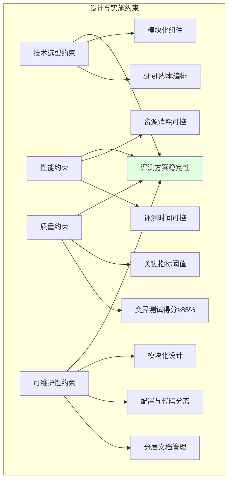

Sources:
[scripts/](https://git.tencent.com/ut/ut-bench/blob/a11a49cb0e4bd26fc939914e1547ced334b40812/scripts/), [benchmark/](https://git.tencent.com/ut/ut-bench/blob/a11a49cb0e4bd26fc939914e1547ced334b40812/benchmark/)

# 2.2. 评测流水线设计

评测流水线是 ut-bench 项目的核心执行架构，采用五阶段流水线模式实现从模型调用到质量评估的端到端自动化。流水线以测试样本为输入，通过 Runner 调用模型 API 生成测试代码，经由 Evaluator 执行编译验证、测试执行、覆盖率分析和变异测试四个质量评估阶段，最终由 Reporter 生成可视化报告。各阶段通过明确的输入输出接口和质量标准紧密协作，确保评测过程的一致性、可重复性和结果可追溯性。

## 流水线整体架构

评测流水线采用标准化的五阶段执行架构，每个阶段承担明确的职责和输出标准。Runner 阶段负责模型调用和测试代码生成，是流水线的入口；Evaluator 承担质量评估职责，包含编译验证、测试执行、覆盖率分析和变异测试四个连续阶段；Reporter 阶段负责数据聚合和可视化报告生成，是流水线的出口。阶段间通过临时文件传递中间产物，每个阶段设置质量门控机制：编译失败则不进入测试执行，测试执行未通过则不进行覆盖率统计，确保只有符合前置条件的阶段才能继续执行。流水线设计强调一致性和可重复性，通过配置驱动和模块化架构支持多模型、多语言的灵活评测。

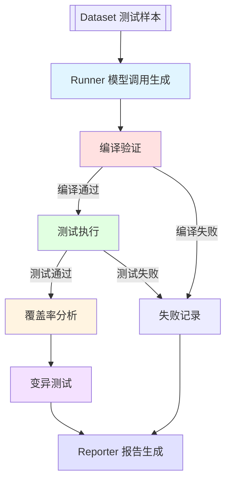

> Sources:
> [README.md](https://git.tencent.com/ut/ut-bench/blob/a11a49cb0e4bd26fc939914e1547ced334b40812/README.md#L1)

## 阶段一：Runner 模型调用生成

Runner 阶段是评测流水线的起始环节，负责调用 AI 模型 API 生成单元测试代码。该阶段从 dataset 目录读取测试样本文件作为输入，通过 config/models.yaml 配置文件获取目标模型的 API 地址、认证信息和参数配置。Runner 遍历每个测试样本，构建提示词并调用模型 API，生成符合目标语言测试框架规范的单元测试代码。生成的测试代码按照统一命名规范输出到指定目录，同时记录生成元数据（生成耗时、Token 消耗等）。质量标准要求生成的测试代码符合目标语言的语法规范和测试框架约束。错误处理机制包括超时控制（防止模型响应超时）、异常捕获（记录 API 调用失败情况）和失败重试（针对网络抖动等临时性问题）。实现细节详见 5.1 Runner 评测执行器章节。

```mermaid
sequenceDiagram
    participant D as Dataset
    participant C as Config
    participant R as Runner
    participant M as Model API
    
    D->>R: 提供测试样本
    C->>R: 模型配置信息
    R->>R: 构建提示词
    R->>M: API 调用
    M-->>R: 返回测试代码
    R->>R: 验证代码规范
    R->>R: 输出测试文件

```

> Sources:
> [README.md](https://git.tencent.com/ut/ut-bench/blob/a11a49cb0e4bd26fc939914e1547ced334b40812/README.md#L1)

## 阶段二：编译验证

编译验证阶段是质量评估的第一道门控，负责测试代码的语法正确性检查。该阶段接收 Runner 生成的测试代码文件作为输入，根据目标语言调用相应的编译器进行编译。对于 Java 项目调用 javac 编译，Python 项目检查 pylint 语法规则，Go 项目调用 go build 编译。编译过程输出编译结果日志和编译状态（成功/失败），成功时生成编译产物（.class 字节码、解释器缓存等），失败时记录详细的编译错误信息。质量标准要求代码必须成功编译且无语法错误、无依赖缺失。失败处理机制包括：编译错误的详细记录、失败样本标记、错误日志归档。编译通过率作为正确性维度的关键指标，反映模型生成测试代码的基础质量水平。

> Sources:
> [README.md](https://git.tencent.com/ut/ut-bench/blob/a11a49cb0e4bd26fc939914e1547ced334b40812/README.md#L1)

## 阶段三：测试执行

测试执行阶段基于编译通过后的测试代码，运行测试用例并统计执行结果。该阶段接收编译后的测试类作为输入，通过目标语言的测试框架执行测试用例。Java 项目使用 JUnit/TestNG 执行器，Python 项目使用 pytest/unittest，Go 项目使用 go test。测试执行过程输出执行日志和测试结果统计，包括测试用例总数、通过数量、失败数量、跳过数量。质量标准要求所有测试用例必须全部通过且无运行时异常。失败处理机制包括：执行结果详细记录、失败原因分析（断言失败、空指针异常、超时等）、异常堆栈信息捕获。测试执行通过率作为正确性维度的另一关键指标，与编译通过率共同评估模型生成测试代码的可运行性和正确性。

> Sources:
> [README.md](https://git.tencent.com/ut/ut-bench/blob/a11a49cb0e4bd26fc939914e1547ced334b40812/README.md#L1)

## 阶段四：覆盖率分析

覆盖率分析阶段在测试执行过程中收集代码覆盖率数据，量化测试代码对被测代码的覆盖程度。该阶段接收测试执行过程中的覆盖率数据作为输入，调用目标语言的覆盖率工具进行统计分析。Java 项目使用 JaCoCo 工具收集行、分支、函数覆盖率，Python 项目使用 coverage.py 工具，Go 项目使用 go tool cover 工具。覆盖率分析输出覆盖率统计报告和各类型覆盖率的数值指标。质量标准要求覆盖率指标达到预设阈值（如行覆盖率 ≥ 70%、分支覆盖率 ≥ 60%、函数覆盖率 ≥ 80%）。多语言实现存在工具差异但指标定义统一。覆盖率维度是衡量测试质量的重要指标，反映测试代码对被测代码的检测能力。

```mermaid
graph LR
    A["测试执行"] --> B["Java: JaCoCo"]
    A --> C["Python: coverage.py"]
    A --> D["Go: go tool cover"]
    
    B --> E["行覆盖率"]
    B --> F["分支覆盖率"]
    B --> G["函数覆盖率"]
    
    C --> E
    C --> F
    C --> G
    
    D --> E
    D --> F
    D --> G
    
    E --> H["覆盖率报告"]
    F --> H
    G --> H

```

> Sources:
> [README.md](https://git.tencent.com/ut/ut-bench/blob/a11a49cb0e4bd26fc939914e1547ced334b40812/README.md#L1)

## 阶段五：变异测试

变异测试阶段通过注入代码变异体，评估测试用例对缺陷的检测能力，计算变异测试得分（Mutation Score）。该阶段接收被测代码和测试用例作为输入，使用变异测试工具（如 PITest for Java、mutmut for Python、go-mutesting for Go）生成变异体。变异体生成策略包括：算术运算符替换（+ → -）、逻辑运算符翻转（&& → ||）、条件语句修改（if 条件取反）、循环语句修改（while → do-while）等常见变异算子。运行测试用例检测每个变异体是否被杀死（测试用例在变异体上失败），变异测试输出变异测试报告、变异得分、被杀死/存活变异体数量。质量标准要求 Mutation Score ≥ 85%，即至少 85% 的变异体被测试用例杀死。变异测试得分是有效性维度的核心指标，反映测试用例的缺陷检测能力。

```mermaid
graph TD
    A["被测代码 + 测试用例"] --> B["变异体生成"]
    
    B --> C["算术运算符替换"]
    B --> D["逻辑运算符翻转"]
    B --> E["条件语句修改"]
    B --> F["循环语句修改"]
    
    C --> G["运行测试用例"]
    D --> G
    E --> G
    F --> G
    
    G --> H["变异体存活/杀死统计"]
    H --> I["计算 Mutation Score"]
    
    C -.->|等效变异体| J["排除"]
    D -.-> J
    E -.-> J
    F -.-> J

```

> Sources:
> [README.md](https://git.tencent.com/ut/ut-bench/blob/a11a49cb0e4bd26fc939914e1547ced334b40812/README.md#L1)

## 阶段六：Reporter 报告生成

Reporter 阶段负责数据聚合和可视化报告生成，将前五个阶段的评测数据和指标计算结果转换为易于理解的分析报告。该阶段接收原始评测数据（编译结果、测试执行记录、覆盖率数据、变异测试结果）和指标计算结果（编译通过率、测试执行通过率、覆盖率指标、变异得分）作为输入。Reporter 按照多维度（按模型、按语言、按复杂度、按场景）进行数据聚合和对比分析，生成可视化报告文件，支持多种格式（JSON 原始数据、CSV 统计表格、HTML 交互式报告）。报告内容包括多模型横向对比、多维度分析趋势、指标分布散点图、雷达图对比等可视化元素。实现细节详见 5.3 Reporter 报告生成器章节。

```mermaid
graph LR
    A["编译结果"] --> D["Reporter"]
    B["测试执行记录"] --> D
    C["覆盖率数据"] --> D
    E["变异测试结果"] --> D
    
    D --> F["数据聚合"]
    F --> G["多维度分析"]
    G --> H["可视化报告"]
    
    H --> I["JSON 原始数据"]
    H --> J["CSV 统计表格"]
    H --> K["HTML 交互式报告"]

```

> Sources:
> [README.md](https://git.tencent.com/ut/ut-bench/blob/a11a49cb0e4bd26fc939914e1547ced334b40812/README.md#L1)

## 流水线质量标准与协作机制

评测流水线建立五大维度的统一质量标准体系。正确性维度通过编译通过率和测试执行通过率衡量，覆盖率维度包含行覆盖率、分支覆盖率、函数覆盖率三类指标，有效性维度通过变异测试得分评估，效率维度记录生成耗时和 Token 消耗，工程质量维度评估 Mock 准确率和断言充分性。各阶段设置严密的门控机制：编译失败则终止该样本后续阶段并标记为失败，测试执行失败则跳过覆盖率统计和变异测试但记录失败原因，确保资源合理利用和结果准确性。阶段间数据流转通过临时文件传递中间产物，每阶段输出下一阶段的标准输入格式。失败降级策略包括：单阶段失败不影响其他样本运行、错误样本详细记录、整体报告包含失败样本统计。流水线设计强调一致性和可重复性，通过标准化接口和配置驱动实现自动化和多模型横向对比。

```mermaid
graph TB
    subgraph "质量标准体系"
        Q1["正确性: 编译通过率, 测试执行通过率"]
        Q2["覆盖率: 行/分支/函数覆盖率"]
        Q3["有效性: Mutation Score"]
        Q4["效率: 生成耗时, Token消耗"]
        Q5["工程质量: Mock准确率, 断言充分性"]
    end
    
    subgraph "门控机制"
        G1["编译失败 → 终止"]
        G2["测试失败 → 跳过覆盖率"]
        G3["记录失败样本数据"]
    end
    
    subgraph "数据流转"
        F1["临时文件传递"]
        F2["标准化接口"]
        F3["配置驱动"]
    end
    
    Q1 --> G1
    Q1 --> G2
    G1 --> G3
    G2 --> G3

```

Sources:
[README.md](https://git.tencent.com/ut/ut-bench/blob/a11a49cb0e4bd26fc939914e1547ced334b40812/README.md#L1)

# 2.3. 模块协作与数据流转

## 模块职责概览

ut-bench 评测系统采用模块化架构设计，核心功能由三个独立模块协同完成：

- **Runner（评测执行器）**：负责调用配置的 AI 模型 API，根据数据集中的代码样本生成单元测试代码。该模块是测试生成的核心入口，将待测源代码和测试需求转换为目标语言的测试代码。
- **Evaluator（评测指标计算）**：承担质量评估职责，对生成的测试代码执行编译验证、测试执行、覆盖率分析和变异测试等任务。该模块计算包括编译通过率、测试执行通过率、行覆盖率、分支覆盖率、函数覆盖率、变异测试得分等关键指标。
- **Reporter（评测报告生成）**：将评测过程的原始数据和指标计算结果转换为可视化报告。该模块支持多模型横向对比和多维度分析展示，将定量的评测数据转化为可读性强的分析报告。

三个模块通过标准化接口实现松耦合协作，每个模块专注于单一职责，便于独立维护和扩展。

相关代码

- [benchmark/runner/](https://git.tencent.com/ut/ut-bench/blob/a11a49cb0e4bd26fc939914e1547ced334b40812/benchmark/runner/)
- [benchmark/evaluator/](https://git.tencent.com/ut/ut-bench/blob/a11a49cb0e4bd26fc939914e1547ced334b40812/benchmark/evaluator/)
- [benchmark/reporter/](https://git.tencent.com/ut/ut-bench/blob/a11a49cb0e4bd26fc939914e1547ced334b40812/benchmark/reporter/)


------

## 模块协作关系

三个核心模块通过流水线模式协同工作，实现端到端的评测流程：

1. **编排层（Shell 脚本）**：scripts/run_benchmark.sh 作为评测流程的总入口，负责环境初始化、参数解析、模块调用顺序控制和流程编排。
2. **模块调用流程**：
   - Runner 接收待测样本和模型配置，调用 AI 模型 API 生成测试代码
   - Evaluator 接收生成的测试代码，按照 pipeline 顺序执行编译、测试执行、覆盖率分析、变异测试
   - Reporter 汇聚 Evaluator 的指标计算结果，生成可视化报告并输出到 results 目录
3. **并行执行支持**：系统支持单模型评测（通过 --model 参数）和单语言评测（通过 --lang 参数），可根据需求灵活配置评测范围。

```mermaid
graph TD
    A["run_benchmark.sh<br/>编排层"] --> B["Runner<br/>测试生成"]
    A --> C["dataset/<br/>评测基准数据集"]
    C --> B
    B --> D["Evaluator<br/>指标计算"]
    D --> D1["编译验证"]
    D --> D2["测试执行"]
    D --> D3["覆盖率分析"]
    D --> D4["变异测试"]
    D --> E["Reporter<br/>报告生成"]
    E --> F["results/<br/>评测结果存档"]
    A --> G["models.yaml<br/>模型配置"]
    G --> B
    style A fill:#e1f5e1
    style F fill:#fff4e1

```

相关代码

- [scripts/run_benchmark.sh](https://git.tencent.com/ut/ut-bench/blob/a11a49cb0e4bd26fc939914e1547ced334b40812/scripts/run_benchmark.sh)


------

## 接口定义与依赖

模块间通过标准化接口实现数据传递和功能调用：

1. **配置接口**：Runner 通过读取 benchmark/config/models.yaml 获取参评模型的 API 配置、参数设置和访问密钥。该配置文件是系统灵活性和可扩展性的关键支撑，新增评测模型仅需修改配置文件，无需改动核心代码。
2. **数据传递格式**：
   - Runner 输出：生成的测试代码文件
   - Evaluator 输入：测试代码路径、待测源代码路径
   - Evaluator 输出：结构化的指标数据（JSON 格式）
   - Reporter 输入：指标数据文件
   - Reporter 输出：可视化报告文件（HTML/Markdown）
3. **依赖关系**：
   - Runner 依赖 models.yaml 配置文件
   - Evaluator 依赖 Runner 生成的测试代码文件
   - Reporter 依赖 Evaluator 生成的指标数据文件
   - 模块间无循环依赖，确保清晰的依赖流向

相关代码

- [benchmark/config/models.yaml](https://git.tencent.com/ut/ut-bench/blob/a11a49cb0e4bd26fc939914e1547ced334b40812/benchmark/config/models.yaml)


------

## 数据流转机制

数据从测试样本到最终报告的流转路径如下：

1. **输入阶段**：从 dataset 目录读取待测源代码样本，按编程语言（java、python、go）组织。
2. **生成阶段**：Runner 将样本代码和测试需求发送给配置的 AI 模型 API，获取生成的测试代码并暂存到临时目录。
3. **评估阶段**：Evaluator 按照 pipeline 流程处理测试代码：
   - 编译验证：编译测试代码，记录编译通过率
   - 测试执行：运行测试用例，记录测试执行通过率
   - 覆盖率分析：计算行覆盖率、分支覆盖率、函数覆盖率
   - 变异测试：评估缺陷检测能力，目标是 Mutation Score ≥ 85%
4. **输出阶段**：Reporter 将指标数据转换为多模型横向对比分析报告，存储到 results 目录。

```mermaid
graph LR
    A["dataset/<br/>待测源代码"] -->|读取| B["Runner"]
    B -->|生成| C["测试代码<br/>临时文件"]
    C --> D["Evaluator Pipeline"]
    D --> D1["编译验证<br/>编译通过率"]
    D --> D2["测试执行<br/>执行通过率"]
    D --> D3["覆盖率分析<br/>行/分支/函数覆盖率"]
    D --> D4["变异测试<br/>Mutation Score"]
    D1 --> E["指标数据<br/>JSON 结构"]
    D2 --> E
    D3 --> E
    D4 --> E
    E --> F["Reporter"]
    F --> G["可视化报告<br/>存储到 results/"]
    style A fill:#e3f2fd
    style G fill:#fff4e1

```

相关代码

- [scripts/run_benchmark.sh](https://git.tencent.com/ut/ut-bench/blob/a11a49cb0e4bd26fc939914e1547ced334b40812/scripts/run_benchmark.sh)
- [benchmark/evaluator/executor.py](https://git.tencent.com/ut/ut-bench/blob/a11a49cb0e4bd26fc939914e1547ced334b40812/benchmark/evaluator/executor.py)


------

## 中间产物管理

为确保评测过程的可追溯性和资源的合理利用，系统对中间产物进行统一管理：

1. **临时目录管理**：评测过程中创建的临时目录用于存储生成的测试代码、编译产物和执行日志。临时目录在评测完成后自动清理，避免占用过多磁盘空间。
2. **测试代码暂存**：Runner 生成的测试代码文件按模型名称和样本 ID 组织命名，便于追踪和调试。例如：`{model_name}/{sample_id}_test.java`。
3. **编译产物收集**：编译验证产生的中间文件（如 .class 文件）和编译日志被记录到指定目录，用于分析编译失败原因。
4. **执行结果记录**：测试执行的输出日志、覆盖率报告和变异测试结果以结构化格式存储，包括：
   - 编译日志和编译状态
   - 测试执行日志和通过/失败状态
   - 覆盖率详细数据（行级、分支级、函数级）
   - 变异测试的存活变异体列表和得分
5. **结果归档**：所有评测数据和最终报告统一存储在 results 目录，按评测批次进行归档，支持历史数据的查询和对比分析。

相关代码

- [scripts/run_benchmark.sh](https://git.tencent.com/ut/ut-bench/blob/a11a49cb0e4bd26fc939914e1547ced334b40812/scripts/run_benchmark.sh)
- [benchmark/evaluator/executor.py](https://git.tencent.com/ut/ut-bench/blob/a11a49cb0e4bd26fc939914e1547ced334b40812/benchmark/evaluator/executor.py)

# 3. 评测指标体系

## 评测指标体系概述

评测指标体系是 ut-bench 平台的核心组件，通过构建五大维度的统一评测标准，为不同大语言模型的单元测试生成能力提供公平量化的对比基准。该指标体系遵循多角度、可量化、可对比的设计原则，既关注生成测试的基本质量，也衡量代码覆盖程度，并通过变异测试评估缺陷检测能力。同时体系还考虑了模型生成的效率以及工程实用性，形成了一个全面、立体的评测标准。

该指标体系支撑了 ut-bench 平台从生成到质量量化的全链路自动化评测流程，确保评测过程的一致性和可重复性。

```mermaid
flowchart TD
    A["评测指标体系"] --> B["正确性维度"]
    A --> C["覆盖率维度"]
    A --> D["有效性维度"]
    A --> E["效率维度"]
    A --> F["工程质量维度"]
    
    B --> B1["编译通过率"]
    B --> B2["测试执行通过率"]
    
    C --> C1["行覆盖率"]
    C --> C2["分支覆盖率"]
    C --> C3["函数覆盖率"]
    
    D --> D1["变异测试得分"]
    
    E --> E1["生成耗时"]
    E --> E2["Token消耗"]
    
    F --> F1["Mock准确率"]
    F --> F2["断言充分性"]

```

## 正确性维度

正确性维度通过指标的测量，评估生成测试的基本质量。该维度包含编译通过率和测试执行通过率两个核心指标，分别衡量生成测试代码的语法正确性和逻辑正确性。编译通过率反映模型能否生成符合目标语言规范的代码，测试执行通过率则体现测试用例是否能正确执行并验证目标功能。详细内容请查看 3.1 正确性与覆盖率指标 章节。

## 覆盖率维度

覆盖率维度衡量生成测试对目标代码的覆盖程度，通过量化指标评估测试的全面性。该维度包含行覆盖率、分支覆盖率和函数覆盖率三个指标。行覆盖率反映测试执行到的代码行比例，分支覆盖率评估条件分支的测试完备性，函数覆盖率统计被调用的函数或方法数量。这些指标综合体现了测试用例对目标代码的探索深度和广度。详细内容请查看 3.1 正确性与覆盖率指标 章节。

## 有效性维度

有效性维度通过变异测试得分这一核心指标，评估测试用例的缺陷检测能力。变异测试通过在目标代码中注入合理的代码缺陷，模拟真实的程序错误，然后运行测试用例验证其是否能够检测到这些缺陷。如果测试用例发现了变异，说明测试有效；如果所有变异都被发现，则表明测试具有较高的缺陷检测能力。该维度聚焦于测试用例的实际价值，而非仅关注覆盖表面的代码区域。详细内容请查看 3.2 有效性与变异测试 章节。

## 效率维度

效率维度评估模型生成测试的性能表现，包含生成耗时和 Token 消耗两个指标。生成耗时衡量模型从接收到测试请求到返回测试代码的时间开销，反映模型的响应速度和计算效率。Token 消耗统计生成过程中的输入和输出 Token 数量，表征模型的资源使用情况和经济成本。这些指标帮助评估不同模型在实际应用场景下的可扩展性和成本效益。详细内容请查看 3.3 效率与工程质量指标 章节。

## 工程质量维度

工程质量维度评估测试用例的实用性和可维护性，包含 Mock 准确率和断言充分性两个指标。Mock 准确率衡量测试中对外部依赖的模拟是否合理、是否遵循最佳实践，直接影响测试的稳定性和可信度。断言充分性评估测试用例中包含的断言数量和质量，反映测试对预期结果的验证强度。高质量测试应包含明确、必要的断言，确保在目标行为偏离预期时能够及时发现问题。该维度关注生成的测试代码是否适合长期维护和团队协作。详细内容请查看 3.3 效率与工程质量指标 章节。

# 3.1. 正确性与覆盖率指标

## 正确性指标概述

正确性指标是评测体系中衡量生成测试代码基本可用性的第一维度。正确性从编译和执行两个层面评估测试代码：编译通过率反映模型是否掌握目标语言语法和测试框架规范，测试执行通过率反映模型生成的测试用例是否具备逻辑正确性。正确性指标与覆盖率、有效性等后续维度形成递进关系，只有正确性达标才能进行更深入的质量评估。

## 编译通过率

编译通过率衡量生成的测试代码能够成功编译的比例。计算公式为：编译通过的样本数 / 总样本数 × 100%。该指标反映模型是否掌握目标语言（Java/Python/Go）的语法规则、类型检查以及JUnit/pytest/go test等测试框架的使用规范。不同语言的编译验证机制存在差异：Java通过javadoc或javac编译、Python进行语法检查、Go通过go build验证。高编译通过率是模型具备基础编码能力的前提，但无法保证测试逻辑的正确性。

## 测试执行通过率

测试执行通过率衡量编译通过后测试用例全部执行成功的比例。计算公式为：测试执行通过的样本数 / 编译通过的样本数 × 100%。该指标反映生成的测试用例是否具备逻辑正确性，包括断言是否合理、Mock是否准确、依赖注入是否完整。测试执行通过率与编译通过率呈联动关系：高编译通过率但低执行通过率说明模型能生成语法正确但逻辑错误的测试。该指标在评测流水线的第二阶段（编译验证后）计算。

## 正确性指标的应用场景

正确性指标在模型选型和工程实践中具有关键应用。高编译通过率可快速筛选具备基本能力的模型，过滤掉语言基础薄弱的选项。高编译通过率但低测试执行通过率能识别生成逻辑错误的模型，需要优化提示词或选择更强模型。为新模型引入设定质量阈值时，通常要求编译通过率≥90%、测试执行通过率≥80%作为基本准入标准。

## 覆盖率指标概述

覆盖率指标从代码覆盖程度量化测试代码的质量，包括行覆盖率、分支覆盖率和函数覆盖率三个维度。覆盖率与有效性指标（变异测试得分）形成互补：覆盖率衡量测试的广度，变异测试衡量测试的深度。高覆盖率不一定代表高质量测试，但低覆盖率通常意味着测试不够全面，是初步筛查测试质量的有效手段。

## 行覆盖率

行覆盖率衡量测试执行过程中被执行到的代码行数与总代码行数的比例。计算公式为：被执行的代码行数 / 总代码行数 × 100%。该指标反映测试是否覆盖了被测函数的主要逻辑路径。行覆盖率的局限性在于无法反映分支条件和异常情况，如if语句的else分支可能未被覆盖。不同语言使用不同工具计算：Java使用JaCoCo、Python使用coverage、Go使用go tool cover。行覆盖率是覆盖率指标中最基础但最粗粒度的度量。

```mermaid
graph LR
    A["测试代码执行"] --> B["收集代码行数据"]
    B --> C["JaCoCo - Java"]
    B --> D["coverage - Python"]
    B --> E["go tool cover - Go"]
    C --> F["计算行覆盖率 = 执行行数 / 总行数"]
    D --> F
    E --> F

```

> Sources:
> [README.md](https://git.tencent.com/ut/ut-bench/blob/a11a49cb0e4bd26fc939914e1547ced334b40812/README.md#L1)

## 分支覆盖率

分支覆盖率衡量测试执行过程中执行到的条件分支数与总条件分支数的比例。计算公式为：执行到的分支数 / 总分支数 × 100%。该指标反映测试是否覆盖了所有可能的判断逻辑，包括if/else、switch/case、三元运算等。分支覆盖率比行覆盖率具有更高敏感度，能够发现未测试的边界条件和异常分支。不同语言对分支覆盖率计算的标准存在差异：如Python的coverage工具将复合条件的每个原子条件视为独立分支，而JaCoCo则按完整条件语句计算。分支覆盖率是评估测试逻辑完整性的关键指标。

## 函数覆盖率

函数覆盖率衡量测试执行过程中调用到的函数或方法数与总函数数的比例。计算公式为：被调用的函数数 / 总函数数 × 100%。该指标反映测试是否覆盖了模块或类的所有公开方法。函数覆盖率在模块级质量评估中发挥重要作用，能快速发现遗漏的关键功能验证。函数覆盖率与其他覆盖率指标呈关联关系：高函数覆盖率是高行/分支覆盖率的必要非充分条件，即覆盖所有函数不一定保证覆盖所有代码行和分支，但未覆盖函数必然导致低行/分支覆盖率。

```mermaid
graph TB
    A["函数覆盖率 100%"] --> B["所有公开方法被调用"]
    A --> C["必要非充分条件"]
    C --> D["行覆盖率可能 < 100%"]
    C --> E["分支覆盖率可能 < 100%"]
    B --> F["避免遗漏关键功能"]
    D --> G["需要补充测试路径"]
    E --> G

```

> Sources:
> [README.md](https://git.tencent.com/ut/ut-bench/blob/a11a49cb0e4bd26fc939914e1547ced334b40812/README.md#L1)

## 覆盖率指标的综合分析

三个覆盖率指标提供互补的质量评估维度：函数覆盖率评估完整性、行覆盖率评估路径、分支覆盖率评估逻辑。覆盖率阈值设定建议为：函数覆盖率≥100%、行覆盖率≥80%、分支覆盖率≥70%。覆盖率指标与测试用例数量存在权衡关系，避免为追求高覆盖率而编写大量低质量测试。理想的覆盖率组合是高函数覆盖率+高行覆盖率+高分支覆盖率，但需结合变异测试得分进一步验证测试有效性。

## 正确性与覆盖率指标的关联分析

正确性与覆盖率指标呈现不同的组合模式，反映模型能力的不同侧面。高正确性+高覆盖率（理想状态）说明模型能力强，能生成正确且全面的测试。高正确性+低覆盖率说明模型能生成正确测试但覆盖不足，需要引导模型生成更全面的测试用例。低正确性+高覆盖率说明生成测试覆盖广但存在逻辑错误，需要优化提示词或选择更强大模型。通过指标组合分析可以指导针对性优化，如结合正确性差异定位逻辑问题，结合覆盖率差异引导扩展测试场景。

## 指标计算实现要点

正确性和覆盖率指标在ut-bench系统中通过标准化流程计算。编译通过率在评测流水线第一阶段（run_benchmark.sh的编译环节）计算，通过检查编译退出码统计通过样本数。测试执行通过率在第二阶段（编译验证后）计算，通过执行测试并检查退出码和断言统计通过样本数。覆盖率分析在第三阶段通过覆盖率工具自动收集数据，Java使用JaCoCo生成jacoco.exec报告，Python使用coverage生成coverage.xml，Go使用go tool cover生成profile.out。指标数据按标准化格式存储，支持多模型横向对比分析。Evaluator模块负责指标计算的编排和数据汇总。

## 注意事项与局限性

覆盖率指标无法衡量测试的有效性，高覆盖率可能包含弱断言或冗余测试，需结合变异测试得分（Mutation Score，详见3.2有效性指标）评估测试质量。正确性和覆盖率指标依赖于数据集的代表性，不同场景下的指标可能差异显著，选择数据集需兼顾覆盖范围和业务典型性。指标计算的前提条件是配置正确的测试框架和覆盖率工具，详见9.1快速开始文档。覆盖率指标仅反映被测代码的覆盖程度，不直接反映测试的工程质量（如可维护性、可读性），需要结合工程质量维度综合评估。

# 3.2. 有效性与变异测试

## 有效性维度概述

有效性维度是ut-bench项目五大评测体系之一，关注测试用例的缺陷检测能力。与正确性维度关注测试能否通过、覆盖率维度关注代码执行范围不同，有效性维度衡量测试用例发现真实缺陷的能力。正确性保证测试的完整性，覆盖率保证测试的广度，有效性保证测试的深度，三者构成质量评估的完整基础。

## 变异测试基本概念

变异测试通过人为在源代码中注入细小变化模拟真实缺陷。这些注入的变化称为变异体。运行测试用例验证变异体是否被检测到：被测试用例检测到的变异体称为"killed"，未被检测到的称为"survived"。变异测试将抽象的缺陷概念转化为可操作的检测场景。

## 变异测试机制原理

变异测试包含三个核心阶段：

```mermaid
graph TD
    A["源代码"] --> B["变异体生成"]
    B --> C["应用变异操作符"]
    C --> D["变异体集合"]
    D --> E["测试执行"]
    E --> F["结果分析"]
    F --> G["Killed Mutants"]
    F --> H["Survived Mutants"]
    F --> I["Equivalent Mutants"]

```

1. **变异体生成**：对源代码应用变异操作符创建大量变异体
2. **测试执行**：运行测试用例验证每个变异体
3. **结果分析**：统计killed和survived的变异体数量

变异操作符设计原则包括细粒度、多样性和可编译性,确保模拟真实缺陷场景。

> Sources:
> [README.md](https://git.tencent.com/ut/ut-bench/blob/a11a49cb0e4bd26fc939914e1547ced334b40812/README.md#L73)

## Mutation Score 计算方法

变异测试得分是量化测试有效性的核心指标。

### 计算公式

```javascript
Mutation Score = (Killed Mutants / Total Mutants - Equivalent Mutants) × 100%
```

### 术语定义

- **Killed Mutants**：被测试用例检测到的变异体数量
- **Total Mutants**：生成的变异体总数
- **Equivalent Mutants**：修改后与原代码功能等价的变异体，理论上无法被检测

### 计算示例

假设生成100个变异体，其中5个为等价变异体，测试用例检测到80个变异体：

```javascript
Mutation Score = 80 / (100 - 5) × 100% = 80 / 95 × 100% = 84.2%
```

该值低于85%目标阈值，说明测试用例存在缺陷检测盲区。

> Sources:
> [README.md](https://git.tencent.com/ut/ut-bench/blob/a11a49cb0e4bd26fc939914e1547ced334b40812/README.md#L73)

## 目标阈值≥85%的设定依据

ut-bench项目将变异测试得分目标阈值设定为≥85%，基于以下考量：

### 1. 行业基准参考

85%是业界公认的强测试质量标准，高于此值表明测试用例具有较强的缺陷检测能力，符合业界要求。

### 2. 缺陷检测覆盖要求

85%的阈值确保测试用例能检测到绝大多数潜在的代码缺陷，为工程实践提供可靠的质量保障。

### 3. AI模型能力评估标准

该阈值为不同AI模型单元测试生成能力提供统一、严格的质量衡量标准，支持公平横向对比。

### 质量等级对照表

| Mutation Score 范围 | 测试质量等级 | 说明             |
| :------------------ | :----------- | :--------------- |
| 90% - 100%          | 优秀         | 强缺陷检测能力   |
| 80% - 89%           | 良好         | 较强缺陷检测能力 |
| 70% - 79%           | 中等         | 缺陷检测能力一般 |
| < 70%               | 不足         | 缺陷检测能力较弱 |

\> Sources:

> [README.md](https://git.tencent.com/ut/ut-bench/blob/a11a49cb0e4bd26fc939914e1547ced334b40812/README.md#L73)

## 有效性指标的应用价值

变异测试得分在ut-bench项目评测体系中具有重要应用价值。

### 关键价值

1. **横向对比能力**：为不同AI模型生成测试的缺陷检测能力提供公平量化的对比基准
2. **质量量化评估**：将测试用例质量从主观判断转为客观数值
3. **改进方向指引**：通过分析survived变异体类型，识别测试用例覆盖的缺陷类型盲区
4. **工程实践指导**：为CSIG单测质量防护体系提供科学的数据支撑

### 与覆盖率指标的区别

| 指标   | 衡量对象     | 关注重点   |
| :----- | :----------- | :--------- |
| 覆盖率 | 代码执行范围 | 测试的广度 |
| 有效性 | 缺陷检测能力 | 测试的深度 |

测试用例可能达到高覆盖率但有效性低（执行了代码但未检测缺陷），也可能达到高有效性但覆盖率低（覆盖了关键逻辑的缺陷）。两者结合提供更全面的测试质量评估。

> Sources:
> [README.md](https://git.tencent.com/ut/ut-bench/blob/a11a49cb0e4bd26fc939914e1547ced334b40812/README.md#L73)

# 3.3. 效率与工程质量指标

## 效率指标概述

效率维度关注模型生成测试的资源和时间成本，是评测体系中的辅助维度。效率指标与质量指标形成互补关系：质量指标评估测试的有效性，而效率指标评估测试生成的经济性。效率评估对于模型选型具有重要价值，特别是在大规模应用场景中，需要在保证测试质量的前提下，控制生成成本和时间开销。

## 生成耗时指标

生成耗时指从发起模型API调用到完成测试代码生成的时间间隔，计量单位为秒或毫秒。计算方法包括单个样本生成耗时、平均生成耗时、最大/最小生成耗时等统计指标。生成耗时记录在评测流程的runner阶段，通过调用模型API的时间戳计算得到。该指标能够反映模型的推理速度和响应性能。

```mermaid
graph LR
    A[发起API调用] -->|记录开始时间| B[模型生成中]
    B -->|接收生成结果| C[记录结束时间]
    C -->|计算时间差| D[生成耗时]
    D -->|汇总统计| E[平均/最大/最小耗时]

```

## Token消耗指标

Token消耗指模型生成测试过程中使用的prompt tokens和completion tokens总量，计算方式为Input Tokens + Output Tokens。该指标记录每个测试样本生成的完整Token使用情况，包括用户输入的提示词和模型输出的测试代码。通过Token消耗可以评估模型的成本效益，计算单个样本Token消耗、每行代码平均Token消耗、Token利用率等衍生指标。

```mermaid
graph LR
    A[输入Prompt] -->|Input Tokens| B[模型处理]
    B -->|Completion Tokens| C[输出测试代码]
    D[Token消耗] -->|Input+Output| E[总Token数]
    E -->|统计分析| F[平均Token消耗]
    E -->|对比分析| G[Token利用率]

```

## 效率指标评价标准

效率指标的评价设置分级的参考标准。生成耗时方面，<30秒为优秀，30-60秒为良好，>60秒需优化。Token消耗需要结合测试代码质量和Token使用效率进行综合评估，不应仅追求低消耗而牺牲测试质量。效率指标与质量指标的权衡分析原则是：在达到质量标准的前提下，优先选择效率更高的模型。

## 工程质量指标概述

工程质量维度关注测试用例的可维护性、可读性和实用性，是评测体系的辅助维度。工程质量指标评估生成的测试代码是否符合工程实践标准，包括代码结构、依赖处理、断言设计等方面。工程质量直接影响测试的长期维护成本，高质量的测试用例易于理解和修改，能够适应被测代码的演进变化。

## Mock准确率指标

Mock准确率指生成的Mock对象或Mock函数的准确程度，评估维度包括：Mock接口匹配度、Mock行为符合性、Mock参数配置正确性、Mock覆盖率。准确率的计算方法为准确Mock数与总Mock依赖数的比值。评估标准分为三级：≥90%为优秀，≥80%为良好，≥70%为及格。Mock准确率反映了模型对被测函数依赖关系的理解能力和测试隔离的正确性。

```mermaid
graph TD
    A[分析依赖关系] -->|识别Mock需求| B[生成Mock对象]
    B --> C[评估准确程度]
    C -->|接口匹配| D[准确Mock数]
    C -->|行为符合| D
    C -->|参数正确| D
    E[总Mock依赖数] --> F[Mock准确率=准确Mock数/总依赖数]

```

## 断言充分性指标

断言充分性指测试用例中断言语句对被测函数核心逻辑的覆盖程度，评估维度包括：断言数量充分性、断言覆盖关键路径、断言覆盖边界条件、断言覆盖异常场景。充分性的计算方法为有效断言数与核心逻辑判定点数的比值。评估标准分为三级：≥85%为优秀，≥75%为良好，≥60%为及格。断言充分性反映模型对测试验证点的设计能力和测试完整度。

## 工程质量指标评价标准

工程质量指标采用综合评价方法，将Mock准确率和断言充分性进行加权评分。不同编程语言的工程质量基准存在差异，例如Java的Mock准确率要求可能高于Python的灵活Mock模式，这与语言的测试生态和惯用实践相关。工程质量指标与测试维护成本呈负相关：工程质量越高，后续维护和修改的成本越低。评价指标应结合实际工程团队的代码规范和测试标准进行定制化设置。

## 效率与工程质量指标的应用场景

效率指标用于模型选型的成本效益分析，评估大规模应用中的资源消耗和时间开销。工程质量指标用于评估测试的长期可维护性，预测后续维护成本和人力投入。效率与工程质量的权衡策略需要综合考虑：高质量的Mock和断言可能增加生成耗时，但能降低长期维护成本。多维度综合评分模型建议权重分配：正确性40% + 有效性30% + 覆盖率15% + 工程质量10% + 效率5%，该权重配置突出了测试质量的核心地位，同时兼顾效率和工程实践。

> Sources:
> [README.md](https://git.tencent.com/ut/ut-bench/blob/a11a49cb0e4bd26fc939914e1547ced334b40812/README.md#L1)

# 4. 评测基准数据集

## 数据集概述

评测基准数据集是 ut-bench 项目的核心基础设施,为多模型单测生成能力横向评测提供标准化和多样化的测试样本集。数据集覆盖 Java、Python、Go 三种主流编程语言,通过复杂度分级和业务场景分类构建多维度的样本空间,解决基准数据缺失问题,为多模型横向对比提供统一的测试样本基础。

> Sources:
> [README.md](https://git.tencent.com/ut/ut-bench/blob/a11a49cb0e4bd26fc939914e1547ced334b40812/README.md#L22), line 22

## 数据集设计原则

数据集设计遵循五大核心原则:代表性,选择真实业务场景的典型代码片段;典型性,覆盖不同编程模式和设计模式;覆盖性,确保各语言、各复杂度、各场景均有充分样本;多样性,避免样本特征过于集中;公平性,确保各模型在面对不同类型样本时都有一致的评测条件。

## 样本选择标准

测试样本的选择标准包含以下维度:代码规模需控制合理范围;功能完整性确保包含输入输出逻辑;复杂度特征需体现控制流复杂度、数据结构复杂度、依赖关系复杂度;可测试性评估是否适合编写单元测试;去重原则避免功能相似的重复样本。

## 复杂度分级策略

样本复杂度采用三级分级策略:简单级(纯函数,无复杂分支,无外部依赖)、中等级(含依赖,含条件判断和循环)、复杂级(含 DB/网络/文件 IO)。每个级别定义明确的量化指标,为模型选型和评测结果分析提供清晰的基准。

> Sources:
> [README.md](https://git.tencent.com/ut/ut-bench/blob/a11a49cb0e4bd26fc939914e1547ced334b40812/README.md#L99), line 99

## 业务场景分类方法

数据集涵盖三类业务场景:工具类(纯计算逻辑、无状态的工具方法)、服务类(业务逻辑处理、封装服务接口)、数据处理类(数据解析、转换、验证)。每类场景具有明确的特征定义,确保评测覆盖实际开发中的常见模式。

> Sources:
> [README.md](https://git.tencent.com/ut/ut-bench/blob/a11a49cb0e4bd26fc939914e1547ced334b40812/README.md#L100), line 100

## 数据集组织结构

```mermaid
graph TD
    A["dataset/"] --> B["java/"]
    A --> C["python/"]
    A --> D["go/"]
    A --> E["README.md"]
    
    B --> B1["simple/"]
    B --> B2["medium/"]
    B --> B3["complex/"]
    
    C --> C1["simple/"]
    C --> C2["medium/"]
    C --> C3["complex/"]
    
    D --> D1["simple/"]
    D --> D2["medium/"]
    D --> D3["complex/"]

```

> Sources:
> [README.md](https://git.tencent.com/ut/ut-bench/blob/a11a49cb0e4bd26fc939914e1547ced334b40812/README.md#L45), line 45

数据集按编程语言分类存储在 dataset/java/、dataset/python/、dataset/go/ 目录下。每个语言目录可按复杂度进一步细分。数据集包含独立的 README.md 文件提供详细说明。

> Sources:
> [README.md](https://git.tencent.com/ut/ut-bench/blob/a11a49cb0e4bd26fc939914e1547ced334b40812/README.md#L45), line 45

## 样本特征分布统计

| 维度       | 分类             | 说明                   |
| :--------- | :--------------- | :--------------------- |
| 编程语言   | Java、Python、Go | 每种语言均有独立目录   |
| 代码复杂度 | 简单、中等、复杂 | 按依赖和逻辑复杂度分级 |

样本分布设计注重均衡性,确保每种语言、每个复杂度级别、每个场景类型都有充足的样本支撑统计显著性。

> Sources:
> [README.md](https://git.tencent.com/ut/ut-bench/blob/a11a49cb0e4bd26fc939914e1547ced334b40812/README.md#L98), line 98

## 样本检索与使用

```mermaid
graph LR
    A["Runner"] --> B["读取数据集"]
    B --> C["按语言筛选"]
    C --> D["按复杂度筛选"]
    D --> E["按场景筛选"]
    E --> F["生成测试代码"]
    F --> G["评测执行"]

```

支持按语言、复杂度、场景等多维度筛选条件组合查询。Runner 模块遍历数据集样本,对各样本调用不同模型 API 生成测试代码,评测结果按样本特征进行多维分析,提供精准的横向对比数据。

## 数据集维护与扩展

数据集维护机制包括:定期补充新样本以覆盖更多编程模式和业务场景;移除过时或代表性不足的样本;保持样本分布的均衡性。贡献新的测试样本需遵循提交规范,确保代码质量和元数据标注格式正确,持续提升数据集的质量和覆盖面。

# 4.1. 数据集设计原则

数据集设计原则是 ut-bench 评测基准数据集构建的核心指导思想，通过系统化的样本选择标准、复杂度分级策略和业务场景分类方法，确保评测数据集的多样性、代表性和公平性。

## 设计目标与基本原则

ut-bench 数据集设计的总体目标是建立标准化评测基准，支持多语言模型横向对比，覆盖多样化工程场景。设计的三大基本原则包括：代表性（样本能真实反映工程实践）、典型性（选取常见代码模式）、覆盖性（全面覆盖各维度特征）。

项目计划覆盖 Java、Python、Go 三种编程语言，涵盖简单、中等、复杂三个代码复杂度级别，以及工具类、服务类、数据处理类三类业务场景，旨在构建能够真实反映 AI 模型单测生成能力的基准数据集。

> Sources:
> [README.md](https://git.tencent.com/ut/ut-bench/blob/a11a49cb0e4bd26fc939914e1547ced334b40812/README.md#L96)

## 样本选择标准

样本选择的三大标准确保数据集质量：代表性标准要求从真实工程中抽取具有广泛代表性的代码样本，确保评测结果对工程实践有指导意义；典型性标准要求选取各语言和场景下的典型代码模式，涵盖常用的数据结构、控制逻辑和 API 使用方式；覆盖性标准确保样本能够覆盖不同的代码特征维度。

通过多维度覆盖，数据集能够评估模型在不同代码特征下的单测生成能力，避免单一类型样本的偏差。

## 复杂度分级策略

ut-bench 采用三级复杂度分级体系，每个级别对应不同的代码特征和测试生成难度：

```mermaid
graph LR
    A["简单级"] --> B["纯函数"]
    A --> C["无外部依赖"]
    A --> D["基础数据类型"]
    A --> E["简单控制流"]
    
    F["中等级"] --> G["含依赖但有独立性"]
    F --> H["类间协作"]
    F --> I["接口调用"]
    F --> J["复杂业务逻辑"]
    
    K["复杂级"] --> L["外部依赖"]
    K --> M["DB/网络/文件IO"]
    K --> N["并发处理"]
    K --> O["资源管理"]
    K --> P["复杂状态变化"]

```

**简单级**：纯函数，无外部依赖，包含基础数据类型、简单控制流、基本异常处理。

**中等级**：含依赖但无外部 IO，包含类间协作、接口调用、复杂业务逻辑。

**复杂级**：含 DB/网络/文件 IO 等外部依赖，包含并发处理、资源管理、复杂状态变化。

这种分级方式能够渐进式评估模型在不同复杂度场景下的测试生成能力，符合实际工程中的代码分布情况。

> Sources:
> [README.md](https://git.tencent.com/ut/ut-bench/blob/a11a49cb0e4bd26fc939914e1547ced334b40812/README.md#L99)

## 业务场景分类方法

业务场景分类依据代码的使用方式和功能特征进行划分，涵盖以下主要场景类型：

**工具类**：纯函数计算、数据转换、格式化等无状态操作，通常代码简洁、逻辑独立。

**服务类**：业务逻辑封装、状态管理、规则引擎等有状态操作，涉及对象间的协作和生命周期管理。

**数据处理类**：数据清洗、聚合、转换等批量操作，通常涉及集合操作、流式处理。

每种场景具有不同的代码模式特征和测试生成挑战，通过场景分类可以针对性评估模型在特定业务场景下的单测生成效果。

> Sources:
> [README.md](https://git.tencent.com/ut/ut-bench/blob/a11a49cb0e4bd26fc939914e1547ced334b40812/README.md#L100)

## 多样性与公平性保障机制

为确保数据集的多样性和公平性，需要从多个维度进行平衡和控制：

- **数量平衡**：各语言、各复杂度、各场景的样本数量保持均衡分布，避免单一维度样本过多导致评测偏差
- **难度分布**：在同一复杂度级别中包含不同难度梯度的样本，避免样本难度过于集中
- **场景权重**：根据工程实践中的实际使用频率调整各场景的样本权重，反映真实开发情况
- **交叉验证**：通过跨语言、跨场景的样本对比验证评测结果的一致性

通过这些机制，数据集能够为不同 AI 模型提供公平、可靠的评测基础。

## 设计原则的应用实践

设计原则在实践中的应用遵循标准化流程：从真实项目源码中选择符合代表性和典型性的代码样本，按照复杂度标准进行分类标记，根据业务场景特征进行归类，通过数量统计确保各维度样本分布均衡。

在此过程中需要避免常见的样本偏差问题，如避免过度关注特定语言特性或业务场景，确保每个维度的样本都有足够的覆盖。

## 数据集质量验证机制

数据集设计完成后的质量验证包含多个环节：

- **人工审查**：确保样本代码质量和分类准确性，验证样本是否真实反映工程实践
- **交叉验证**：不同评审者对样本分类的一致性检查，减少主观偏差
- **场景覆盖度统计**：验证是否覆盖了预定义的所有场景类型，避免遗漏重要场景
- **复杂度梯度检查**：确认同一复杂度级别内难度分布合理，避免难度断层

基于验证反馈持续优化数据集设计，确保数据集始终符合评测需求和质量标准。

# 4.2. 数据集组织结构

## 目录组织方式

数据集采用三级目录结构，按编程语言分类存储测试样本，便于快速定位和管理。

```mermaid
graph TD
    A["dataset/"] --> B["README.md"]
    A --> C["java/"]
    A --> D["python/"]
    A --> E["go/"]
    C --> C1["样本1/"]
    C --> C2["样本2/"]
    C --> C3["..."]
    D --> D1["样本1/"]
    D --> D2["样本2/"]
    E --> E1["样本1/"]
    E --> E2["样本2/"]

```

第一级为 `dataset/` 根目录，包含数据集说明文件 `README.md` 和三个语言子目录。第二级按语言划分为 `java/`、`python/`、`go/` 三个目录，分别存储对应语言的测试样本。第三级为具体测试样本目录，每个目录包含该样本的所有文件。这种层级划分遵循清晰关注点分离原则，语言维度作为一级分类便于快速导航。

> Sources:
> [README.md](https://git.tencent.com/ut/ut-bench/blob/a11a49cb0e4bd26fc939914e1547ced334b40812/README.md)

## 测试样本文件组织格式

每个测试样本包含三类文件：被测源码文件、元数据配置文件和依赖声明文件。

```mermaid
graph LR
    A["样本目录"] --> B["源码文件<br/>.java/.py/.go"]
    A --> C["sample.yaml<br/>元数据配置"]
    A --> D["依赖文件<br/>pom.xml/requirements.txt/go.mod"]
    
    B --> B1["被测类/函数实现"]
    C --> C1["语言、复杂度、场景等"]
    D --> D1["测试框架依赖"]

```

被测源码文件（`.java`/`.py`/`.go`）包含待测试的类或函数实现，是单测生成的目标文件。`sample.yaml` 元数据文件定义样本的属性信息，包括语言类型、复杂度等级、场景类型等关键字段。依赖声明文件根据语言不同而异：Java 为 `pom.xml`（Maven）或 `build.gradle`（Gradle），Python 为 `requirements.txt` 或 `pyproject.toml`，Go 为 `go.mod`，声明测试运行所需的框架依赖。

## 元数据标记字段

`sample.yaml` 文件定义样本的多维属性，用于分类筛选和质量评估。

| 字段            | 类型   | 可选值                                                 | 说明                                               |
| :-------------- | :----- | :----------------------------------------------------- | :------------------------------------------------- |
| language        | string | java, python, go                                       | 语言类型                                           |
| complexity      | string | simple, medium, complex                                | 复杂度等级：简单、中等、复杂                       |
| scenario        | string | utility, service, data-processing, network-io, file-io | 业务场景：工具类、服务类、数据处理、网络IO、文件IO |
| coverage_target | number | 0-100                                                  | 预期覆盖率目标（百分比）                           |
| dependencies    | list   | -                                                      | 依赖关系列表                                       |

语言类型标识样本归属的语言环境，决定评测执行器调用的语言特定工具。复杂度等级样本按代码行数、分支数、圈复杂度等指标分级,用于评估模型对不同难度代码的测试生成能力。场景类型区分样本的业务领域，支持评测模型在不同场景下的测试生成效果。预期覆盖率目标为该样本在理想情况下的覆盖率基准，用于衡量模型效果。依赖关系列出样本运行所需的外部库或框架，确保测试环境正确配置。

> Sources:
> [README.md](https://git.tencent.com/ut/ut-bench/blob/a11a49cb0e4bd26fc939914e1547ced334b40812/README.md)

## 样本覆盖率统计方法

数据集通过多维度交叉统计确保覆盖均衡性和代表性。

```mermaid
graph TD
    A["样本统计"] --> B["语言维度"]
    A --> C["复杂度维度"]
    A --> D["场景维度"]
    
    B --> B1["Java样本数"]
    B --> B2["Python样本数"]
    B --> B3["Go样本数"]
    
    C --> C1["Simple样本数"]
    C --> C2["Medium样本数"]
    C --> C3["Complex样本数"]
    
    D --> D1["Utility样本数"]
    D --> D2["Service样本数"]
    D --> D3["Data Processing样本数"]
    D --> D4["Network IO样本数"]
    D --> D5["File IO样本数"]
    
    B1 --> E["交叉统计<br/>语言×复杂度×场景"]
    B2 --> E
    B3 --> E

```

统计维度包括语言、复杂度和场景类型的交叉覆盖，确保每个语言在每个复杂度等级和场景类型下都有足够样本。分类样本数量分布按语言×复杂度×场景生成三维分布矩阵，验证各组合的样本均衡性。复杂度均衡性验证通过方差分析确保简单、中等、复杂样本比例合理。场景类型完整性检查确认工具类、服务类、数据处理、网络IO、文件IO五种场景在每种语言下都有覆盖。复杂度分级策略和场景分类方法详见 [4.1. 数据集设计原则](https://git.tencent.com/#4.1-数据集设计原则)。

## 样本定位与检索方法

系统提供三种检索方式以便快速定位目标样本集。

基于目录结构直接定位：通过语言目录导航进入目标语言子目录，按样本名称或编号查找。适用于按语言浏览和手动测试特定样本场景。

基于元数据筛选查询：通过解析 `sample.yaml` 文件中的 complexity 和 scenario 字段，使用脚本或工具按条件过滤样本。例如查找所有"中等复杂度的数据处理类样本"，或"复杂的服务类样本"。支持多字段组合查询实现精准定位。

批量检索方案：评测执行器支持按组合条件批量检索样本，提供 `--lang`、`--complexity`、`--scenario` 参数筛选。命令示例：`bash scripts/run_benchmark.sh --lang java --complexity medium --scenario utility` 运行指定条件的定向评测。检索最佳实践是优先使用命令行参数批量执行，避免手动逐个选择样本。

> Sources:
> [README.md](https://git.tencent.com/ut/ut-bench/blob/a11a49cb0e4bd26fc939914e1547ced334b40812/README.md)

# 5. 评测执行引擎

## 引擎架构概述

评测执行引擎是 ut-bench 平台的核心技术组件，承担从调用 AI 模型 API 生成单元测试代码，到执行五阶段质量评估流水线，再到生成可视化分析报告的端到端自动化能力。引擎采用模块化分层设计，将 Runner（评测执行器）、Evaluator（评测计算器）、Reporter（报告生成器）三个核心模块通过标准化接口实现松耦合协作。

Runner 模块负责调用 AI 模型 API 生成测试代码，Evaluator 模块执行编译、测试执行、覆盖率分析和变异测试，Reporter 模块将评测数据转换为可视化报告。模块间通过文件系统和标准化数据格式进行数据流转，确保各模块可独立部署和扩展。

> Sources:
> [README.md](https://git.tencent.com/ut/ut-bench/blob/a11a49cb0e4bd26fc939914e1547ced334b40812/README.md#L48)

```mermaid
graph TD
    A["Dataset<br/>测试样本"] --> B["Runner<br/>评测执行器"]
    B --> C["Generated Tests<br/>测试代码"]
    C --> D["Evaluator<br/>评测计算器"]
    D --> E["Metrics Data<br/>指标数据"]
    D --> F["Logs & Reports<br/>日志报告"]
    E --> G["Reporter<br/>报告生成器"]
    F --> G
    G --> H["Final Reports<br/>最终报告"]
    
    style B fill:#e1f5fe
    style D fill:#e1f5fe
    style G fill:#e1f5fe

```

## Runner 评测执行器

Runner 模块的核心职责是根据评测数据集中的代码样本,调用配置的 AI 模型 API 生成对应的单元测试代码。模块通过读取 models.yaml 配置文件加载各类模型的 API 接口信息，构建统一的模型客户端调用接口。

API 调用机制支持超时控制（默认 60 秒）、异常捕获（网络异常、API 响应异常、内容解析异常）和失败重试（指数退避策略、最大重试次数）等容错机制。针对 Java（JUnit）、Python（pytest）、Go（go test）三种语言的测试框架差异，Runner 在生成逻辑中进行了适配处理。

扩展新 AI 模型只需在 models.yaml 中添加模型配置，无需修改核心代码。生成的测试代码按语言和模型分别存储，便于后续评测流程调用。

> Sources:
> [README.md](https://git.tencent.com/ut/ut-bench/blob/a11a49cb0e4bd26fc939914e1547ced334b40812/README.md#L50)

## Evaluator 评测计算器

Evaluator 模块执行五阶段流水线评估，对 Runner 生成的测试代码进行质量量化。

编译验证子模块针对 Java（javac/mvn）、Python（python -m pytest --collect-only）、Go（go build）构建编译命令，解析编译日志并统计编译通过率。

测试执行子模块调用对应的测试框架执行测试用例，解析测试日志并计算测试执行通过率。

覆盖率分析子模块集成 JaCoCo（Java）、Coverage.py（Python）、go tool cover（Go）工具，从覆盖率数据中提取行覆盖率、分支覆盖率、函数覆盖率三类指标。

变异测试子模块使用 PIT、Mutmut 等工具进行突变测试，计算变异测试得分，目标阈值为 ≥85%。

> Sources:
> [README.md](https://git.tencent.com/ut/ut-bench/blob/a11a49cb0e4bd26fc939914e1547ced334b40812/README.md#L51)

```mermaid
flowchart TD
    A["Generated Tests"] --> B["<b>编译验证</b><br/>Java: javac/mvn<br/>Python: pytest --collect-only<br/>Go: go build"]
    B --> C["编译通过率"]
    C --> D["<b>测试执行</b><br/>JUnit / pytest / go test"]
    D --> E["测试执行通过率"]
    E --> F["<b>覆盖率分析</b><br/>JaCoCo / Coverage.py /<br/>go tool cover"]
    F --> G["行/分支/函数覆盖率"]
    G --> H["<b>变异测试</b><br/>PIT / Mutmut"]
    H --> I["变异测试得分<br/>目标 ≥85%"]
    I --> J["综合指标报告"]
    
    style B fill:#fff3e0
    style D fill:#fff3e0
    style F fill:#fff3e0
    style H fill:#fff3e0

```

## Reporter 报告生成器

Reporter 模块将评测过程的原始数据和 Evaluator 计算的指标结果转换为结构化的可视化报告。

数据聚合模块从编译日志、测试执行日志、覆盖率数据、变异测试结果和元数据信息中提取数据并进行汇总。

报告格式支持 JSON 结构化报告（包含模型信息、数据集信息、指标数据、时间戳等字段）和 CSV 表格报告（便于数据分析工具导入）。

多模型横向对比机制从多个模型的评测结果中提取相同数据集样本的指标值，进行归一化处理和对比分析。多维度分析支持按语言（Java/Python/Go）、按复杂度（简单/中等/复杂）、按业务场景（工具类/服务类/数据处理类）进行指标聚合和可视化图表生成。

> Sources:
> [README.md](https://git.tencent.com/ut/ut-bench/blob/a11a49cb0e4bd26fc939914e1547ced334b40812/README.md#L52)

```mermaid
graph LR
    subgraph Data["数据源"]
        A1["编译日志"]
        A2["测试日志"]
        A3["覆盖率数据"]
        A4["变异测试结果"]
        A5["元数据信息"]
    end
    
    A1 --> B["数据聚合"]
    A2 --> B
    A3 --> B
    A4 --> B
    A5 --> B
    
    B --> C1["JSON报告"]
    B --> C2["CSV报告"]
    B --> C3["可视化图表"]
    
    subgraph Analysis["分析维度"]
        D1["语言维度"]
        D2["复杂度维度"]
        D3["业务场景维度"]
    end
    
    C3 --> D1
    C3 --> D2
    C3 --> D3
    
    D1 --> E["多模型横向对比"]
    D2 --> E
    D3 --> E

```

## 模块接口与使用方法

Runner、Evaluator、Reporter 模块分别对外暴露主要函数接口。Runner 接收代码样本和模型配置，返回生成的测试代码文件路径。Evaluator 接收测试代码路径，返回评测指标字典。Reporter 接收评测数据目录，生成可视化报告文件。

配置参数包括环境变量（模型 API 密钥）、配置文件参数（评测超时时间、并发控制）和命令行参数（模型选择、语言选择）。

模块依赖关系要求按顺序启动：Runner 生成测试代码 → Evaluator 执行评测 → Reporter 生成报告。

环境初始化需要配置 Java 环境（JDK、JUnit）、Python 环境（Python、pytest、coverage.py）、Go 环境（Go 版本、覆盖率工具）以及覆盖率工具（JaCoCo、Coverage.py）和变异测试工具（PIT、Mutmut）。

> Sources:
> [README.md](https://git.tencent.com/ut/ut-bench/blob/a11a49cb0e4bd26fc939914e1547ced334b40812/README.md#L50)

# 5.1. Runner评测执行器

## 模块职责与架构设计

Runner模块是ut-bench评测系统的核心组件，负责调用各AI模型API生成单元测试代码。模块通过统一的接口层实现多模型API的抽象调用,为后续的编译验证、测试执行、覆盖率分析和变异测试提供基础输入。

模块采用分层架构设计,包含模型客户端层、测试生成器层和配置加载器层三个核心组件。模型客户端层封装HTTP请求逻辑,处理不同模型API的差异化参数;测试生成器层负责Prompt构造和结果解析;配置加载器层统一管理models.yaml中的模型配置信息。

```mermaid
graph TB
    subgraph "Runner模块架构"
        A[模型客户端层<br/>ModelClient]
        B[测试生成器层<br/>TestGenerator]
        C[配置加载器层<br/>ConfigLoader]
        D[模型适配器<br/>ModelAdapter]
    end
    
    E[Dataset数据集] --> B
    C --> A
    D --> A
    
    A --> F[AI模型API]
    B --> G[生成的测试代码]
    G --> H[Evaluator模块]
    
    F --> E1[GPT-4o]
    F --> E2[Claude 3.5]
    F --> E3[DeepSeek-V3]
    F --> E4[混元]

```

Runner模块与Evaluator、Reporter模块形成流水线协作关系。Runner生成的测试代码输入到Evaluator模块进行质量评估,所有评测数据最终由Reporter模块生成可视化报告。

> Sources:
> [README.md](https://git.tencent.com/ut/ut-bench/blob/a11a49cb0e4bd26fc939914e1547ced334b40812/README.md#L48)

## API调用机制

统一API调用接口通过模型抽象层实现不同模型API的标准化调用。HTTP请求封装层支持POST请求发送,自动添加认证头和Content-Type。请求参数构造包含上下文窗口限制、温度参数(temperature)、最大生成长度(max_tokens)等核心配置。

响应解析层自动提取生成的测试代码文本,并获取token消耗、生成耗时等效率指标。系统记录输入tokens、输出tokens和总tokens数量,为后续效率维度评估提供数据基础。

请求超时控制默认设置为60秒,防止长时间无响应阻塞评测流程。针对不同模型的API特性,参数适配器自动转换参数名称和格式,确保请求的兼容性。

```mermaid
sequenceDiagram
    participant TG as TestGenerator
    participant MC as ModelClient
    participant MA as ModelAdapter
    participant API as AI模型API
    
    TG->>MC: 调用generate_test()
    MC->>MA: 获取模型配置参数
    MA-->>MC: 返回适配后的参数
    MC->>API: 发送HTTP POST请求
    API-->>MC: 返回响应数据
    MC->>MC: 解析响应提取测试代码
    MC->>MC: 记录token消耗和耗时
    MC-->>TG: 返回生成的测试代码

```

> Sources:
> [README.md](https://git.tencent.com/ut/ut-bench/blob/a11a49cb0e4bd26fc939914e1547ced334b40812/README.md#L81)

## 错误处理与重试机制

错误处理策略覆盖网络异常、API限流、超时、认证失败等常见场景。系统通过异常捕获和分类机制,识别不同类型的失败原因并记录详细错误日志。

失败重试机制采用指数退避策略,可配置最大重试次数和重试间隔。首次重试延迟2秒,后续重试间隔呈指数增长(2秒、4秒、8秒),最大重试时长控制在60秒内,避免持续重试导致的资源浪费。

重试失败后的降级处理策略将失败样本记录到异常日志文件,标注失败原因(网络异常、限流、超时等),供后续人工分析模型能力边界。错误日志包含请求参数、响应状态码、错误消息等完整信息,为模型能力评估提供数据支持。

```mermaid
stateDiagram
    [*] --> 发起请求
    发起请求 --> 成功: 请求成功
    发起请求 --> 捕获异常: 请求失败
    
    捕获异常 --> 判断重试次数: 未达上限
    捕获异常 --> 标记失败: 已达上限
    
    判断重试次数 --> 等待退避: 继续重试
    等待退避 --> 发起请求: 延迟到期
    
    标记失败 --> 记录错误日志: 保存失败原因
    记录错误日志 --> [*]
    
    成功 --> 记录成功指标: 保存token和耗时
    记录成功指标 --> [*]

```

> Sources:
> [README.md](https://git.tencent.com/ut/ut-bench/blob/a11a49cb0e4bd26fc939914e1547ced334b40812/README.md#L54)

## 多语言测试生成差异化处理

针对Java、Python、Go三种语言的测试生成采用差异化配置策略。语言标识参数传递给Prompt生成器,触发对应的语言特定Prompt模板。

各语言的测试框架配置如下:

- Java:JUnit框架,要求测试类注解@Test、断言使用assertEquals/assertTrue
- Python:pytest框架,要求测试函数名以test_开头、断言使用assert语句
- Go:go test框架,要求测试文件以_test.go结尾、使用testing.T进行断言

Prompt工程差异通过模板化和参数注入实现。系统维护各语言的测试代码规范模板,包括import语句结构、测试类/函数声明格式、Mock对象初始化方式等。断言模板根据语言特性自动适配,例如Java使用Expect风格、Python使用assert风格、Go使用t.Errorf风格。

语言特化处理通过配置文件中的language_profiles定义,包括测试框架导入包、标准库Mock支持、异步处理方式等语言特定配置。

```mermaid
graph LR
    A[测试样本] --> B{语言类型判断}
    
    B -->|Java| C[Java Prompt模板]
    B -->|Python| D[Python Prompt模板]
    B -->|Go| E[Go Prompt模板]
    
    C --> C1[JUnit框架配置]
    D --> D1[pytest框架配置]
    E --> E1[go test框架配置]
    
    C1 --> F[生成Java测试代码]
    D1 --> G[生成Python测试代码]
    E1 --> H[生成Go测试代码]

```

> Sources:
> [README.md](https://git.tencent.com/ut/ut-bench/blob/a11a49cb0e4bd26fc939914e1547ced334b40812/README.md#L45)

## 模型扩展支持机制

模型配置的标准化流程通过models.yaml文件实现。配置文件定义了每个模型的标准化配置项:

```yaml
models:
  - name: gpt-4o
    provider: openai
    api_endpoint: https://api.openai.com/v1/chat/completions
    api_key: ${OPENAI_API_KEY}
    max_tokens: 4096
    temperature: 0.7
    context_window: 128000
  - name: deepseek-v3
    provider: deepseek
    api_endpoint: https://api.deepseek.com/v1/chat/completions
    api_key: ${DEEPSEEK_API_KEY}
    max_tokens: 4096
    temperature: 0.7
    context_window: 64000
```

添加新模型的具体步骤:

1. 在models.yaml中添加模型配置条目,指定必要的配置项
2. 如需特殊参数处理,编写模型适配器继承基类并重写参数转换方法
3. 执行连通性验证脚本,确认API密钥和端点配置正确
4. 使用单样本测试API调用功能,验证模型响应格式兼容性

模型抽象接口设计确保新模型接入的一致性。基类定义generate()方法,子类实现参数适配和响应解析逻辑。配置加载器自动读取models.yaml,实例化对应的模型客户端对象。

```mermaid
classDiagram
    class ModelAdapter {
        <<abstract>>
        +generate(prompt, context) TestResult
        +adapt_params(params) AdaptedParams
        +parse_response(response) ParsedResult
    }
    
    class GPTAdapter {
        +generate(prompt, context) TestResult
        +adapt_params(params) AdaptedParams
        +parse_response(response) ParsedResult
    }
    
    class DeepSeekAdapter {
        +generate(prompt, context) TestResult
        +adapt_params(params) AdaptedParams
        +parse_response(response) ParsedResult
    }
    
    class HunyuanAdapter {
        +generate(prompt, context) TestResult
        +adapt_params(params) AdaptedParams
        +parse_response(response) ParsedResult
    }
    
    ModelAdapter <|-- GPTAdapter
    ModelAdapter <|-- DeepSeekAdapter
    ModelAdapter <|-- HunyuanAdapter

```

> Sources:
> [README.md](https://git.tencent.com/ut/ut-bench/blob/a11a49cb0e4bd26fc939914e1547ced334b40812/README.md#L54)

## 测试生成流程

测试生成流程从读取测试样本到完成测试代码生成的端到端处理:

1. 样本读取:从dataset目录遍历指定语言的测试样本文件,读取被测代码源文件
2. Prompt构造:组合被测代码、测试要求、语言标识构造完整Prompt
3. API调用:通过模型客户端调用对应模型的生成接口
4. 结果解析:从API响应中提取生成的测试代码文本
5. 语法验证:检查生成代码的语法完整性,验证import语句、测试类、测试方法等必要元素
6. 结果暂存:将验证通过的测试代码保存到results/{model}/{language}/目录,文件名与原样本对应

流程编排支持批量生成和并发控制。批量生成通过样本队列实现,系统维护待处理样本列表,逐个提交生成任务。并发控制通过信号量限制最大同时请求数,默认并发数为3,避免API限流。

生成结果缓存机制基于样本文件内容哈希,相同样本的重复生成直接返回缓存结果,减少不必要的API调用。

```mermaid
flowchart TD
    A[读取测试样本] --> B[构造Prompt]
    B --> C[检查缓存]
    C -->|命中| D[返回缓存结果]
    C -->|未命中| E[调用模型API]
    E --> F{API调用成功?}
    F -->|是| G[解析响应]
    F -->|否| H[重试机制]
    H --> E
    G --> I[语法验证]
    I --> J{验证通过?}
    J -->|是| K[暂存到临时目录]
    J -->|否| L[记录失败日志]
    K --> M[返回生成结果]
    L --> N[返回失败结果]

```

> Sources:
> [README.md](https://git.tencent.com/ut/ut-bench/blob/a11a49cb0e4bd26fc939914e1547ced334b40812/README.md#L48)

## 性能优化与指标收集

性能优化措施包括:

- API调用并发控制:通过信号量机制限制最大并发请求数,平衡生成速度和API限流风险
- 请求队列管理:使用优先级队列,优先处理高优先级样本(如核心业务代码)
- 生成结果缓存复用:基于样本哈希的缓存机制,避免重复调用相同样本

效率指标收集机制:

- 生成耗时统计:端到端时长(从读取样本到保存结果)、API等待时长(网络传输和处理时间)
- Token消耗统计:输入tokens(Prompt长度)、输出tokens(生成代码长度)、总计tokens
- 成功率统计:一次成功率(无需重试的比例)、重试成功率(重试后成功的比例)、总体失败率

所有指标通过结构化数据格式传递给Evaluator模块,用于后续的效率维度评估。指标数据包含时间戳、模型名称、语言类型、样本标识、耗时、token消耗、成功状态等字段,支持多维度聚合分析。

> Sources:
> [README.md](https://git.tencent.com/ut/ut-bench/blob/a11a49cb0e4bd26fc939914e1547ced334b40812/README.md#L75)

# 5.2. Evaluator评测计算器

## 模块概述与架构设计

Evaluator 模块是 ut-bench 评测执行引擎的核心质量评估组件，负责对 Runner 生成的单元测试代码执行全链路质量评估。模块采用五阶段流水线架构：编译验证 → 测试执行 → 覆盖率分析 → 变异测试 → 指标聚合,依次评估测试代码的正确性、覆盖率和有效性。

模块输入为 Runner 生成的测试代码和 dataset 中的测试样本，输出结构化的评测指标数据，包括编译通过率、测试执行通过率、行覆盖率、分支覆盖率、函数覆盖率以及变异测试得分等关键指标。架构设计遵循接口标准化原则，支持 Java、Python、Go 多语言适配，通过统一的评估接口封装各语言的测试框架和分析工具，确保评测流程的一致性和可扩展性。

```mermaid
graph LR
    A["测试代码输入"] --> B["编译验证阶段"]
    B --> C["测试执行阶段"]
    C --> D["覆盖率分析阶段"]
    D --> E["变异测试阶段"]
    E --> F["指标聚合输出"]
    
    G["Java 工具"] --> B
    H["Python 工具"] --> B
    I["Go 工具"] --> B
    
    G --> C
    H --> C
    I --> C
    
    G --> D
    H --> D
    I --> D
    
    G --> E
    H --> E
    I --> E
    
    F --> J["评测指标JSON"]

```

## 编译验证阶段实现

编译验证阶段评估生成的测试代码能否成功编译通过，是评测流程的第一道质量关卡。针对不同编程语言采用差异化的验证策略：Java 使用 javac 编译器进行标准编译验证；Python 通过 AST 语法分析检查代码语法正确性；Go 调用 go build 命令执行编译验证。

配置参数包括编译超时时间（防止长时间阻塞）、编译器选项（如 Java 的 classpath、Go 的模块路径）等。编译失败时捕获标准错误输出并记录详细信息，包括错误类型、错误行号、错误原因等，便于后续分析模型生成的测试代码质量问题。编译通过率计算公式为：编译成功的样本数 / 总样本数。

```mermaid
flowchart TD
    A["开始编译验证"] --> B{判断语言类型}
    B -->|Java| C["调用 javac 编译器"]
    B -->|Python| D["执行 AST 语法分析"]
    B -->|Go| E["调用 go build 命令"]
    
    C --> F{编译成功?}
    D --> F
    E --> F
    
    F -->|是| G["标记通过"]
    F -->|否| H["捕获错误信息"]
    
    G --> I["统计成功数量"]
    H --> J["记录错误详情"]
    
    I --> K["计算编译通过率"]
    J --> K

```

Sources:
[README.md](https://git.tencent.com/ut/ut-bench/blob/a11a49cb0e4bd26fc93991471547ced334b40812/README.md)

# 5.3. Reporter报告生成器

## 模块功能概述

Reporter模块是ut-bench评测系统的可视化报告生成组件,负责将Evaluator输出的评测数据转换为结构化报告。接收编译通过率、测试执行通过率、覆盖率指标、变异测试得分等原始数据,进行数据聚合与统计分析,最终生成可视化报告。系统支持按语言、复杂度、场景等多维度分析,通过gen_report.sh脚本触发报告生成流程。


```mermaid
graph LR
    A[Evaluator评测结果数据] --> B[Reporter数据聚合]
    B --> C[数据标准化处理]
    C --> D[多维度统计分析]
    D --> E[可视化图表生成]
    D --> F[HTML报告构建]
    E --> G[结构化报告输出]
    F --> G
    G --> H[results/目录存储]

```

> Sources:
> [README.md](https://git.tencent.com/ut/ut-bench/blob/a11a49cb0e4bd26fc939914e1547ced334b40812/README.md#L52)

## 数据聚合机制

数据聚合机制从Evaluator收集五大维度的评测指标:正确性(编译通过率、测试执行通过率)、覆盖率(行/分支/函数覆盖率)、有效性(变异测试得分)、效率(生成耗时、Token消耗)、工程质量(Mock准确率、断言充分性)。通过数据清洗和标准化处理,将原始评测数据转换为结构化格式,并为多维度分析建立索引机制。

```mermaid
graph TD
    subgraph 数据源
        D1[编译通过率]
        D2[测试执行通过率]
        D3[行/分支/函数覆盖率]
        D4[变异测试得分]
        D5[生成耗时]
        D6[Token消耗]
        D7[Mock准确率]
        D8[断言充分性]
    end
    
    subgraph 聚合处理
        P1[数据清洗]
        P2[标准化处理]
        P3[结构化存储]
        P4[索引建立]
    end
    
    D1 --> P1
    D2 --> P1
    D3 --> P1
    D4 --> P1
    D5 --> P1
    D6 --> P1
    D7 --> P1
    D8 --> P1
    
    P1 --> P2
    P2 --> P3
    P3 --> P4

```

> Sources:
> [README.md](https://git.tencent.com/ut/ut-bench/blob/a11a49cb0e4bd26fc939914e1547ced334b40812/README.md#L64)

## 报告格式设计

Reporter支持JSON、CSV等报告格式。JSON格式采用层次化组织结构,按模型维度、语言维度、指标维度进行数据嵌套,便于程序化处理和深度分析。CSV格式采用扁平化表格设计,将评测数据按多维度展开,便于导入Excel等分析工具进行二次处理。报告存储于results目录,通过gen_report.sh脚本触发生成。

```mermaid
graph TD
    subgraph 输入数据
        I1[评测原始数据]
        I2[配置参数]
    end
    
    subgraph 格式转换
        F1[JSON处理器]
        F2[CSV处理器]
    end
    
    subgraph 输出产物
        O1[层次化JSON]
        O2[扁平化CSV]
    end
    
    I1 --> F1
    I1 --> F2
    I2 --> F1
    I2 --> F2
    
    F1 --> O1
    F2 --> O2

```

> Sources:
> [README.md](https://git.tencent.com/ut/ut-bench/blob/a11a49cb0e4bd26fc939914e1547ced334b40812/README.md#L58)

## 多模型横向对比实现

横向对比机制按模型名称聚合评测数据,计算各模型在编译通过率、覆盖率、变异测试得分等指标上的平均值和标准差。通过排名算法展示GPT-4o、Claude 3.5 Sonnet、DeepSeek-V3、混元等模型在各评测维度上的性能差异,突出各模型的优势和劣势,为模型选型提供量化依据。

```mermaid
graph LR
    subgraph 数据聚合
        A1[GPT-4o数据]
        A2[Claude数据]
        A3[DeepSeek数据]
        A4[混元数据]
    end
    
    subgraph 统计分析
        B1[平均值计算]
        B2[标准差计算]
        B3[排名算法]
    end
    
    subgraph 对比展示
        C1[指标排名表]
        C2[性能对比图]
    end
    
    A1 --> B1
    A2 --> B1
    A3 --> B1
    A4 --> B1
    
    A1 --> B2
    A2 --> B2
    A3 --> B2
    A4 --> B2
    
    B1 --> B3
    B2 --> B3
    
    B3 --> C1
    B3 --> C2

```

> Sources:
> [README.md](https://git.tencent.com/ut/ut-bench/blob/a11a49cb0e4bd26fc939914e1547ced334b40812/README.md#L82)

## 多维度分析展示

多维度分析机制根据评测样本的元数据对评测数据进行切片分析。按编程语言维度:生成Java、Python、Go三种语言下的模型表现对比报告。按复杂度维度:简单(纯函数)、中等(含依赖)、复杂(含DB/网络/文件IO)三个等级的性能分析。按业务场景维度:工具类、服务类、数据处理类的专项评测报告。支持维度交叉分析,展现同一模型在不同维度下的综合表现。

```mermaid
graph TD
    subgraph 数据源
        D1{评测样本元数据}
    end
    
    subgraph 维度切片
        S1[语言维度切片<br/>Java/Python/Go]
        S2[复杂度维度切片<br/>简单/中等/复杂]
        S3[场景维度切片<br/>工具/服务/数据]
    end
    
    subgraph 分析输出
        O1[语言对比报告]
        O2[复杂度分析报告]
        O3[场景专项报告]
        O4[交叉分析报告]
    end
    
    D1 --> S1
    D1 --> S2
    D1 --> S3
    
    S1 --> O1
    S1 --> O4
    S2 --> O2
    S2 --> O4
    S3 --> O3
    S3 --> O4

```

> Sources:
> [README.md](https://git.tencent.com/ut/ut-bench/blob/a11a49cb0e4bd26fc939914e1547ced334b40812/README.md#L96)

## 可视化图表生成

可视化策略采用多种图表类型呈现评测数据。柱状图用于横向对比不同模型的编译通过率、覆盖率等关键指标。折线图展示模型在不同数据集上的性能变化趋势。雷达图呈现模型在五大评测维度(正确性、覆盖率、有效性、效率、工程质量)的综合能力分布。热力图展示复杂度与性能指标的关联性。图表采用清晰的配色方案和图例说明,支持交互式数据查看。

```mermaid
graph LR
    subgraph 数据输入
        I1[聚合数据]
    end
    
    subgraph 图表生成器
        G1[柱状图生成<br/>横向对比]
        G2[折线图生成<br/>趋势分析]
        G3[雷达图生成<br/>综合能力]
        G4[热力图生成<br/>关联分析]
    end
    
    subgraph 可视化输出
        O1[模型指标对比图]
        O2[性能趋势图]
        O3[能力雷达图]
        O4[复杂度热力图]
    end
    
    I1 --> G1
    I1 --> G2
    I1 --> G3
    I1 --> G4
    
    G1 --> O1
    G2 --> O2
    G3 --> O3
    G4 --> O4

```

> Sources:
> [README.md](https://git.tencent.com/ut/ut-bench/blob/a11a49cb0e4bd26fc939914e1547ced334b40812/README.md#L64)

## HTML报告生成

HTML报告包含摘要部分、详细分析部分和附录部分。摘要部分展示总览指标和模型排名,快速呈现评测核心结论。详细分析部分包含各维度的可视化图表,支持按模型、语言、复杂度等多维度对比展示。附录部分提供原始数据表格,支持数据导出和深度分析。报告采用响应式布局设计,确保在不同设备上的良好展示效果。

```mermaid
graph TD
    subgraph 页面结构
        A1[摘要部分]
        A2[详细分析部分]
        A3[附录部分]
    end
    
    subgraph 摘要内容
        B1[总览指标]
        B2[模型排名]
        B3[核心结论]
    end
    
    subgraph 分析内容
        C1[横向对比图表]
        C2[维度分析图表]
        C3[交叉分析图表]
    end
    
    subgraph 附录内容
        D1[原始数据表]
        D2[数据导出功能]
    end
    
    A1 --> B1
    A1 --> B2
    A1 --> B3
    
    A2 --> C1
    A2 --> C2
    A2 --> C3
    
    A3 --> D1
    A3 --> D2

```

> Sources:
> [README.md](https://git.tencent.com/ut/ut-bench/blob/a11a49cb0e4bd26fc939914e1547ced334b40812/README.md#L52)

## 配置与扩展

Reporter模块的配置参数包括报告输出目录(results)、报告格式选择、图表样式自定义、阈值设定等。通过gen_report.sh脚本集成,支持命令行参数控制报告生成行为。模块采用可扩展设计,新增报告格式或图表类型可通过修改对应处理器实现,无需改动核心流程。

```mermaid
graph LR
    subgraph 配置输入
        C1[报告输出目录]
        C2[格式选择参数]
        C3[图表样式配置]
        C4[阈值设定]
    end
    
    subgraph 脚本集成
        S1[gen_report.sh]
        S2[命令行参数]
    end
    
    subgraph 扩展点
        E1[新增格式处理器]
        E2[新增图表类型]
    end
    
    C1 --> S1
    C2 --> S1
    C3 --> S1
    C4 --> S1
    
    S2 --> C2
    S2 --> C3
    S2 --> C4
    
    E1 -.-> S1
    E2 -.-> S1

```

Sources:
[README.md](https://git.tencent.com/ut/ut-bench/blob/a11a49cb0e4bd26fc939914e1547ced334b40812/README.md#L58)

# 5.4. 模块接口与配置

## 环境依赖与配置概览

ut-bench系统运行需要配置多语言测试环境，包括基础运行时环境、测试框架、覆盖率分析工具和变异测试工具。系统通过自动化脚本实现环境初始化，各语言环境需要配置对应的测试框架和工具链。

### 依赖关系图

```mermaid
graph TD
    A[setup.sh 初始化脚本] --> B[Java 环境]
    A --> C[Python 环境]  
    A --> D[Go 环境]
    
    B --> B1[JUnit 测试框架]
    B --> B2[JaCoCo 覆盖率工具]
    B --> B3[PIT 变异测试工具]
    
    C --> C1[pytest 测试框架]
    C --> C2[coverage 覆盖率工具]
    C --> C3[Mutmut 变异测试工具]
    
    D --> D1[go test 框架]
    D --> D2[go tool cover 工具]
    
    style A fill:#e1f5ff
    style B fill:#fff4e1
    style C fill:#fff4e1
    style D fill:#fff4e1

```

> Sources:
> [README.md](https://git.tencent.com/ut/ut-bench/blob/a11a49cb0e4bd26fc939914e1547ced334b40812/README.md#L30)

### 环境配置要求

| 类别         | Java 环境 | Python 环境 | Go 环境       |
| :----------- | :-------- | :---------- | :------------ |
| 运行时版本   | JDK 8+    | Python 3.7+ | Go 1.16+      |
| 测试框架     | JUnit 4/5 | pytest      | go test       |
| 覆盖率工具   | JaCoCo    | coverage.py | go tool cover |
| 变异测试工具 | PIT       | Mutmut      | -             |

## Runner模块接口定义

Runner模块负责调用AI模型API生成单元测试代码，提供统一的测试生成接口规范。

### 核心接口

```mermaid
classDiagram
    class Runner {
        +generateTest(samplePath, modelConfig, language) TestResult
        +callModelAPI(prompt, modelConfig) ModelResponse
        +handleError(error) ErrorInfo
    }
    
    class TestResult {
        +testCode: string
        +metadata: JSON
        +filePath: string
    }
    
    class ModelConfig {
        +modelName: string
        +apiKey: string
        +endpoint: string
        +parameters: Map
    }
    
    Runner --> TestResult
    Runner --> ModelConfig

```

> Sources:
> [README.md](https://git.tencent.com/ut/ut-bench/blob/a11a49cb0e4bd26fc939914e1547ced334b40812/README.md#L50)

### 接口参数说明

#### generateTest 接口

**输入参数：**

- `samplePath`：测试样本文件路径
- `modelConfig`：模型配置对象（包含API密钥、端点、参数等）
- `language`：编程语言（java/python/go）

**输出格式：**

- 生成的测试代码文件
- 元数据JSON（包含样本信息、模型信息、生成时间戳等）

#### 错误处理机制

- API调用超时处理
- 响应格式验证
- 异常捕获与重试机制

## Evaluator模块接口定义

Evaluator模块执行五阶段评测流水线，计算各维度的质量指标。

### 评测流水线接口

```mermaid
flowchart TD
    A[编译验证接口] --> B{编译通过?}
    B -->|是| C[测试执行接口]
    B -->|否| E[返回失败结果]
    
    C --> F{测试通过?}
    F -->|是| G[覆盖率分析接口]
    F -->|否| E
    
    G --> H[行/分支/函数覆盖率]
    H --> I[变异测试接口]
    I --> J[Mutation Score]
    J --> K[返回评测结果]
    
    style A fill:#e8f5e9
    style G fill:#e3f2fd
    style I fill:#fff3e0

```

> Sources:
> [README.md](https://git.tencent.com/ut/ut-bench/blob/a11a49cb0e4bd26fc939914e1547ced334b40812/README.md#L64)

### 各阶段接口规范

#### 编译验证接口

**输入格式：** 测试源代码文件
**输出格式：** 编译通过率、错误日志
**配置参数：** 编译命令、目标语言

#### 测试执行接口

**输入格式：** 编译后的测试二进制
**输出格式：** 测试通过率、执行时间
**配置参数：** 测试命令、超时设置

#### 覆盖率分析接口

**输入格式：** 测试执行结果
**输出格式：** 行覆盖率、分支覆盖率、函数覆盖率
**配置参数：** 覆盖率工具路径、输出格式

#### 变异测试接口

**输入格式：** 原始代码和测试代码
**输出格式：** Mutation Score（目标≥85%）
**配置参数：** 变异算子配置、超时设置

## Reporter模块接口定义

Reporter模块负责数据聚合和多维度分析，生成可视化报告。

### 报告生成接口

```mermaid
classDiagram
    class Reporter {
        +aggregateData(evaluationResults) AggregatedData
        +generateReport(data, config, format) Report
        +multiModelCompare(results) ComparisonChart
    }
    
    class AggregatedData {
        +compilationRate: float
        +executionRate: float
        +lineCoverage: float
        +branchCoverage: float
        +mutationScore: float
    }
    
    class ReportConfig {
        +template: string
        +chartType: string
        +dimensions: string[]
    }
    
    Reporter --> AggregatedData
    Reporter --> ReportConfig

```

> Sources:
> [README.md](https://git.tencent.com/ut/ut-bench/blob/a11a49cb0e4bd26fc939914e1547ced334b40812/README.md#L52)

### 接口规范

#### 数据聚合接口

**输入格式：** 评测原始数据JSON、指标计算结果
**输出格式：** 聚合后的结构化数据

#### 报告生成接口

**输入格式：** 聚合数据、配置参数
**输出格式：** HTML/JSON/CSV报告
**配置参数：** 报告模板、图表类型、对比维度

#### 多维度分析接口

**支持的维度：**

- 按模型对比
- 按语言对比
- 按复杂度对比
- 按业务场景对比

## 模块间协作接口规范

Runner、Evaluator、Reporter三个核心模块通过标准接口进行协作，实现评测流程的端到端自动化。

### 模块协作流程

```mermaid
sequenceDiagram
    participant User
    participant Runner
    participant Evaluator
    participant Reporter
    
    User->>Runner: 调用generateTest接口
    Runner->>Runner: 调用模型API生成测试
    Runner-->>User: 返回测试代码和元数据
    
    User->>Evaluator: 提交测试代码进行评测
    Evaluator->>Evaluator: 编译验证
    Evaluator->>Evaluator: 测试执行
    Evaluator->>Evaluator: 覆盖率分析
    Evaluator->>Evaluator: 变异测试
    Evaluator-->>User: 返回评测结果
    
    User->>Reporter: 请求生成报告
    Reporter->>Reporter: 数据聚合
    Reporter->>Reporter: 多维度分析
    Reporter-->>User: 返回可视化报告

```

> Sources:
> [README.md](https://git.tencent.com/ut/ut-bench/blob/a11a49cb0e4bd26fc939914e1547ced334b40812/README.md#L48)

### 标准元数据结构

```mermaid
graph LR
    A[元数据] --> B[样本信息]
    A --> C[模型信息]
    A --> D[评测阶段]
    A --> E[时间戳]
    
    B --> B1[文件路径]
    B --> B2[语言类型]
    B --> B3[复杂度级别]
    
    C --> C1[模型名称]
    C --> C2[API端点]
    C --> C3[参数配置]
    
    D --> D1[编译结果]
    D --> D2[测试结果]
    D --> D3[覆盖率数据]
    D --> D4[变异测试分数]
    
    style A fill:#e1f5ff

```

> Sources:
> [README.md](https://git.tencent.com/ut/ut-bench/blob/a11a49cb0e4bd26fc939914e1547ced334b40812/README.md#L48)

### 中间产物规范

**命名规范：**

- 测试代码文件：`{model}_{lang}_{sample}_{timestamp}.test.{ext}`
- 编译产物：`{model}_{lang}_{sample}_{timestamp}.{bin_ext}`
- 覆盖率报告：`{model}_{lang}_{sample}_coverage.{ext}`
- 变异测试报告：`{model}_{lang}_{sample}_mutation.{ext}`

**存储路径约定：**

```javascript
results/
├── {model_name}/
│   ├── tests/
│   ├── reports/
│   └── artifacts/
```

## 配置文件参数说明

系统通过配置文件实现灵活的参数管理和环境部署。

### models.yaml 配置结构

```mermaid
graph TD
    A[models.yaml] --> B[模型配置列表]
    B --> C[模型1配置]
    B --> D[模型2配置]
    B --> E[模型N配置]
    
    C --> C1[model字段]
    C --> C2[provider字段]
    C --> C3[api_key字段]
    C --> C4[endpoint字段]
    C --> C5[parameters字段]
    
    C5 --> C5a[temperature]
    C5 --> C5b[max_tokens]
    C5 --> C5c[top_p]
    
    style A fill:#e1f5ff
    style C5 fill:#fff4e1

```

> Sources:
> [README.md](https://git.tencent.com/ut/ut-bench/blob/a11a49cb0e4bd26fc939914e1547ced334b40812/README.md#L54)

**参数说明：**

| 字段                   | 类型   | 必填 | 说明            | 默认值 |
| :--------------------- | :----- | :--- | :-------------- | :----- |
| model                  | string | 是   | 模型名称        | -      |
| provider               | string | 是   | 服务提供商      | -      |
| api_key                | string | 是   | API访问密钥     | -      |
| endpoint               | string | 是   | API端点URL      | -      |
| parameters             | object | 否   | 模型参数配置    | -      |
| parameters.temperature | float  | 否   | 温度参数        | 0.7    |
| parameters.max_tokens  | int    | 否   | 最大生成token数 | 2000   |
| parameters.top_p       | float  | 否   | Top-p采样参数   | 1.0    |

## 接口调用示例与调试指南

### 典型调用流程

```mermaid
flowchart TD
    Start[开始评测] --> Init[初始化环境<br/>setup.sh]
    Init --> Generate[调用Runner生成测试<br/>Run generateTest]
    Generate --> Evaluate[调用Evaluator执行评测<br/>Run five-stage pipeline]
    Evaluate --> Report[调用Reporter生成报告<br/>Run generateReport]
    Report --> End[完成]
    
    style Start fill:#e8f5e9
    style End fill:#ffebee

```

> Sources:
> [README.md](https://git.tencent.com/ut/ut-bench/blob/a11a49cb0e4bd26fc939914e1547ced334b40812/README.md#L56)

### 调试配置

**日志级别：**

- `DEBUG`：详细调试信息
- `INFO`：常规运行日志
- `WARN`：警告信息
- `ERROR`：错误信息

**调试模式：**

- 启用详细输出：`--verbose`
- 单步执行：`--dry-run`
- 指定模块：`--module runner/evaluator/reporter`

### 常见错误诊断

| 错误类型    | 可能原因              | 诊断方法                          |
| :---------- | :-------------------- | :-------------------------------- |
| API调用失败 | API密钥错误、网络问题 | 检查models.yaml配置，测试网络连接 |
| 编译失败    | 依赖缺失、语法错误    | 检查环境配置，查看编译日志        |
| 测试超时    | 代码复杂度高、死循环  | 调整超时参数，优化测试用例        |
| 覆盖率异常  | 工具配置错误          | 验证覆盖率工具路径和版本          |

> Sources:
> [README.md](https://git.tencent.com/ut/ut-bench/blob/a11a49cb0e4bd26fc939914e1547ced334b40812/README.md#L1)

# 6. 模型配置管理

## 配置文件概述

模型配置文件 `models.yaml` 是 ut-bench 评测系统的基础支撑模块，位于 `benchmark/config/` 目录下。该文件通过配置驱动的设计理念实现多模型 API 的统一管理，是系统可扩展性和灵活性的关键保障。

评测流程中，配置文件在环境初始化阶段被加载，Runner 模块读取配置信息后调用各模型的 API 生成单元测试代码。新增模型或修改参数仅需更新配置文件，无需改动核心代码，降低了系统的扩展成本。

```mermaid
graph TD
    A[scripts/setup.sh<br>环境初始化] -->|读取配置| B[models.yaml<br>模型配置文件]
    B -->|加载模型信息| C[Runner 模块]
    C -->|调用 API| D[GPT-4o]
    C -->|调用 API| E[Claude 3.5 Sonnet]
    C -->|调用 API| F[DeepSeek-V3]
    C -->|调用 API| G[混元]
    
    style B fill:#e1f5ff
    style B stroke:#0277bd

```

> Sources:
> [README.md](https://git.tencent.com/ut/ut-bench/blob/a11a49cb0e4bd26fc939914e1547ced334b40812/README.md#L30)

## 模型配置文件结构

`models.yaml` 采用 YAML 格式定义参评模型的配置信息，包括模型名称、提供方、API 端点、认证密钥、特殊参数等核心配置项。配置文件支持灵活的模型扩展，用户可添加新模型或修改现有模型的参数设置。

每个模型配置包含以下关键信息：

- **模型标识**：用于 Runner 模块调用和结果统计的唯一标识
- **API 端点**：模型服务的 HTTP/HTTPS 接口地址
- **认证凭证**：API Key、Secret Key 等访问密钥
- **请求参数**：temperature、max_tokens 等 API 调用参数

```mermaid
graph LR
    subgraph models.yaml
        A[模型A配置] --> A1[模型标识]
        A --> A2[API端点]
        A --> A3[认证密钥]
        A --> A4[请求参数]
        
        B[模型B配置] --> B1[模型标识]
        B --> B2[API端点]
        B --> B3[认证密钥]
        B --> B4[请求参数]
    end
    
    models.yaml -->|配置驱动| C[Runner 模块]
    C -->|动态加载| D[运行时模型列表]

```

> Sources:
> [README.md](https://git.tencent.com/ut/ut-bench/blob/a11a49cb0e4bd26fc939914e1547ced334b40812/README.md#L54)

## 参评模型列表

当前平台支持以下参评模型，覆盖国际主流模型和国产优秀模型：

| 模型              | 提供方    | 在评测中的定位 |
| :---------------- | :-------- | :------------- |
| GPT-4o            | OpenAI    | 国际基准模型   |
| Claude 3.5 Sonnet | Anthropic | 国际基准模型   |
| DeepSeek-V3       | DeepSeek  | 国产模型代表   |
| 混元              | 腾讯      | 内部模型       |

各模型的技术细节和能力对比详见【8.1 模型能力调研】文档。平台采用横向对比设计，所有模型使用相同的评测数据集和指标体系，确保评测结果的公平性和可比性。

```mermaid
mindmap
    root((参评模型))
        OpenAI
            GPT-4o
                国际基准
        Anthropic
            Claude 3.5 Sonnet
                国际基准
        DeepSeek
            DeepSeek-V3
                国产代表
        腾讯
            混元
                内部模型

```

> Sources:
> [README.md](https://git.tencent.com/ut/ut-bench/blob/a11a49cb0e4bd26fc939914e1547ced334b40812/README.md#L81)

## 模型扩展指南

扩展支持新的 AI 模型需完成以下步骤：

1. **配置模型信息**：在 `models.yaml` 中添加新模型配置
2. **填写必填字段**：模型名称、API 端点、认证密钥
3. **配置可选参数**：temperature、max_tokens 等 API 参数
4. **验证配置**：运行测试调用确保 API 连通性

Runner 模块通过读取配置文件动态加载模型列表，支持运行时指定评测模型。用户可通过 `--model` 参数选择特定模型进行评测。关于 Runner 模块的详细实现机制，参见【5.1 Runner 评测执行器】文档。

```mermaid
flowchart LR
    A[准备新模型] --> B[获取 API 凭证]
    B --> C[编辑 models.yaml]
    C --> D[添加模型配置]
    D --> E[填写必填字段]
    E --> F[配置可选参数]
    F --> G[保存配置文件]
    G --> H[运行测试验证]
    H -->|成功| I[完成模型扩展]
    H -->|失败| J[检查配置]

```

> Sources:
> [README.md](https://git.tencent.com/ut/ut-bench/blob/a11a49cb0e4bd26fc939914e1547ced334b40812/README.md#L54), [README.md](https://git.tencent.com/ut/ut-bench/blob/a11a49cb0e4bd26fc939914e1547ced334b40812/README.md#L122)

## 配置管理与维护

为确保配置文件的完整性和正确性，建议遵循以下管理规范：

**版本管理建议**：配置文件应纳入 Git 版本控制，通过 `.gitignore` 排除真实的 API 密钥，使用环境变量或密钥管理系统存储敏感信息。

**密钥安全存储**：推荐使用环境变量或密钥管理工具存储 API 密钥，配置文件中通过占位符引用，避免密钥泄露风险。

**配置变更影响范围**：修改模型配置会影响后续所有评测任务，建议在测试环境验证后再应用到生产环境。

**配置调试方法**：通过 `scripts/run_benchmark.sh --model <模型名>` 进行单模型测试，快速定位配置问题。

**常见配置错误**：API 端点错误、密钥无效、参数超限等需根据 API 响应错误码排查解决。

> Sources:
> [README.md](https://git.tencent.com/ut/ut-bench/blob/a11a49cb0e4bd26fc939914e1547ced334b40812/README.md#L122)

# 6.1. 模型配置文件结构

## 1. 配置文件定位与作用

models.yaml位于`benchmark/config/`目录下，是ut-bench平台实现多模型API统一接入和管理的核心配置文件。作为模型配置管理的唯一入口，该文件集中管理参评模型的API端点、认证密钥、特殊参数等核心配置项，支持GPT-4o、Claude 3.5 Sonnet、DeepSeek-V3、混元等多种主流AI模型的统一接入。

配置驱动机制确保系统的灵活性和可扩展性，新增评测模型仅需修改models.yaml文件，无需改动核心代码，有效降低系统的扩展成本。

> Sources:
> [README.md](https://git.tencent.com/ut/ut-bench/blob/a11a49cb0e4bd26fc939914e1547ced334b40812/README.md#L54)

## 2. 配置项结构说明

每个模型配置包含以下核心字段：

| 字段         | 类型   | 必填 | 说明                                            |
| :----------- | :----- | :--- | :---------------------------------------------- |
| name         | string | 是   | 模型唯一标识名称，用于脚本和日志引用            |
| provider     | string | 是   | 模型提供商标识（如OpenAI、Anthropic、DeepSeek） |
| api_endpoint | string | 是   | API调用端点URL                                  |
| api_key      | string | 是   | API认证密钥，支持环境变量引用                   |
| api_version  | string | 否   | API版本号，部分模型API需要                      |
| model_id     | string | 是   | 具体模型标识（如gpt-4o、claude-3-5-sonnet）     |
| parameters   | object | 否   | 模型特定参数配置对象                            |

> Sources:
> [README.md](https://git.tencent.com/ut/ut-bench/blob/a11a49cb0e4bd26fc939914e1547ced334b40812/README.md#L82)

## 3. 配置示例与模板

### 完整配置示例（模板）

```yaml
models:
  - name: gpt-4o
    provider: OpenAI
    api_endpoint: https://api.openai.com/v1
    api_key: ${OPENAI_API_KEY}
    model_id: gpt-4o
    parameters:
      temperature: 0.7
      max_tokens: 4000
      timeout: 60

  - name: claude-3-5-sonnet
    provider: Anthropic
    api_endpoint: https://api.anthropic.com/v1
    api_key: ${ANTHROPIC_API_KEY}
    api_version: 2023-06-01
    model_id: claude-3-5-sonnet-20241022
    parameters:
      temperature: 0.5
      max_tokens: 8000
      timeout: 90

  - name: deepseek-v3
    provider: DeepSeek
    api_endpoint: https://api.deepseek.com
    api_key: ${DEEPSEEK_API_KEY}
    model_id: deepseek-chat
    parameters:
      temperature: 0.6
      max_tokens: 6000
      timeout: 60

  - name: hunyuan
    provider: Tencent
    api_endpoint: https://hunyuan.tencentcloudapi.com
    api_key: ${TENCENT_API_KEY}
    model_id: hunyuan-lite
    parameters:
      temperature: 0.8
      max_tokens: 4000
      timeout: 60
```

### 新增模型配置模板

```yaml
  - name: <模型唯一标识>
    provider: <提供商名称>
    api_endpoint: <API端点URL>
    api_key: <认证密钥或环境变量>
    api_version: <API版本，可选>
    model_id: <具体模型标识>
    parameters:
      temperature: 0.7  # 推荐0.5-1.0
      max_tokens: 4000  # 根据模型限制调整
      timeout: 60       # 超时时间（秒）
```

### YAML格式规范

- 使用两个空格缩进，禁止使用Tab
- 字符串值建议用双引号包裹
- 使用`#`添加注释说明
- 环境变量使用`${变量名}`格式引用

> Sources:
> [README.md](https://git.tencent.com/ut/ut-bench/blob/a11a49cb0e4bd26fc939914e1547ced334b40812/README.md#L82)

## 4. 添加新模型配置

### 配置流程

```mermaid
graph TD
    A["步骤1: 确定模型基本信息"] --> B["步骤2: 获取认证密钥"]
    B --> C["步骤3: 填写models.yaml配置"]
    C --> D["步骤4: 验证配置正确性"]
    D --> E["运行单样本测试"]
    E --> F["配置成功"]

```

**步骤1：确定模型基本信息**

- 确认模型名称和提供商
- 获取API调用端点URL
- 确认具体模型标识名称

**步骤2：获取和配置认证密钥**

- 从模型提供商后台申请API密钥
- 推荐使用环境变量存储密钥，避免直接写入YAML文件
- 确保密钥具有足够的API调用权限

**步骤3：填写models.yaml配置**

- 在models数组末尾添加新模型配置块
- 严格按照字段规范填写各项配置
- 设置合理的参数初始值

**步骤4：验证配置正确性**

- 检查YAML格式语法是否正确
- 验证环境变量是否正确设置
- 使用单样本测试验证API调用是否正常

### 常见配置错误排查

| 错误现象    | 可能原因        | 排查方法                   |
| :---------- | :-------------- | :------------------------- |
| API调用失败 | 端点URL错误     | 检查api_endpoint拼写和协议 |
| 认证失败    | 密钥错误或过期  | 验证api_key是否正确启用    |
| 参数无效    | 参数格式错误    | 查阅模型API文档确认字段    |
| 超时        | timeout设置过小 | 增大timeout参数值          |

> Sources:
> [README.md](https://git.tencent.com/ut/ut-bench/blob/a11a49cb0e4bd26fc939914e1547ced334b40812/README.md#L90)

## 5. 环境变量与密钥管理

### API密钥配置策略

**方式一：环境变量引用（推荐）**

```yaml
api_key: ${OPENAI_API_KEY}
```

设置环境变量：

```bash
# 临时设置
export OPENAI_API_KEY=your_key_here

# 永久设置（添加到~/.bashrc或~/.zshrc）
echo 'export OPENAI_API_KEY=your_key_here' >> ~/.bashrc
source ~/.bashrc
```

**方式二：直接配置（不推荐生产环境）**

```yaml
api_key: "sk-your-actual-key-here"
```

### 密钥安全最佳实践

- 使用环境变量存储密钥，避免硬编码在YAML文件中
- 将models.yaml加入.gitignore，或确保不提交真实的密钥值
- 设置文件权限：`chmod 600 models.yaml`
- 定期轮换API密钥，降低泄露风险
- 使用独立的密钥用于开发和生产环境
- 通过访问控制策略限制密钥使用范围

> Sources:
> [README.md](https://git.tencent.com/ut/ut-bench/blob/a11a49cb0e4bd26fc939914e1547ced334b40812/README.md#L54)

## 6. 参数配置与调优

### 关键参数说明

| 参数        | 类型  | 推荐范围  | 说明                         |
| :---------- | :---- | :-------- | :--------------------------- |
| temperature | float | 0.0-2.0   | 控制生成随机性，值越高越随机 |
| top_p       | float | 0.0-1.0   | 核采样参数，控制词汇选择范围 |
| max_tokens  | int   | 1000-8000 | 最大输出token数量            |
| timeout     | int   | 30-120    | API调用超时时间（秒）        |

### 参数影响分析

```mermaid
graph LR
    A["temperature参数"] --> B{取值影响}
    B -->|0.0-0.3| C["低随机性<br>生成稳定但保守"]
    B -->|0.4-0.7| D["中等随机性<br>平衡稳定性和创造性"]
    B -->|0.8-2.0| E["高随机性<br>生成多样但不稳定"]
    
    F["max_tokens参数"] --> G{取值影响}
    G -->|过小| H["测试代码不完整"]
    G -->|适中| I["完整生成测试代码"]
    G -->|过大| J["增加Token消耗和耗时"]

```

**推荐配置策略**

- 单元测试生成推荐temperature：0.5-0.7，保持生成稳定性
- 复杂场景测试推荐max_tokens：6000-8000，确保测试用例完整
- API调用推荐timeout：60-90秒，避免网络波动导致失败

> 注意：各模型的详细能力参数对比分析请参阅6.2节参评模型说明文档

### 针对不同模型的参数建议

| 模型类型      | temperature | max_tokens | 说明                       |
| :------------ | :---------- | :--------- | :------------------------- |
| OpenAI系列    | 0.6-0.7     | 4000-8000  | 平衡创造性和准确性         |
| Anthropic系列 | 0.4-0.5     | 6000-8000  | 生成质量较高，可降低随机性 |
| DeepSeek系列  | 0.5-0.6     | 5000-7000  | 考虑Token成本优化          |
| 混元系列      | 0.6-0.8     | 4000-6000  | 根据实际表现调整           |

> Sources:
> [README.md](https://git.tencent.com/ut/ut-bench/blob/a11a49cb0e4bd26fc939914e1547ced334b40812/README.md#L82)

## 7. 配置验证与测试

### 配置验证流程

```mermaid
graph TD
    A["加载models.yaml"] --> B["YAML格式校验"]
    B --> C["字段完整性检查"]
    C --> D["环境变量解析"]
    D --> E["单样本API测试"]
    E --> F{测试通过?}
    F -->|是| G["配置有效"]
    F -->|否| H["错误诊断并修复"]
    H --> A

```

### 验证方法

**Python脚本验证（模板示例）**

```python
import yaml

# 加载配置文件
with open('benchmark/config/models.yaml', 'r') as f:
    config = yaml.safe_load(f)

# 检查字段完整性
for model in config['models']:
    required_fields = ['name', 'provider', 'api_endpoint', 'api_key', 'model_id']
    for field in required_fields:
        assert field in model, f"模型 {model.get('name')} 缺少必填字段 {field}"
```

**单样本测试验证**

```bash
# 使用单个样本测试特定模型
bash scripts/run_benchmark.sh --model gpt-4o --lang java --sample dataset/java/BankAccount.java
```

### 配置错误调试清单

-  YAML缩进是否正确（2空格）
-  所有必填字段是否填写
-  环境变量是否正确设置
-  API端点URL是否可访问
-  密钥权限是否满足要求
-  参数值是否符合模型API规范
-  网络连接是否正常

### 常见问题处理

| 问题           | 可能原因       | 解决方案                   |
| :------------- | :------------- | :------------------------- |
| YAML解析错误   | 缩进或格式问题 | 使用yamllint工具检查语法   |
| 环境变量未解析 | 变量名拼写错误 | 验证环境变量名称和导出     |
| API连接超时    | 网络或端点问题 | 检查网络连接和端点可用性   |
| 认证失败       | 密钥无效       | 更新密钥并重新导出环境变量 |

> Sources:
> [README.md](https://git.tencent.com/ut/ut-bench/blob/a11a49cb0e4bd26fc939914e1547ced334b40812/README.md#L115)

## 8. 配置变更与版本管理

### 配置变更机制

models.yaml配置的修改立即生效，无需重启评测系统。配置加载在每次运行`scripts/run_benchmark.sh`时动态读取。

### 版本管理策略

```mermaid
graph LR
    A["配置修改"] --> B["提交Git版本"]
    B --> C["添加变更说明"]
    C --> D["推送远程仓库"]
    D --> E["团队共享配置"]

```

**推荐实践**

1. **Git版本控制**

   ```bash
   git add benchmark/config/models.yaml
   git commit -m "add: 新增DeepSeek模型配置"
   git push origin dev/init-ut-bench
   ```

   

2. **变更记录**

   - 使用清晰的commit message说明变更内容
   - 在config目录下维护CHANGELOG.md文件
   - 记录模型API版本升级历史

3. **分支策略**

   - 开发新模型配置在feature分支完成
   - 通过Code Review验证配置正确性
   - 合并到主干后进行完整评测测试

### 配置迁移最佳实践

**模型API升级场景**

1. 备份当前配置文件
2. 更新api_version和model_id字段
3. 根据API文档调整parameters配置
4. 使用单样本测试验证新版本API
5. 完成测试后提交新配置版本

**团队协作场景**

1. 在config目录添加config.example模板文件
2. 在README.md中说明配置流程
3. 建立配置变更审核机制
4. 定期同步团队配置差异

> 注意：实际配置加载的实现逻辑请参阅5.4节模块接口与配置文档

### 配置文件权限建议

```bash
# 设置配置文件读写权限
chmod 640 benchmark/config/models.yaml

# 确保config目录安全
chmod 750 benchmark/config
```

> Sources:
> [README.md](https://git.tencent.com/ut/ut-bench/blob/a11a49cb0e4bd26fc939914e1547ced334b40812/README.md#L54)

# 6.2. 参评模型说明

本文档详细介绍ut-bench平台当前支持的参评模型，包括各模型的技术特性、参数配置、能力定位以及扩展方法。通过配置文件统一管理参评模型，支持灵活扩展，为多模型的横向评测提供标准化基础。详细的模型能力调研请参见《8.1. 模型能力调研》文档。

## 模型列表概览

ut-bench平台当前支持以下参评模型，覆盖国际主流模型、国产模型和内部模型：

| 模型              | 提供方    | 备注         |
| :---------------- | :-------- | :----------- |
| GPT-4o            | OpenAI    | 基准对比     |
| Claude 3.5 Sonnet | Anthropic | 基准对比     |
| DeepSeek-V3       | DeepSeek  | 国产模型代表 |
| 混元              | 腾讯      | 内部模型     |

> 持续扩充中，欢迎提交 PR 添加新模型。

参评模型配置文件位于`benchmark/config/models.yaml`，通过runner模块调用各模型API生成单元测试代码。

> Sources:
> [README.md](https://git.tencent.com/ut/ut-bench/blob/a11a49cb0e4bd26fc939914e1547ced334b40812/README.md#L81)

## 模型能力对比分析

各参评模型在单元测试生成能力上各有特点，平台通过统一评测指标体系进行横向对比：

```mermaid
graph LR
    A[评测指标] --> B[正确性]
    A --> C[覆盖率]
    A --> D[有效性]
    A --> E[效率]
    A --> F[工程质量]
    
    B --> B1[编译通过率]
    B --> B2[测试执行通过率]
    
    C --> C1[行覆盖率]
    C --> C2[分支覆盖率]
    C --> C3[函数覆盖率]
    
    D --> D1[变异测试得分]
    
    E --> E1[生成耗时]
    E --> E2[Token消耗]
    
    F --> F1[Mock准确率]
    F --> F2[断言充分性]

```

评测覆盖Java、Python、Go多语言，涵盖简单（纯函数）、中等（含依赖）、复杂（含DB/网络/文件IO）三种复杂度等级。

> Sources:
> [README.md](https://git.tencent.com/ut/ut-bench/blob/a11a49cb0e4bd26fc939914e1547ced334b40812/README.md#L64)

## 新增模型扩展指南

平台支持通过配置文件灵活扩展新的AI模型，扩展步骤如下：

### 扩展流程

```mermaid
flowchart TD
    A["开始新增模型"] --> B["修改models.yaml"]
    B --> C["添加API端点配置"]
    C --> D["配置认证密钥"]
    D --> E["设置上下文窗口参数"]
    E --> F["扩展runner模块适配器"]
    F --> G["配置超时参数"]
    G --> H["运行测试验证"]
    H --> I["完成扩展"]

```

### 配置项说明

在`benchmark/config/models.yaml`中添加新模型配置，需包含：

- API端点地址
- 认证密钥
- 上下文窗口大小
- 超时设置
- 特殊参数配置

在runner模块中实现对应的API调用适配逻辑，处理不同模型的请求格式差异。

> Sources:
> [README.md](https://git.tencent.com/ut/ut-bench/blob/a11a49cb0e4bd26fc939914e1547ced334b40812/README.md#L48)

## 模型使用注意事项

使用各模型进行评测时需注意以下约束条件：

- **API调用频率限制**：需遵守各模型的API调用速率限制，避免触发限流
- **成本控制**：监控Token消耗，合理设置生成超时时间
- **网络环境要求**：确保评测环境可访问模型API端点
- **配置文件安全**：妥善保管models.yaml中的认证密钥

所有参评模型通过统一的评测流水线：生成 → 编译 → 执行 → 覆盖率 → 变异测试，确保评测过程的一致性和可重复性。

> Sources:
> [README.md](https://git.tencent.com/ut/ut-bench/blob/a11a49cb0e4bd26fc939914e1547ced334b40812/README.md#L22)

# 7. 核心业务流程

## 评测流程整体架构

ut-bench 评测系统采用流水线式架构,将完整的评测过程划分为五个核心阶段:环境初始化、测试生成、质量评估、数据聚合和报告生成。各阶段按顺序执行,前一阶段的输出作为后一阶段的输入,形成端到端的自动化评测闭环。

```mermaid
graph TD
    A[环境初始化] --> B[测试生成]
    B --> C[质量评估]
    C --> D[数据聚合]
    D --> E[报告生成]
    
    A --> A1[检查运行环境]
    A --> A2[安装依赖工具]
    A --> A3[加载配置]
    
    B --> B1[读取测试样本]
    B --> B2[调用模型 API]
    B --> B3[生成测试代码]
    
    C --> C1[编译验证]
    C --> C2[测试执行]
    C --> C3[覆盖率分析]
    C --> C4[变异测试]
    
    D --> D1[收集原始数据]
    D --> D2[计算指标]
    
    E --> E1[聚合多模型数据]
    E --> E2[生成可视化报告]

```

> Sources:
> [README.md](https://git.tencent.com/ut/ut-bench/blob/a11a49cb0e4bd26fc939914e1547ced334b40812/README.md#L30)

## 第一阶段:环境初始化

环境初始化是评测流程的基础准备阶段,通过执行 `scripts/setup.sh` 脚本完成运行环境的配置。该阶段主要任务包括:检查 Java/Python/Go 编程语言的运行时环境是否正常,验证对应语言的测试框架(JUnit、pytest、Go testing)是否可用,安装覆盖率分析工具(JaCoCo、coverage.py、go test -cover)和变异测试工具(PITest、mutmut、go-mutesting),加载 `config/models.yaml` 配置文件以获取模型 API 信息,创建必要的临时目录用于存放中间产物,设置关键环境变量确保工具链路径正确。

初始化过程中会对依赖项进行逐一验证,某项依赖检查失败时会输出错误信息并终止流程,确保评测环境处于就绪状态。

## 第二阶段:评测流程编排

评测流程编排通过 `scripts/run_benchmark.sh` 脚本实现端到端自动化执行。脚本首先解析命令行参数,支持通过 `--model` 参数指定特定模型(如 `--model gpt-4o`)或 `--lang` 参数指定特定语言(如 `--lang java`),实现定向评测。若未指定参数,则对所有模型和所有语言执行完整评测。

编排流程遍历 `dataset` 目录中的测试样本,按编程语言分类组织。对每个样本,系统调用 `runner` 模块读取待测源代码,构造提示词并调用对应模型的 API 生成单元测试代码。生成的测试代码触发 `evaluator` 执行五阶段流水线:编译验证、测试执行、覆盖率分析、变异测试、指标计算。整个过程中系统实时记录日志和进度,支持通过日志级别(DEBUG/INFO/ERROR)控制输出详细程度。

> Sources:
> [README.md](https://git.tencent.com/ut/ut-bench/blob/a11a49cb0e4bd26fc939914e1547ced334b40812/README.md#L116)

## 第三阶段:数据流转路径

评测流程中的数据流转沿着清晰的管道进行,每个阶段都有明确的输入输出。数据流转路径包含八个关键步骤:

1. **测试样本读取**:从 `dataset/{lang}/` 目录按语言分类加载待测代码样本
2. **模型 API 调用**:`runner` 模块根据 `config/models.yaml` 配置,调用指定的 LLM API
3. **测试代码生成**:模型返回的测试代码暂存至临时目录,按样本 ID 命名
4. **编译产物管理**:执行编译命令,收集编译结果文件,标记编译失败的样本并跳过后续阶段
5. **测试执行结果**:运行测试用例,记录测试通过/失败状态及错误堆栈信息
6. **覆盖率数据收集**:生成覆盖率报告文件(XML/JSON 格式),提取行覆盖率、分支覆盖率、函数覆盖率指标
7. **变异测试结果**:执行变异测试工具,汇总变异测试得分(Mutation Score),目标值 ≥ 85%
8. **评测数据汇聚**:将各阶段的原始数据聚合为结构化文件,包括编译结果汇总、测试结果汇总、覆盖率指标、变异测试得分

每个阶段都包含异常处理机制,API 调用超时或失败时进行重试,编译失败时记录原因并隔离处理,覆盖率工具异常时降级执行。

## 第四阶段:中间产物管理

评测流程产生大量中间产物,需要进行系统化的管理以确保整洁性和可重复性。中间产物管理采用临时目录策略,系统在流水线开始时创建以下目录结构:

- **测试代码暂存目录**:存放模型生成的原始测试代码,按 `样本ID_模型ID` 组织
- **编译产物目录**:存放编译生成的 `.class`、`.pyc`、可执行文件等
- **覆盖率报告目录**:存放覆盖率工具生成的 report.xml、报告文件
- **变异测试目录**:存放变异测试的中间文件和结果

中间产物的生命周期遵循"生成-使用-清理"原则:测试代码暂存目录在质量评估阶段完成后保留用于报告生成,编译产物目录在覆盖率分析完成后立即清理,覆盖率报告在指标提取后保留用于可视化,变异测试目录在计算得分后清理。

失败样本的中间产物会被隔离存储到专门的 `failed/` 子目录,包含错误日志和原始数据,支持后续分析和重试。磁盘空间管理设置产物清理阈值(如 10GB),超过阈值时自动清理旧的中间产物。

## 第五阶段:报告生成流程

报告生成通过 `scripts/gen_report.sh` 脚本完成可视化输出。脚本首先读取分散在各阶段的评测原始数据文件,包括编译结果汇总、测试执行结果、覆盖率数据、变异测试得分等。接着系统聚合多模型、多维度的指标数据:按模型维度统计整体表现,按语言维度分析差异,按复杂度维度划分等级,按场景维度归纳类型。

聚合后的数据传递给 `reporter` 模块进行格式转换和可视化处理。报告生成器支持多种输出格式:JSON 格式的结构化数据便于程序化分析,CSV 格式便于导入 BI 工具,可视化图表(柱状图、折线图、热力图展示模型横向对比)。最终报告文件统一存储到 `results/` 目录,按时间戳命名(如 `result_20260323.json`),并归档历史报告以便趋势分析。报告生成失败时会保留原始数据并记录错误日志,支持重新生成。

> Sources:
> [README.md](https://git.tencent.com/ut/ut-bench/blob/a11a49cb0e4bd26fc939914e1547ced334b40812/README.md#L126)

## 流程控制与参数化

评测流程提供灵活的参数化控制能力,支持多种执行策略。单模型定向评测通过 `--model` 参数指定特定模型,如 `bash scripts/run_benchmark.sh --model deepseek --lang java` 可仅执行 DeepSeek 模型对 Java 语言样本的评测。单语言定向评测通过 `--lang` 参数指定,适用于关注特定语言的场景。

并发执行控制避免 API 调用过载,系统限制同时生成的样本数量,默认为 3 个并发请求。断点续评机制支持从失败点继续评测,通过检查点文件记录已完成的样本,重启时自动跳过已完成项。日志级别控制通过环境变量或启动参数设置,DEBUG 级别输出详细调用链路,INFO 级别输出关键节点,ERROR 级别仅输出异常信息。

## 异常处理与容错机制

系统在评测流程的各关键节点部署了全面的异常处理和容错机制。环境初始化阶段的依赖缺失会输出明确的错误提示(如缺少 JVM 路径、PIP 命令未找到),权限问题会给出解决建议(需要 sudo 权限、目录可写性检查)。

模型 API 调用失败处理包括超时重试机制(默认重试 3 次,指数退避策略)、限流保护(触发 429 错误后暂停并等待)、认证失败提示(API Key 无效或过期)。编译失败样本会被标记并跳过后续阶段,错误信息记录编译器输出和依赖缺失详情。测试执行失败时捕获完整的异常堆栈,记录失败用例ID和错误类型。

覆盖率工具异常处理包括版本兼容性检查(如 JaCoCo 版本与 JVM 版本匹配)、配置错误提示(如覆盖率阈值设置不合理)。变异测试中断处理包括资源不足时自动降级(减少变异体数量)、工具崩溃时保留已完成的变异结果并记录崩溃日志。系统的容错能力确保单个样本、单个模型的失败不会阻断整体评测流程,所有异常都会详细记录在日志文件中供后续分析。

## 扩展阅读

- Runner、Evaluator、Reporter 的功能实现详见第 5 章「评测执行引擎」
- 评测指标的计算方法详见第 3 章「评测指标体系」
- 数据集的组织结构详见第 4 章「评测基准数据集」
- 具体的操作步骤详见第 9 章「使用指南」

# 7.1. 评测流程编排

## 流程编排架构概览

评测流程编排是ut-bench项目的核心控制层，通过Shell脚本实现端到端自动化评测流水线的编排。系统设计三个核心Shell脚本：

- setup.sh：负责环境初始化和运行时依赖的安装
- run_benchmark.sh：负责评测流程的端到端编排和任务调度
- gen_report.sh：负责评测数据的聚合和报告生成

三个脚本形成清晰的职责边界和调用时序，在评测流水线中承担流程编排的核心作用。脚本按顺序调用Runner、Evaluator、Reporter模块完成测试代码生成、质量评估和可视化报告的完整闭环。

```mermaid
graph TD
    A["setup.sh<br/>环境初始化"] --> B["run_benchmark.sh<br/>评测任务编排"]
    B --> C["Runner模块<br/>测试代码生成"]
    C --> D["Evaluator模块<br/>五阶段流水线评估"]
    D --> E["gen_report.sh<br/>报告生成编排"]
    E --> F["Reporter模块<br/>数据聚合与可视化"]
    B --> G["参数控制"]
    G -->|单模型/多模型| H["模型筛选"]
    G -->|单语言/多语言| I["数据集筛选"]
    style A fill:#e1f5ff
    style B fill:#e1f5ff
    style E fill:#e1f5ff
    style C fill:#fff4e1
    style D fill:#fff4e1
    style F fill:#fff4e1

```

> Sources:
> [README.md](https://git.tencent.com/ut/ut-bench/blob/a11a49cb0e4bd26fc939914e1547ced334b40812/README.md)

## setup.sh环境初始化脚本

setup.sh脚本承担评测环境的初始化职责，检测和安装运行所需的各类依赖环境。脚本需要处理以下环境的检查和安装：

- 运行环境：Java/Python/Go编译和执行环境
- 测试框架：各语言对应的单元测试框架（JUnit、pytest、testing等）
- 覆盖率工具：代码覆盖率分析工具（JaCoCo、coverage.py等）
- 变异测试工具：缺陷检测能力评估工具（PITest、mutmut等）

脚本执行环境检查逻辑，按依赖项列表逐一验证可用性，对缺失的依赖执行自动安装。脚本读取并加载benchmark/config/models.yaml配置文件，验证参评模型的API配置是否正确。环境初始化失败时提供清晰的错误提示，并中止后续评测流程。

> Sources:
> [README.md](https://git.tencent.com/ut/ut-bench/blob/a11a49cb0e4bd26fc939914e1547ced334b40812/README.md)

## run_benchmark.sh评测任务编排

run_benchmark.sh是评测流程的核心编排脚本，负责端到端的评测任务调度。脚本执行以下主要步骤：

1. **参数解析**：解析命令行参数（--model、--lang等），确定评测范围
2. **样本筛选**：根据语言参数从dataset目录筛选对应的测试样本
3. **模型遍历**：遍历配置文件中的模型列表或指定的单个模型
4. **测试生成**：调用Runner模块生成每个样本的单元测试代码
5. **流水线执行**：触发Evaluator执行五阶段评估流水线

评测流水线包含五个有序阶段：编译验证 → 测试执行 → 覆盖率分析 → 变异测试，最终生成完整的评测数据。脚本支持并行调度策略，对多个模型或样本可并发执行提升效率。脚本管理临时目录，收集中间产物，对异常场景实现自动重试机制。

```mermaid
graph LR
    A["参数解析<br/>--model --lang"] --> B["样本筛选"]
    B --> C["模型遍历"]
    C --> D["Runner模块<br/>测试代码生成"]
    D --> E["编译验证"]
    E --> F["测试执行"]
    F --> G["覆盖率分析"]
    G --> H["变异测试"]
    H --> I["评测数据输出"]
    J["临时目录管理"] --> D
    K["异常重试机制"] --> E
    K --> F
    style D fill:#fff4e1
    style E fill:#ffe1e1
    style F fill:#ffe1e1
    style G fill:#ffe1e1
    style H fill:#ffe1e1

```

> Sources:
> [README.md](https://git.tencent.com/ut/ut-bench/blob/a11a49cb0e4bd26fc939914e1547ced334b40812/README.md)

## gen_report.sh报告生成编排

gen_report.sh脚本负责评测报告生成流程的编排。脚本从results目录读取评测原始数据，调用Reporter模块完成以下处理：

- **数据聚合**：整合各模型、各样本的评测数据
- **指标计算**：计算编译通过率、覆盖率、变异测试得分等指标
- **报告生成**：生成可视化报告（支持JSON、CSV等格式）

脚本支持多模型横向对比，按编程语言、代码复杂度、业务场景等多维度分析展示评测结果。报告文件采用规范的命名规则，输出到results目录并支持历史归档机制。报告生成的核心算法和可视化逻辑由Reporter模块实现。

> Sources:
> [README.md](https://git.tencent.com/ut/ut-bench/blob/a11a49cb0e4bd26fc939914e1547ced334b40812/README.md)

## 参数控制与定向评测

脚本支持灵活的参数控制，实现多场景的定向评测：

| 参数    | 说明                                         | 示例                    |
| :------ | :------------------------------------------- | :---------------------- |
| --model | 指定评测模型，支持单个或多个模型（逗号分隔） | --model gpt-4o,deepseek |
| --lang  | 指定评测语言，支持单个或多种语言             | --lang java,python      |

通过参数组合可实现多样化评测场景：

```bash
# 单模型单语言
bash scripts/run_benchmark.sh --model deepseek --lang java

# 单模型多语言
bash scripts/run_benchmark.sh --model gpt-4o --lang java,python,go

# 多模型单语言
bash scripts/run_benchmark.sh --model claude,gpt-4o --lang python

# 完整评测
bash scripts/run_benchmark.sh
```

脚本包含严格的参数校验规则，验证模型和数据集的有效性，设置合理的默认值以简化使用。

> Sources:
> [README.md](https://git.tencent.com/ut/ut-bench/blob/a11a49cb0e4bd26fc939914e1547ced334b40812/README.md)

## 异常处理与日志管理

脚本设计完善的异常处理策略，覆盖关键错误场景：

- **模型API调用超时**：设置合理的超时时间，超时后记录错误样本继续执行
- **网络异常**：实现重试机制，支持最大重试次数配置
- **依赖安装失败**：提供具体的依赖缺失提示和安装指引
- **编译错误**：记录编译失败样本和错误信息，不影响其他样本执行

日志管理采用分级策略，记录脚本执行的完整轨迹：

- **标准输出**：实时显示执行进度和重要事件
- **日志文件**：详细记录执行过程，包括时间戳、日志级别、详细信息
- **错误堆栈**：异常时输出完整的堆栈信息便于定位

日志文件按时间戳命名，存储在results/logs目录，支持日志级别过滤和查询。脚本在执行过程中输出实时进度条，显示当前执行的模型、样本和阶段。

> Sources:
> [README.md](https://git.tencent.com/ut/ut-bench/blob/a11a49cb0e4bd26fc939914e1547ced334b40812/README.md)

# 7.2. 数据流转与中间产物管理

## 数据流转概览

ut-bench评测系统的数据流转遵循标准化流水线模式,从数据集样本读取到最终评测报告生成形成完整链路。系统通过scripts/run_benchmark.sh统一编排数据流转,各阶段明确输入输出关系。数据在runner、evaluator、reporter模块间传递,经过生成、编译、执行、分析、汇总五个关键转换节点,最终汇聚到results目录。

```mermaid
flowchart TD
    A["dataset/测试样本"] --> B["runner/测试代码生成"]
    B --> C["临时测试代码"]
    C --> D["evaluator/编译验证"]
    D --> E["编译产物"]
    E --> F["evaluator/测试执行"]
    F --> G["执行结果"]
    G --> H["evaluator/覆盖率分析"]
    H --> I["覆盖率数据"]
    I --> J["evaluator/变异测试"]
    J --> K["变异数据"]
    K --> L["results/评测结果"]
    L --> M["reporter/评测报告"]

```

> Sources:
> [run_benchmark.sh](https://git.tencent.com/ut/ut-bench/blob/a11a49cb0e4bd26fc939914e1547ced334b40812/scripts/run_benchmark.sh)

## 测试样本读取与预处理

评测系统从dataset目录按编程语言分类读取测试样本,支持java、python、go三种语言。每个样本包含待测代码及其元数据(复杂度、场景类型)。系统通过文件路径解析识别语言类型,确保样本与执行环境的匹配。预处理阶段完成样本格式标准化,为后续测试生成准备统一输入。

> Sources:
> [README.md](https://git.tencent.com/ut/ut-bench/blob/a11a49cb0e4bd26fc939914e1547ced334b40812/README.md#L30)

## 模型API调用与响应数据

Runner模块通过benchmark/config/models.yaml配置调用多个模型API,请求数据包含样本代码、生成指令和语言配置。API响应返回生成的测试代码及元数据,系统对超时控制和错误重试进行处理。具体实现细节详见章节5.1 Runner评测执行器。数据传递采用标准化格式,确保不同模型响应的一致性。

> Sources:
> [models.yaml](https://git.tencent.com/ut/ut-bench/blob/a11a49cb0e4bd26fc939914e1547ced334b40812/benchmark/config/models.yaml)

## 测试代码生成与暂存

生成的测试代码经过格式化和规范化处理,按照既定命名规则暂存于临时目录。文件命名包含模型标识、样本标识和时间戳,确保唯一性和可追溯性。存储结构遵循语言分类原则,便于后续编译和执行。系统维护测试代码版本信息,支持重生成和回退操作。

## 编译产物管理

编译验证阶段产生的产物包括编译生成的字节码文件、错误日志和编译状态记录。Java语言产生.class文件,Python为.pyc字节码,Go为可执行二进制文件。这些产物存储在临时构建目录,通过生命周期管理控制清理时机。具体实现请查阅章节5.2 Evaluator评测计算器。

> Sources:
> [executor.py](https://git.tencent.com/ut/ut-bench/blob/a11a49cb0e4bd26fc939914e1547ced334b40812/benchmark/evaluator/executor.py)

## 测试执行结果记录

测试执行阶段收集测试通过/失败状态、执行耗时、异常堆栈等信息。多模型、多样本的执行结果按照模型-语言-样本的三维结构组织和索引,支持快速查询和统计分析。记录采用结构化格式,便于自动化报告生成。

## 覆盖率数据收集

覆盖率分析阶段收集行覆盖率、分支覆盖率、函数覆盖率三类指标的原始数据。不同语言使用不同收集工具:Java使用JaCoCo、Python使用coverage、Go使用go tool cover。工具输出经过解析转换为统一格式,持久化存储以支撑指标计算和分析。

## 变异测试结果汇总

变异测试处理变异数据文件,包括变异算子生成、变异体执行记录和变异杀死判定逻辑。系统汇总变异体的执行结果,计算Mutation Score(目标≥85%),并将大量变异数据文件组织存储。变异测试数据是评估测试用例质量的重要依据。

## 评测数据聚合与存储

各阶段数据汇聚到results目录,按时间戳和评测轮次组织文件结构。数据聚合策略确保数据的完整性和一致性,历史版本支持归档管理。results目录的文件结构反映评测的多维度特性(模型、语言、复杂度),便于长期数据管理和历史分析。

> Sources:
> [README.md](https://git.tencent.com/ut/ut-bench/blob/a11a49cb0e4bd26fc939914e1547ced334b40812/README.md#L30)

## 中间产物生命周期管理

临时文件、编译产物、执行日志、变异数据等中间产物具有明确的生命周期。创建、使用、销毁各阶段由系统统一管理,资源清理策略在评测完成后自动执行。磁盘空间管理和故障恢复机制确保中间产物的可靠性。

> Sources:
> [run_benchmark.sh](https://git.tencent.com/ut/ut-bench/blob/a11a49cb0e4bd26fc939914e1547ced334b40812/scripts/run_benchmark.sh)

## 数据流转监控与调试

数据流转过程通过多等级日志记录进行监控,关键节点设置数据检查点验证数据完整性。系统提供数据流转异常的排查机制,支持实时状态查看和历史数据回溯,帮助快速定位问题。

# 8. 调研报告

## 模型能力调研

### 参评模型概况

本项目评测涵盖四种主流 AI 模型，分别来自不同提供方，具有不同的技术特性和能力优势：

| 模型              | 提供方    | 角色     | 特点                       |
| :---------------- | :-------- | :------- | :------------------------- |
| GPT-4o            | OpenAI    | 基准对比 | 业界领先，代码生成能力成熟 |
| Claude 3.5 Sonnet | Anthropic | 基准对比 | 推理能力强，适合复杂场景   |
| DeepSeek-V3       | DeepSeek  | 国产代表 | 性价比高，中文友好         |
| 混元              | 腾讯      | 内部模型 | 公司内部定制优化           |

### 模型技术特性对比

```mermaid
graph LR
    A[数据集样本] --> B[Runner 调用模型 API]
    B --> C[生成的测试代码]
    C --> D[Evaluator 编译验证]
    D --> E[测试执行]
    E --> F[覆盖率分析]
    F --> G[变异测试]
    G --> H[Reporter 生成报告]
    
    subgraph "工具集成"
        B --> B1[各模型 SDK]
        D --> D1[编译器]
        D1 --> D2[构建工具]
        F --> F1[覆盖率工具]
        G --> G1[变异测试工具]
    end

```

### 关键工具特性总结

- **JUnit**：成熟的 Java 测试框架，支持注解驱动、参数化测试、测试套件
- **pytest**：功能强大的 Python 测试框架，自动发现测试、丰富的插件生态
- **go test**：Go 语言内置测试工具，与标准库深度集成
- **JaCoCo**：Java 代码覆盖率标准工具，支持 Maven/Gradle 集成
- **coverage.py**：Python 覆盖率分析主流工具，支持覆盖率合并
- **PIT**：Java 变异测试工具，支持并行执行，变异体生成策略可配置

> Sources:
> [README.md](https://git.tencent.com/ut/ut-bench/blob/a11a49cb0e4bd26fc939914e1547ced334b40812/README.md#L64)

# 8.1. 模型能力调研

## 调研概述

本项目旨在系统性评估和对比不同大语言模型（LLM）在自动生成单元测试方面的效果。参评模型包括 GPT-4o、Claude 3.5 Sonnet、DeepSeek-V3 和混元大模型四个代表性模型。选取 GPT-4o 和 Claude 3.5 Sonnet 作为国际基准模型，DeepSeek-V3 作为国产模型代表，混元作为腾讯内部模型。调研聚焦于 API 接入复杂度、上下文处理能力、指令遵循准确率、代码理解深度、测试生成质量、多语言支持等核心维度。

## GPT-4o 技术调研

GPT-4o 是 OpenAI 提供的大语言模型，作为项目中的基准对比模型之一。该模型通过 OpenAI API v1 接口提供服务。在评测中需要关注其在复杂业务逻辑测试、边界条件和异常处理测试场景下的表现，评估代码理解和测试框架的使用能力。

```mermaid
flowchart LR
    A[评测任务] --> B[调用 GPT-4o API]
    B --> C[生成单元测试代码]
    C --> D[编译验证]
    D --> E[测试执行]
    E --> F[覆盖率分析]
    F --> G[变异测试]

```

> Sources:
> [README.md](https://git.tencent.com/ut/ut-bench/blob/a11a49cb0e4bd26fc939914e1547ced334b40812/README.md#L85)

## Claude 3.5 Sonnet 技术调研

Claude 3.5 Sonnet 由 Anthropic 提供，同样是基准对比模型。该模型通过 Anthropic Messages API 提供服务，支持使用 system prompt 定义任务上下文。在评测中重点关注其高质量测试生成能力、复杂场景覆盖能力以及生成代码的可读性，与其他模型进行差异化分析。

```mermaid
flowchart LR
    A[评测任务] --> B[调用 Claude 3.5 Sonnet API]
    B --> C[使用 system prompt 定义上下文]
    C --> D[生成单元测试代码]
    D --> E[编译验证]
    E --> F[测试执行]
    F --> G[覆盖率分析]
    G --> H[变异测试]

```

> Sources:
> [README.md](https://git.tencent.com/ut/ut-bench/blob/a11a49cb0e4bd26fc939914e1547ced334b40812/README.md#L86)

## DeepSeek-V3 技术调研

DeepSeek-V3 是国产模型的代表，由 DeepSeek 提供。该模型在中文代码注释理解和国产测试框架支持方面具有优势。评测中重点关注其在中文代码库测试场景下的表现，以及大规模测试生成任务时的成本效率和测试用例完整性。

```mermaid
flowchart LR
    A[评测任务] --> B[调用 DeepSeek-V3 API]
    B --> C[处理中文代码注释]
    C --> D[生成单元测试代码]
    D --> E[编译验证]
    E --> F[测试执行]
    F --> G[覆盖率分析]
    G --> H[变异测试]

```

> Sources:
> [README.md](https://git.tencent.com/ut/ut-bench/blob/a11a49cb0e4bd26fc939914e1547ced334b40812/README.md#L87)

## 混元模型技术调研

混元大模型由腾讯提供，作为项目中的内部模型参与评测。该模型在腾讯内部代码库理解和内部工具链适配方面具有独特优势。评测中重点关注其在企业级测试标准下的表现，以及在内部项目评测和定制化需求场景下的适用性。

```mermaid
flowchart LR
    A[评测任务] --> B[调用混元 API]
    B --> C[理解内部代码库]
    C --> D[生成单元测试代码]
    D --> E[编译验证]
    E --> F[测试执行]
    F --> G[覆盖率分析]
    G --> H[变异测试]

```

> Sources:
> [README.md](https://git.tencent.com/ut/ut-bench/blob/a11a49cb0e4bd26fc939914e1547ced334b40812/README.md#L88)

## 模型能力横向对比

四个模型在评测体系中需要从多个维度进行横向对比。API 调用复杂度包括接口稳定性、错误处理机制和响应时间表现。上下文窗口对比关注支持的 Token 数量、长代码处理能力和多文件理解能力。测试生成质量通过编译通过率、测试执行通过率、覆盖率表现进行初步评估。语言支持考察 Java、Python、Go 三种语言的测试生成能力和测试框架熟悉度。成本效率对比 API 调用成本、生成速度和 Token 消耗情况。

```mermaid
graph TD
    A[模型能力对比] --> B[API 调用复杂度]
    A --> C[上下文窗口]
    A --> D[测试生成质量]
    A --> E[语言支持]
    A --> F[成本效率]
    
    B --> B1[接口稳定性]
    B --> B2[错误处理]
    B --> B3[响应时间]
    
    C --> C1[Token 数量]
    C --> C2[长代码处理]
    C --> C3[多文件理解]
    
    D --> D1[编译通过率]
    D --> D2[执行通过率]
    D --> D3[覆盖率表现]
    
    E --> E1[Java 支持]
    E --> E2[Python 支持]
    E --> E3[Go 支持]
    
    F --> F1[API 成本]
    F --> F2[生成速度]
    F --> F3[Token 消耗]

```

> Sources:
> [README.md](https://git.tencent.com/ut/ut-bench/blob/a11a49cb0e4bd26fc939914e1547ced334b40812/README.md#L82-L90)

## 评估标准与预期

模型调研得出的评估标准包括技术可行性评估、能力基准设定和适用场景划分。技术可行性关注 API 接入难度和稳定性保障机制。能力基准设定基于各模型在标准数据集上的预期表现，包括编译通过率、测试执行通过率、行覆盖率、分支覆盖率、函数覆盖率等五个核心维度。适用场景划分针对不同模型适合的测试类型和复杂度等级，明确各模型的推荐适用场景。

```mermaid
flowchart LR
    A[评估标准体系] --> B[技术可行性]
    A --> C[能力基准]
    A --> D[适用场景]
    
    B --> B1[API 接入难度]
    B --> B2[稳定性保障]
    
    C --> C1[编译通过率]
    C --> C2[测试执行通过率]
    C --> C3[行覆盖率]
    C --> C4[分支覆盖率]
    C --> C5[函数覆盖率]
    C --> C6[变异测试得分]
    C --> C7[生成耗时]
    C --> C8[Token 消耗]
    C --> C9[Mock 准确率]
    C --> C10[断言充分性]
    
    D --> D1[测试类型]
    D --> D2[复杂度等级]
    D --> D3[语言支持]

```

Sources:
[README.md](https://git.tencent.com/ut/ut-bench/blob/a11a49cb0e4bd26fc939914e1547ced334b40812/README.md#L65-L78)

# 8.2. 相关工具调研

## 调研概述

本次工具调研旨在为 ut-bench 平台的评测流水线提供技术选型依据。调研覆盖三大类工具：测试框架、覆盖率分析工具、变异测试工具，涵盖 Java、Python、Go 三种编程语言。调研方法包括官方文档查阅、技术社区调研和实践验证。各工具在评测流水线中的定位由 README.md 明确界定：runner 调用模型生成测试代码，evaluator 执行覆盖率分析和变异测试。

> Sources:
> [README.md](https://git.tencent.com/ut/ut-bench/blob/a11a49cb0e4bd26fc939914e1547ced334b40812/README.md#L20)
> [README.md](https://git.tencent.com/ut/ut-bench/blob/a11a49cb0e4bd26fc939914e1547ced334b40812/README.md#L48)

## Java 测试框架与工具

本平台评测体系中的 Java 评测指标包括编译通过率、执行通过率、行覆盖率、分支覆盖率、函数覆盖率以及变异测试得分（Mutation Score ≥ 85%）。评测流水线通过 runner 模块调用模型 API 生成测试代码，随后由 evaluator 模块执行编译验证和测试运行，最终收集覆盖率数据和变异测试结果。数据集按代码复杂度分层组织，覆盖从简单工具类到含 DB/网络/文件 IO 的复杂场景。

```mermaid
graph LR
    A[数据集样本] --> B[Runner 生成测试]
    B --> C[编译验证]
    C --> D[测试执行]
    D --> E[覆盖率分析]
    D --> F[变异测试]
    E --> G[指标聚合]
    F --> G
    G --> H[评测报告]

```

> Sources:
> [README.md](https://git.tencent.com/ut/ut-bench/blob/a11a49cb0e4bd26fc939914e1547ced334b40812/README.md#L66)
> [README.md](https://git.tencent.com/ut/ut-bench/blob/a11a49cb0e4bd26fc939914e1547ced334b40812/README.md#L99)

## Python 测试框架与工具

Python 评测同样采用标准化指标体系：编译/执行通过率验证代码正确性，行/分支/函数覆盖率量化测试充分性，变异测试得分（≥85%）衡量缺陷检测能力。评测流水线继承统一的执行流程：runner 生成代码 → 编译验证 → 测试执行 → 覆盖率分析 → 变异测试。Python 数据集覆盖工具类、服务类、数据处理类等典型业务场景，支持从纯函数到含依赖的复杂代码样本。

```mermaid
graph TD
    subgraph Python评测流水线
        A1[数据集] --> A2[Runner]
        A2 --> A3[编译验证]
        A3 --> A4[测试执行]
        A4 --> A5[覆盖率分析]
        A4 --> A6[变异测试]
        A5 --> A7[Reporter]
        A6 --> A7
    end

```

> Sources:
> [README.md](https://git.tencent.com/ut/ut-bench/blob/a11a49cb0e4bd26fc939914e1547ced334b40812/README.md#L68)
> [README.md](https://git.tencent.com/ut/ut-bench/blob/a11a49cb0e4bd26fc939914e1547ced334b40812/README.md#L100)

## Go 测试框架与工具

Go 语言评测遵循与 Java、Python 相同的五大维度指标体系。评测流程通过标准化的脚本体系实现自动化：scripts/setup.sh 完成环境初始化，scripts/run_benchmark.sh 触发 runner 和 evaluator 模块执行评测，scripts/gen_report.sh 生成可视化分析报告。数据集按语言维度组织，支持通过 --model 和 --lang 参数进行定向评测。

```mermaid
sequenceDiagram
    participant S as scripts/setup.sh
    participant R as scripts/run_benchmark.sh
    participant G as scripts/gen_report.sh
    participant B as benchmark/*
    participant D as dataset/*
    
    S->>S: 环境初始化
    R->>B: 调用runner生成代码
    R->>B: 调用evaluator分析
    B->>D: 读取数据集样本
    G->>G: 聚合评测结果
    G->>G: 生成可视化报告

```

> Sources:
> [README.md](https://git.tencent.com/ut/ut-bench/blob/a11a49cb0e4bd26fc939914e1547ced334b40812/README.md#L109)
> [README.md](https://git.tencent.com/ut/ut-bench/blob/a11a49cb0e4bd26fc939914e1547ced334b40812/README.md#L122)

## 工具对比与选型分析

评测流水线统一采用五大维度指标体系，确保跨语言评测的可比性。runner 模块负责调用多模型 API（GPT-4o、Claude 3.5 Sonnet、DeepSeek-V3、混元）生成测试代码，evaluator 模块执行编译验证、测试运行、覆盖率分析和变异测试，reporter 模块聚合数据并生成多模型横向对比报告。配置文件 models.yaml 统一管理各模型的 API 配置参数，支持灵活的模型扩展。

```mermaid
graph LR
    subgraph 评测指标体系
        C1[正确性<br/>编译通过率、执行通过率]
        C2[覆盖率<br/>行、分支、函数覆盖率]
        C3[有效性<br/>变异测试得分≥85%]
        C4[效率<br/>生成耗时、Token消耗]
        C5[工程质量<br/>Mock准确率、断言充分性]
    end
    
    subgraph 评测模块
        M1[Runner<br/>调用模型API]
        M2[Evaluator<br/>执行编译、测试、覆盖率、变异测试]
        M3[Reporter<br/>生成对比报告]
    end
    
    M2 -.-> C1
    M2 -.-> C2
    M2 -.-> C3
    M1 -.-> C4
    M1 -.-> C5

```

> Sources:
> [README.md](https://git.tencent.com/ut/ut-bench/blob/a11a49cb0e4bd26fc939914e1547ced334b40812/README.md#L54)
> [README.md](https://git.tencent.com/ut/ut-bench/blob/a11a49cb0e4bd26fc939914e1547ced334b40812/README.md#L83)

## 工具集成实践

评测结果统一存储在 results 目录，历次评测报告文档化保存在 docs/reports 目录。设计文档（benchmark-design.md、metrics-definition、dataset-design.md）和调研报告（model-survey.md、tools-survey.md）为评测体系提供理论基础和背景支撑。通过模块化的目录组织，实现设计、调研、测评、报告的清晰分离，便于长期维护和持续迭代。

```mermaid
graph TD
    subgraph 评测流程
        F1[docs/design<br/>设计文档] --> F2[docs/research<br/>调研报告]
        F2 --> F3[dataset/数据集]
        F3 --> F1[docs/design<br/>设计文档]
    end
    
    subgraph 评测执行
        E1[scripts/setup.sh] --> E2[scripts/run_benchmark.sh]
        E2 --> E3[benchmark/runner]
        E3 --> E4[benchmark/evaluator]
        E4 --> E5[benchmark/reporter]
    end
    
    subgraph 结果管理
        R1[results/<br/>评测结果存档]
        R2[docs/reports/<br/>评测报告文档]
    end
    
    E5 --> R1
    R1 --> R2

```

Sources:
[README.md](https://git.tencent.com/ut/ut-bench/blob/a11a49cb0e4bd26fc939914e1547ced334b40812/README.md#L35)
[README.md](https://git.tencent.com/ut/ut-bench/blob/a11a49cb0e4bd26fc939914e1547ced334b40812/README.md#L59)

# 9. 使用指南

本指南提供 ut-bench 评测系统的完整使用手册，帮助用户从环境准备到结果分析的全流程操作。指南分为快速开始、运行评测、结果查看与分析三个核心章节，涵盖环境搭建、配置填写、评测执行、报告生成和结果解读等关键步骤。

## 快速开始

### 环境准备

评测系统需要以下运行环境依赖：

- **Java 环境**：JDK 8+，JUnit 测试框架，JaCoCo 覆盖率工具
- **Python 环境**：Python 3.6+，pytest 测试框架，coverage.py
- **Go 环境**：Go 1.16+，testing 标准库

### 配置模型 API

在 `benchmark/config/models.yaml` 中填写参评模型的 API 配置，包括 API 端点、认证密钥等必要信息。参评模型包括 GPT-4o、Claude 3.5 Sonnet、DeepSeek-V3、混元等。

### 初始化环境

执行以下脚本完成运行环境的依赖安装和配置加载：

```bash
bash scripts/setup.sh
```

> Sources:
> [README.md](https://git.tencent.com/ut/ut-bench/blob/a11a49cb0e4bd26fc939914e1547ced334b40812/README.md#L112)

### 首次评测

运行第一次评测的简要命令示例：

```bash
bash scripts/run_benchmark.sh --model deepseek --lang java
```

> Sources:
> [README.md](https://git.tencent.com/ut/ut-bench/blob/a11a49cb0e4bd26fc939914e1547ced334b40812/README.md#L122)

## 运行评测

### 基本命令

执行完整评测流程：

```bash
bash scripts/run_benchmark.sh
```

> Sources:
> [README.md](https://git.tencent.com/ut/ut-bench/blob/a11a49cb0e4bd26fc939914e1547ced334b40812/README.md#L119)

### 参数配置

使用 `--model` 参数指定评测模型，使用 `--lang` 参数指定评测语言。

单模型单语言评测：

```bash
bash scripts/run_benchmark.sh --model deepseek --lang java
```

组合参数可实现多种评测场景。

### 日志与数据

评测过程中的执行日志实时输出到控制台。评测数据存储在临时目录，包括编译产物和测试结果。

## 结果查看与分析

### 生成报告

执行以下脚本生成可视化评测报告：

```bash
bash scripts/gen_report.sh
```

> Sources:
> [README.md](https://git.tencent.com/ut/ut-bench/blob/a11a49cb0e4bd26fc939914e1547ced334b40812/README.md#L128)

### 评测指标解读

**正确性维度**：

- 编译通过率：生成的测试代码能否成功编译
- 测试执行通过率：编译后测试用例能否全部通过

**覆盖率维度**：

- 行覆盖率：测试覆盖的代码行比例
- 分支覆盖率：测试覆盖的分支比例
- 函数覆盖率：测试覆盖的函数比例

**有效性维度**：

- 变异测试得分：Mutation Score，衡量测试的缺陷检测能力，目标 ≥ 85%

**效率维度**：

- 生成耗时：完成单个文件测试生成的时间
- Token 消耗：每次生成消耗的 Token 数量

**工程质量维度**：

- Mock 准确率：依赖 Mock 的准确性和完整性
- 断言充分性：断言覆盖核心逻辑的比例

> Sources:
> [README.md](https://git.tencent.com/ut/ut-bench/blob/a11a49cb0e4bd26fc939914e1547ced334b40812/README.md#L66)

### 多模型横向对比

支持按语言、复杂度、场景等多维度进行模型对比分析。评测报告存储在 `results` 目录，可用于识别各模型的优劣势，为 CSIG 单测质量防护体系的模型选型提供决策依据。

```mermaid
graph LR
    A[配置 models.yaml] --> B[运行评测 run_benchmark.sh]
    B --> C[生成测试代码]
    C --> D[编译验证]
    D --> E[执行测试]
    E --> F[覆盖率分析]
    F --> G[变异测试]
    G --> H[生成报告 gen_report.sh]
    H --> I[结果分析 results/]CHERRYFLOWSESSIONCURSOR

```


# 9.1. 快速开始

本章节为用户提供 ut-bench 平台的快速上手指南，帮助用户快速体验 ut-bench 平台的核心功能。

## 环境准备

在开始使用 ut-bench 平台之前，请确保满足以下基本环境要求：

**操作系统**

- Linux 或 macOS
- 支持 Bash 环境

**网络环境**

- 可访问模型 API 端点（OpenAI、Anthropic、DeepSeek 等）
- 稳定的网络连接

**Git 工具**

- Git 客户端已安装并配置

## 快速启动流程

ut-bench 平台提供了简洁的快速启动方式，用户只需执行三个主要步骤即可完成从环境准备到评测运行的全过程。

### 步骤 1：环境初始化

执行环境初始化脚本，准备所需的运行环境：

```bash
bash scripts/setup.sh
```

该脚本会自动完成以下工作：

- 检测系统环境
- 安装必要的依赖工具
- 配置评测工作目录

> **注意**：初始化过程中可能需要用户确认部分操作，请根据提示完成。

### 步骤 2：运行评测

初始化完成后，可以选择以下方式运行评测：

**运行完整评测**

```bash
bash scripts/run_benchmark.sh
```

该命令会运行所有配置模型和所有数据集的完整评测。

**运行指定模型评测**

```bash
bash scripts/run_benchmark.sh --model deepseek --lang java
```

该命令仅针对指定模型（deepseek）和指定语言（java）进行评测，适合快速验证效果。

### 步骤 3：生成评测报告

评测完成后，执行报告生成脚本：

```bash
bash scripts/gen_report.sh
```

报告生成后，可在 `results/reports` 目录下查看可视化的评测结果。

## 模型配置说明

在开始评测前，用户需要配置待评测模型的 API 信息。配置文件位于 `benchmark/config/models.yaml`，支持多模型并行管理。

**配置内容**

- 模型名称：标识待评测模型（如 gpt-4o、claude-3.5-sonnet、deepseek-v3 等）
- API 端点：模型调用接口地址
- 认证密钥：各模型对应的 API Key

**API Key 获取方式**

- GPT-4o：访问 OpenAI 平台获取
- Claude 3.5 Sonnet：访问 Anthropic 平台获取
- DeepSeek-V3：访问 DeepSeek 开放平台获取
- 混元：使用内部 API 密钥

> **安全提醒**：请妥善保管 API 密钥，避免泄露给第三方。

## 评测指标说明

ut-bench 平台提供了多维度的评测指标体系，帮助用户全面评估不同模型的单测生成效果：

| 指标类别 | 具体指标       | 说明                                                 |
| :------- | :------------- | :--------------------------------------------------- |
| 正确性   | 编译通过率     | 生成的测试代码能否成功编译                           |
| 正确性   | 测试执行通过率 | 编译后测试用例能否全部通过                           |
| 覆盖率   | 行覆盖率       | 测试覆盖的代码行比例                                 |
| 覆盖率   | 分支覆盖率     | 测试覆盖的分支比例                                   |
| 覆盖率   | 函数覆盖率     | 测试覆盖的函数比例                                   |
| 有效性   | 变异测试得分   | Mutation Score，衡量测试的缺陷检测能力（目标 ≥ 85%） |
| 效率     | 生成耗时       | 完成单个文件测试生成的时间                           |
| 效率     | Token 消耗     | 每次生成消耗的 Token 数量                            |
| 工程质量 | Mock 准确率    | 依赖 Mock 的准确性和完整性                           |
| 工程质量 | 断言充分性     | 断言覆盖核心逻辑的比例                               |

## 数据集说明

评测数据集覆盖以下维度：

**编程语言覆盖**

- Java
- Python
- Go

**代码复杂度分类**

- 简单：纯函数，无外部依赖
- 中等：含依赖关系，需要 Mock
- 复杂：含数据库、网络、文件 IO 等复杂场景

**业务场景类型**

- 工具类：通用工具方法的测试
- 服务类：业务逻辑服务的测试
- 数据处理类：数据转换和处理的测试

详细的样本说明请参考 `dataset/README.md` 文件。

## 常见问题

**Q1：如何确认环境初始化成功？**

A：执行 `setup.sh` 脚本后，查看输出日志，确认所有依赖工具已正确安装。如有错误提示，请根据错误信息检查网络连接或使用 sudo 权限重新执行。

**Q2：评测执行时间过长怎么办？**

A：可以通过指定单个模型或单个语言的方式减少评测范围，例如：

```bash
bash scripts/run_benchmark.sh --model gpt-4o --lang python
```

**Q3：如何查看评测的实时进度？**

A：执行评测脚本时，系统会输出实时日志，显示当前进度、API 调用状态和评测结果。

**Q4：评测失败后如何排查问题？**

A：可以查看 `results/logs` 目录下的详细日志文件，获取具体的错误信息。常见的失败原因包括：

- API 配置错误或网络问题
- 运行环境版本不满足要求
- 样本依赖配置缺失

**Q5：如何对比不同模型的评测结果？**

A：执行 `gen_report.sh` 生成报告后，报告会自动对比所有参评模型在各维度指标上的表现，并提供可视化图表。

## 下一步

完成快速入门后，用户可以：

1. 阅读详细的评测方案设计文档，了解评测原理和指标定义
2. 查看数据集设计文档，了解样本覆盖范围和筛选标准
3. 根据实际需求调整配置文件，进行定制化评测
4. 贡献新的测试样本，丰富数据集覆盖面

详细的评测方案和设计文档请参考：

- [评测方案总体设计](https://git.tencent.com/design/benchmark-design.md)
- [评测指标定义](https://git.tencent.com/design/metrics-definition.md)
- [数据集设计](https://git.tencent.com/design/dataset-design.md)

------

> Sources:
> [README.md](https://git.tencent.com/ut/ut-bench/blob/a11a49cb0e4bd26fc939914e1547ced334b40812/README.md#L106)

# 9.2. 运行评测

本章节详细介绍使用 run_benchmark.sh 脚本执行评测的具体操作方法，包括命令行参数的使用场景、不同评测范围的执行策略，以及执行过程中的日志监控方式。run_benchmark.sh 脚本是 ut-bench 平台的核心执行入口，支持灵活的模型和语言筛选，能够实现从单模型单语言到全模型全语言的全量评测覆盖。

## 脚本参数说明

run_benchmark.sh 脚本支持通过命令行参数灵活控制评测范围。

### 支持的参数

| 参数      | 说明         | 取值范围                             | 必填 |
| :-------- | :----------- | :----------------------------------- | :--- |
| `--model` | 指定评测模型 | gpt-4o, claude, deepseek, hunyuan 等 | 否   |
| `--lang`  | 指定编程语言 | java, python, go                     | 否   |

### 参数使用规则

- 参数缺失时默认执行全模型全语言评测
- 可单独使用某个参数，也可组合使用
- 支持通过 `--help` 查看参数帮助信息

### 命令格式

```bash
# 基本语法
bash scripts/run_benchmark.sh [--model <模型名>] [--lang <语言代码>]

# 查看帮助
bash scripts/run_benchmark.sh --help
```

> Sources:
> [README.md](https://git.tencent.com/ut/ut-bench/blob/a11a49cb0e4bd26fc939914e1547ced334b40812/README.md#L115-123)

## 执行单模型评测

单模型评测适用于验证特定模型能力或快速测试新模型配置的场景。

### 执行流程

```mermaid
flowchart TD
    A[启动单模型评测] --> B{校验模型配置}
    B -->|配置有效| C[遍历所有语言数据集]
    B -->|配置无效| D[报错终止]
    C --> E[调用模型API生成测试]
    E --> F[执行评测流水线]
    F --> G[输出评测结果]

```

### 命令示例

```bash
# 评测 GPT-4o 模型
bash scripts/run_benchmark.sh --model gpt-4o

# 评测 Claude 3.5 Sonnet 模型
bash scripts/run_benchmark.sh --model claude

# 评测 DeepSeek-V3 模型
bash scripts/run_benchmark.sh --model deepseek

# 评测混元模型
bash scripts/run_benchmark.sh --model hunyuan
```

> Sources:
> [README.md](https://git.tencent.com/ut/ut-bench/blob/a11a49cb0e4bd26fc939914e1547ced334b40812/README.md#L122)

### 应用场景

- 验证新模型接入是否正常工作
- 对比特定模型在不同语言下的表现
- 快速定位模型配置问题

## 执行多模型评测

多模型评测用于横向对比不同模型的测试生成能力，为模型选型决策提供依据。

### 执行流程

```mermaid
flowchart LR
    A[多模型评测] --> B[并发执行各模型评测]
    B --> C[模型1]
    B --> D[模型2]
    B --> E[模型N]
    C --> F[收集结果]
    D --> F
    E --> F
    F --> G[生成对比报告]

```

### 命令示例

```bash
# 执行全量评测（所有模型 × 所有语言）
bash scripts/run_benchmark.sh

# 针对特定语言的模型对比
bash scripts/run_benchmark.sh --lang java
```

> Sources:
> [README.md](https://git.tencent.com/ut/ut-bench/blob/a11a49cb0e4bd26fc939914e1547ced334b40812/README.md#L122)

### 特性说明

- 多模型评测采用并发执行策略，提升整体效率
- 评测完成后自动按模型组织对比数据
- 支持通过 reporter 模块生成可视化对比报告

### 应用场景

- 新模型选型决策
- 模型能力横向对比
- 定期评估模型表现变化

## 执行单语言评测

单语言评测专注于评估模型在特定编程语言上的测试生成能力。

### 支持的语言

| 语言代码 | 语言名称 | 数据集目录     |
| :------- | :------- | :------------- |
| `java`   | Java     | dataset/java   |
| `python` | Python   | dataset/python |
| `go`     | Go       | dataset/go     |

### 命令示例

```bash
# 评测 Java 语言
bash scripts/run_benchmark.sh --lang java

# 评测 Python 语言
bash scripts/run_benchmark.sh --lang python

# 评测 Go 语言
bash scripts/run_benchmark.sh --lang go
```

> Sources:
> [README.md](https://git.tencent.com/ut/ut-bench/blob/a11a49cb0e4bd26fc939914e1547ced334b40812/README.md#L122)

### 数据集覆盖范围

单语言评测会覆盖该语言目录下所有复杂度的测试样本，包括简单、中等、复杂三个级别。

### 应用场景

- 验证测试生成算法的语言适应性
- 排查特定语言的生成问题
- 针对性地改进某语言的测试质量

## 执行多语言评测

多语言评测全面评估模型的跨语言测试生成能力。

### 执行流程

```mermaid
flowchart TD
    A[多语言评测] --> B{选择执行模式}
    B -->|单模型多语言| C[调用指定模型]
    B -->|多模型多语言| D[并发调用多个模型]
    C --> E[遍历各语言数据集]
    D --> E
    E --> F[独立执行各语言评测]
    F --> G[汇总多语言结果]

```

### 命令示例

```bash
# 单模型多语言评测
bash scripts/run_benchmark.sh --model claude

# 全量多语言评测
bash scripts/run_benchmark.sh
```

> Sources:
> [README.md](https://git.tencent.com/ut/ut-bench/blob/a11a49cb0e4bd26fc939914e1547ced334b40812/README.md#L122)

### 结果组织方式

不同语言的评测结果独立存储在 results 目录下，通过 reporter 模块汇总生成跨语言对比报告。

### 应用场景

- 全面评估模型的跨语言能力
- 比较模型在不同语言上的表现差异
- 验证评测框架的语言扩展性

## 组合评测策略

通过灵活组合 `--model` 和 `--lang` 参数，可实现定向评测和全量评测两种策略。

### 组合模式

```mermaid
graph LR
    subgraph 组合策略
        A[单模型+单语言] --> B[定向测试]
        C[单模型+多语言] --> D[跨语言验证]
        E[多模型+单语言] --> E1[模型横向对比]
        F[多模型+多语言] --> G[全量评测]
    end

```

### 命令示例

```bash
# 单模型+单语言：最细粒度定向评测
bash scripts/run_benchmark.sh --model deepseek --lang java

# 单模型+多语言：验证特定模型跨语言能力
bash scripts/run_benchmark.sh --model claude

# 多模型+单语言：对比各模型在特定语言上的表现
bash scripts/run_benchmark.sh --lang java

# 多模型+多语言：一键触发全量评测
bash scripts/run_benchmark.sh
```

> Sources:
> [README.md](https://git.tencent.com/ut/ut-bench/blob/a11a49cb0e4bd26fc939914e1547ced334b40812/README.md#L122)

### 策略选择建议

| 评测目标             | 推荐策略      |
| :------------------- | :------------ |
| 验证新模型基本能力   | 单模型+单语言 |
| 评估模型跨语言适应性 | 单模型+多语言 |
| 模型选型决策         | 多模型+单语言 |
| 定期全面评估         | 多模型+多语言 |

## 查看实时执行日志

通过日志监控可以实时了解评测执行进度和状态。

### 日志存储位置

```javascript
results/
├── logs/
│   ├── runner.log      # 评测执行器日志
│   ├── evaluator.log   # 评测指标计算日志
│   └── reporter.log    # 评测报告生成日志
```

### 日志内容格式

日志采用统一的格式记录关键信息：

```javascript
[时间戳] [模块名] [级别] 进度/状态 | 详细消息
```

### 监控命令

```bash
# 实时查看最新日志
tail -f results/logs/runner.log

# 查看错误日志
grep ERROR results/logs/runner.log

# 查看特定模型的日志
grep "deepseek" results/logs/runner.log

# 查看评测进度
grep -E "进度|Progress" results/logs/runner.log
```

> Sources:
> [README.md](https://git.tencent.com/ut/ut-bench/blob/a11a49cb0e4bd26fc939914e1547ced334b40812/README.md#L122)

### 状态标识说明

| 标识        | 含义       |
| :---------- | :--------- |
| `[RUNNING]` | 正在执行中 |
| `[DONE]`    | 已完成     |
| `[FAILED]`  | 执行失败   |
| `[SKIPPED]` | 跳过执行   |

## 异常处理与重试

系统内置了完善的异常处理机制，确保评测流程的稳定性。

### 常见异常情况

```mermaid
graph TD
    A[评测执行] --> B{异常检测}
    B -->|API调用失败| C[自动重试]
    B -->|网络超时| C
    B -->|编译错误| D[记录并跳过]
    B -->|测试执行错误| D
    C -->|重试成功| E[继续执行]
    C -->|重试失败| D
    D --> F[记录错误日志]
    F --> G[继续下一样本]

```

### 异常类型及处理

| 异常类型          | 处理机制      | 说明             |
| :---------------- | :------------ | :--------------- |
| 模型 API 调用失败 | 自动重试 3 次 | 超时或限流时触发 |
| 网络连接超时      | 自动重试 3 次 | 网络波动时触发   |
| 编译错误          | 记录并跳过    | 代码问题不可恢复 |
| 测试执行错误      | 记录并跳过    | 运行时环境问题   |

### 手动重试失败样本

```bash
# 查看失败样本列表
grep -E "FAILED|SKIPPED" results/logs/runner.log

# 执行失败样本的重评（需根据具体脚本实现）
# bash scripts/rerun_failed.sh --lang java --model deepseek
```

> Sources:
> [README.md](https://git.tencent.com/ut/ut-bench/blob/a11a49cb0e4bd26fc939914e1547ced334b40812/README.md#L122)

### 查看详细错误信息

```bash
# 查看完整错误堆栈
grep -A 10 "ERROR" results/logs/runner.log

# 查看特定样本的错误详情
grep "SampleFile.java" results/logs/runner.log -A 5
```

> Sources:
> [README.md](https://git.tencent.com/ut/ut-bench/blob/a11a49cb0e4bd26fc939914e1547ced334b40812/README.md#L122)

# 9.3. 结果查看与分析

## 生成可视化报告

评测完成后使用 `gen_report.sh` 脚本生成可视化报告。报告生成需要评测流程产生原始数据的前提条件。

报告默认存储在 `results` 目录，支持 HTML、JSON、CSV 等多种格式。

```bash
# 生成全部评测报告
bash scripts/gen_report.sh

# 指定评测结果目录
bash scripts/gen_report.sh --result-dir ./results/20260323

# 指定输出格式
bash scripts/gen_report.sh --format html,json,csv
```

执行成功后输出报告文件路径，可通过浏览器打开 HTML 报告进行交互式查看。

> Sources:
> [gen_report.sh](https://git.tencent.com/ut/ut-bench/blob/a11a49cb0e4bd26fc939914e1547ced334b40812/scripts/gen_report.sh)

## 评测报告结构解析

评测报告按评测时间组织目录结构，每份报告包含完整的元数据和多维度指标数据。

```javascript
results/
├── 20260323-153022/              # 评测时间戳目录
│   ├── metadata.json             # 评测元数据（时间、模型、语言）
│   ├── summary.html              # 总体概览 HTML 报告
│   ├── comparison.html           # 模型对比页面
│   ├── breakdown/                # 分维度分析
│   │   ├── by_language.json      # 分语言指标
│   │   ├── by_complexity.json    # 分复杂度指标
│   │   └── by_scenario.json      # 分场景指标
│   └── raw/                      # 原始数据
│       ├── gpt4o_results.json
│       └── claude_results.json
└── 20260322-100145/
```

报告元数据包含评测时间戳、参评模型列表（如 GPT-4o、Claude 3.5 Sonnet、DeepSeek-V3、混元）、评测语言范围。

> Sources:
> [README.md](https://git.tencent.com/ut/ut-bench/blob/a11a49cb0e4bd26fc939914e1547ced334b40812/README.md#L30)

## 核心指标解读

评测报告基于五大维度指标体系，各指标含义如下：

**正确性指标**

- 编译通过率：生成测试代码能否成功编译
- 测试执行通过率：编译后测试用例能否全部通过

**覆盖率指标**

- 行覆盖率：测试覆盖的代码行比例
- 分支覆盖率：测试覆盖的分支比例
- 函数覆盖率：测试覆盖的函数比例

**有效性指标**

- 变异测试得分（Mutation Score）：衡量测试的缺陷检测能力，目标阈值为 ≥ 85%

**效率与工程质量指标**

- 生成耗时：完成单个文件测试生成的时间
- Token 消耗：每次生成消耗的 Token 数量
- Mock 准确率：依赖 Mock 的准确性和完整性
- 断言充分性：断言覆盖核心逻辑的比例

各指标定义和计算方法详见指标定义文档。

> Sources:
> [README.md](https://git.tencent.com/ut/ut-bench/blob/a11a49cb0e4bd26fc939914e1547ced334b40812/README.md#L65)

## 多模型横向对比

通过对比页面可进行多模型的横向分析，支持总体性能、分语言能力、分场景适配性三个维度。

对比分析通过对比表和对比图展示，重点关注编译通过率、覆盖率和变异测试得分等核心指标。

典型对比场景：不同模型在特定语言上的优势分布。例如，某模型在覆盖率指标表现突出，另一模型在编译通过率更优。

```mermaid
graph LR
    A["评测数据"] --> B[总体性能对比]
    A --> C[分语言能力对比]
    A --> D[分场景适配性对比]
    B --> E["对比表"]
    C --> E
    D --> E
    E --> F["横向分析结论"]

```

> Sources:
> [README.md](https://git.tencent.com/ut/ut-bench/blob/a11a49cb0e4bd26fc939914e1547ced334b40812/README.md#L14)

## 多维度拆解分析

支持按编程语言、复杂度、业务场景三个维度进行深度分析。

**按语言维度**
分析 Java、Python、Go 各语言的表现差异，识别不同模型的语言适配能力。

**按复杂度维度**
对比简单、中等、复杂样本的生成质量，发现模型在复杂场景下的能力边界。

**按业务场景维度**
评估工具类、服务类、数据处理类、IO 类等场景的适应性，为特定业务场景选择最优模型。

通过多维度交叉分析，可定位模型的优势场景和短板领域。

> Sources:
> [README.md](https://git.tencent.com/ut/ut-bench/blob/a11a49cb0e4bd26fc939914e1547ced334b40812/README.md#L95)

## 模型选型决策指南

基于评测结果制定模型选型策略，核心评估标准包括质量优先、效率优先、成本优先等不同维度。

**应用场景选型建议**

- 质量优先场景：选择覆盖率、变异测试得分高的模型
- 效率优先场景：权衡生成耗时和 Token 消耗
- 成本优先场景：考虑 API 调用成本和性能表现

**组合模型策略**
多模型混合使用可发挥各自优势，例如使用高质量模型处理关键业务模块，使用高效率模型处理简单场景。

**模型调优路径**
根据评测结果进行优化迭代，包括 Prompt 调整、参数配置优化等。

选型决策需在局部优化和整体权衡之间取得平衡。

> Sources:
> [README.md](https://git.tencent.com/ut/ut-bench/blob/a11a49cb0e4bd26fc939914e1547ced334b40812/README.md#L14)

## 结果导出与共享

评测数据支持导出为 JSON 和 CSV 标准格式，便于在不同工具中使用。

导出数据可在 Excel、BI 工具中进行二次分析和可视化，也可以用于历史对比和趋势分析。

报告分享和存档建议：

- 历次评测按时间戳存档，形成可追溯的结果版本库
- 重要评测结果生成 PDF 报告便于分享
- 定期对比历史结果，观察模型能力演化趋势

> Sources:
> [README.md](https://git.tencent.com/ut/ut-bench/blob/a11a49cb0e4bd26fc939914e1547ced334b40812/README.md#L30)

## 常见问题排查

**报告生成失败**
常见原因：评测数据不完整、results 目录权限不足、依赖工具未安装。确认评测流程正常完成后再生成报告。

**评测结果异常**
检查原始数据文件完整性，确认模型 API 调用成功且数据格式正确。

**指标数据缺失**
某些样本因编译失败或执行错误导致指标无法计算，属于正常现象，需结合样本总量判断影响程度。

**快速检查清单**

1. 确认 `results` 目录下存在评测数据
2. 检查 metadata.json 元数据完整性
3. 验证 JSON/CSV 文件格式正确性
4. 确认浏览器可正常打开 HTML 报告
